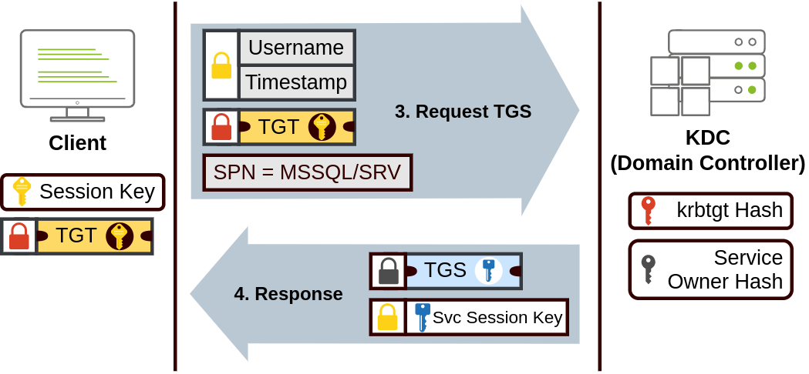
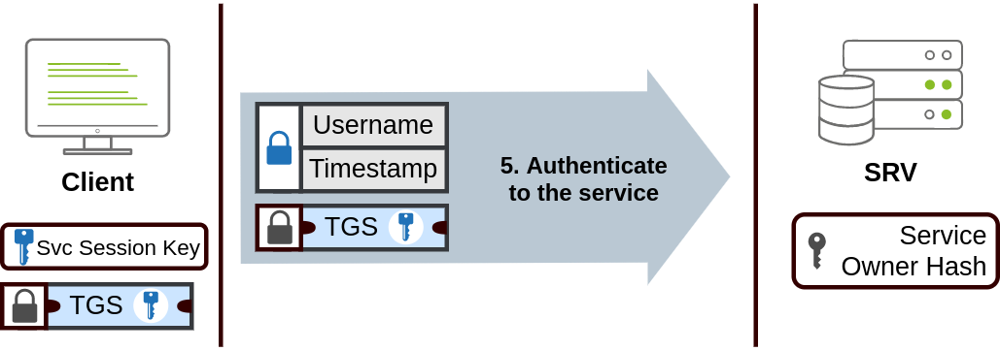
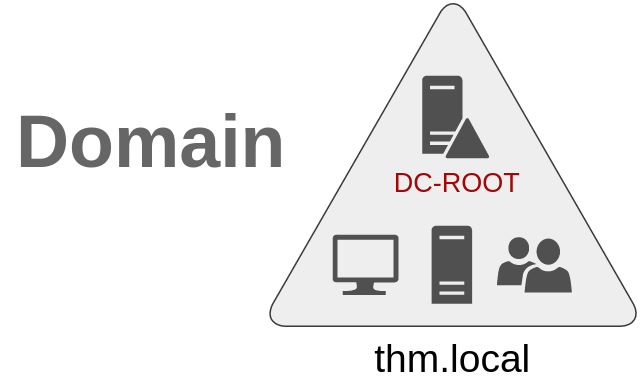
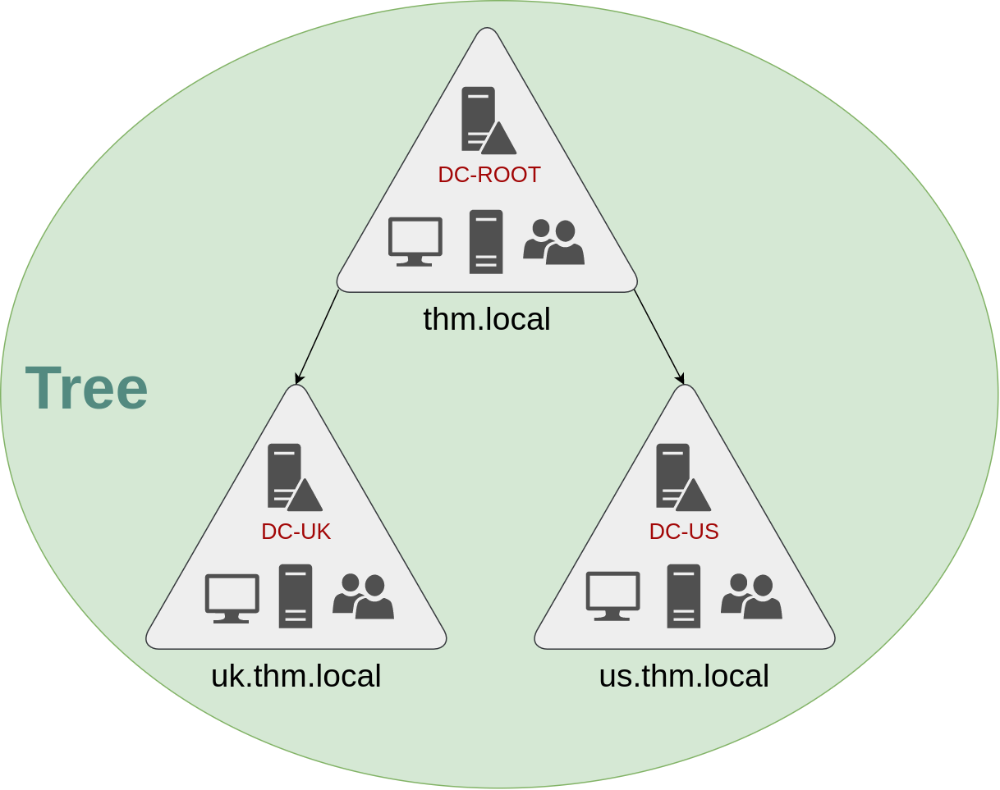
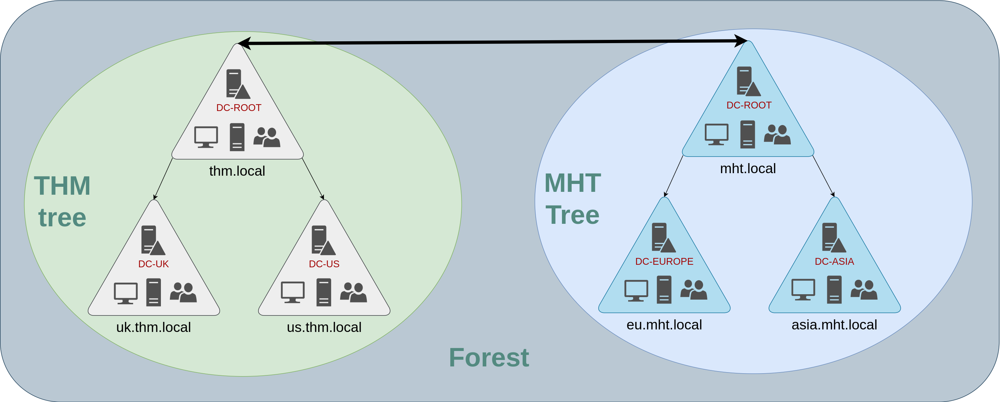
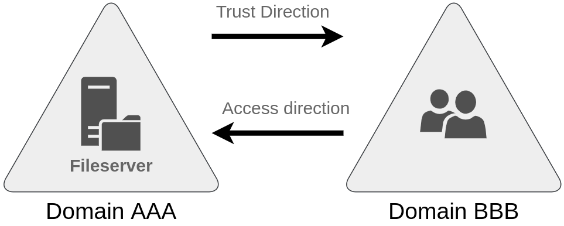

# Windows Domains 

## Was ist eine Windows Domain?

In einem kleinen Unternehmensnetzwerk mit nur einer Handvoll Computer und Mitarbeitern mag es machbar erscheinen, jeden Computer einzeln zu verwalten. Manuell richtest du Benutzerkonten auf jedem Gerät ein, konfigurierst Einstellungen und leistest direkte Unterstützung bei auftretenden Problemen. Doch wenn das Unternehmen wächst, wird dieser Ansatz unpraktisch und ineffizient.

Stell dir vor, dein Unternehmen wächst erheblich, mit 157 Computern und 320 Benutzern, die auf mehrere Büros verteilt sind. Versuche, jeden Computer separat zu verwalten und für jeden Benutzer manuell Richtlinien zu konfigurieren, werden überwältigend. Die Bereitstellung von Vor-Ort-Unterstützung für alle wird logistisch herausfordernd.

Hier kommt ein Windows-Domäne ins Spiel. Eine Windows-Domäne ist im Wesentlichen eine zentralisierte Netzwerkinfrastruktur, die von einer einzigen Einheit verwaltet wird – dem Active Directory (AD). Denk an das AD als digitales Repository, das Informationen über Benutzer, Computer und andere Netzwerkressourcen speichert. Es ermöglicht eine zentrale Verwaltung, Authentifizierung und Autorisierung im gesamten Netzwerk.

Im Herzen der Domäne steht der Domänencontroller (DC), ein Server, der für die Ausführung der Active Directory-Dienste verantwortlich ist. Der DC fungiert als Türsteher und reguliert den Zugriff auf Netzwerkressourcen basierend auf Benutzerberechtigungen und Richtlinien, die im Active Directory definiert sind.

Durch die Implementierung einer Windows-Domäne kannst du Verwaltungsaufgaben optimieren, Sicherheitsrichtlinien durchsetzen und einen konsistenten Zugriff auf Ressourcen im gesamten Netzwerk gewährleisten. Benutzer können sich von jedem Computer innerhalb der Domäne mit einem einzigen Satz von Anmeldeinformationen anmelden, und Administratoren können Benutzerkonten, Berechtigungen und Konfigurationen von einem zentralen Standort aus verwalten.

Zusammenfassend vereinfacht eine Windows-Domäne die Netzwerkverwaltung in groß angelegten Umgebungen, indem sie die Verwaltung durch Active Directory und Domänencontroller zentralisiert. Dadurch wird es einfacher, das Netzwerk zu skalieren und eine sichere und effiziente Netzwerkinfrastruktur aufrechtzuerhalten.

Die Hauptvorteile einer konfigurierten Windows-Domäne sind:

    1. Zentralisierte Identitätsverwaltung: Alle Benutzer im Netzwerk können mit minimalem Aufwand über das Active Directory konfiguriert werden. Dies bedeutet, dass Benutzerkonten zentral erstellt, verwaltet und verwaltet werden können, unabhängig davon, auf welchem Computer im Netzwerk sie sich befinden.

    2. Verwaltung von Sicherheitsrichtlinien: Du kannst Sicherheitsrichtlinien direkt aus dem Active Directory konfigurieren und sie bei Bedarf auf Benutzer und Computer im gesamten Netzwerk anwenden. Dies ermöglicht es Administratoren, einheitliche Sicherheitsstandards festzulegen und durchzusetzen, um die Netzwerksicherheit zu verbessern und Bedrohungen zu minimieren.


# Active Directory 

Der Kern jeder Windows-Domäne ist der Active Directory-Domänendienst (AD DS). Dieser Dienst fungiert als Katalog, der die Informationen aller "Objekte" enthält, die in Ihrem Netzwerk existieren. Unter den vielen Objekten, die von AD unterstützt werden, haben wir Benutzer, Gruppen, Maschinen, Drucker, Freigaben und viele andere. Schauen wir uns einige davon genauer an:

Benutzer

Benutzer sind eine der häufigsten Objekttypen im Active Directory. Benutzer gehören zu den sogenannten Sicherheitsprinzipalen, was bedeutet, dass sie von der Domäne authentifiziert werden können und Privilegien über Ressourcen wie Dateien oder Drucker zugewiesen bekommen können. Man könnte sagen, dass ein Sicherheitsprinzipal ein Objekt ist, das auf Ressourcen im Netzwerk zugreifen kann.

Benutzer können verwendet werden, um zwei Arten von Entitäten darzustellen:

Menschen: Benutzer repräsentieren in der Regel Personen in Ihrer Organisation, die auf das Netzwerk zugreifen müssen, wie Mitarbeiter.

Dienste: Sie können auch Benutzer definieren, die von Diensten wie IIS oder MSSQL verwendet werden sollen. Jeder einzelne Dienst benötigt einen Benutzer zum Ausführen, aber Dienstbenutzer unterscheiden sich von regulären Benutzern, da sie nur die Privilegien haben, die für das Ausführen ihres spezifischen Dienstes erforderlich sind.

Maschinen

Maschinen sind ein weiterer Objekttyp im Active Directory; für jeden Computer, der der Active Directory-Domäne beitritt, wird ein Maschinenobjekt erstellt. Maschinen gelten ebenfalls als "Sicherheitsprinzipale" und erhalten ein Konto wie jeder normale Benutzer. Dieses Konto hat innerhalb der Domäne selbst etwas eingeschränkte Rechte.

Die Maschinenkonten selbst sind lokale Administratoren auf dem zugewiesenen Computer. Sie sollen im Allgemeinen von niemandem außer dem Computer selbst verwendet werden, aber wie bei jedem anderen Konto kannst du, wenn du das Passwort hast, dich damit anmelden.

Hinweis: Maschinenkontopasswörter werden automatisch ausgetauscht und bestehen normalerweise aus 120 zufälligen Zeichen.

Die Identifizierung von Maschinenkonten ist relativ einfach. Sie folgen einem spezifischen Namensschema. Der Name des Maschinenkontos ist der Name des Computers gefolgt von einem Dollarzeichen. Zum Beispiel wird eine Maschine mit dem Namen DC01 ein Maschinenkonto namens DC01$ haben.

Sicherheitsgruppen

Wenn du mit Windows vertraut bist, weißt du wahrscheinlich, dass du Benutzergruppen definieren kannst, um Zugriffsrechte auf Dateien oder andere Ressourcen ganzen Gruppen statt einzelnen Benutzern zuzuweisen. Dies ermöglicht eine bessere Verwaltbarkeit, da du Benutzer einer bestehenden Gruppe hinzufügen kannst, und sie automatisch alle Privilegien der Gruppe erben werden. Sicherheitsgruppen gelten ebenfalls als Sicherheitsprinzipale und können daher Privilegien über Ressourcen im Netzwerk haben.

Gruppen können sowohl Benutzer als auch Maschinen als Mitglieder haben. Bei Bedarf können Gruppen auch andere Gruppen enthalten.

In einer Domäne werden standardmäßig mehrere Gruppen erstellt, die verwendet werden können, um bestimmte Privilegien für Benutzer zu gewähren. Hier sind einige der wichtigsten Gruppen in einer Domäne und ihre Beschreibungen:

| Sicherheitsgruppe     | Beschreibung                                                                                               |
|-----------------------|------------------------------------------------------------------------------------------------------------|
| Domänenadministratoren | Benutzer dieser Gruppe haben administrative Privilegien über die gesamte Domäne. Standardmäßig können sie jeden Computer in der Domäne verwalten, einschließlich der Domänencontroller (DCs). |
| Server-Betreiber      | Benutzer in dieser Gruppe können Domänencontroller verwalten. Sie können keine administrativen Gruppenmitgliedschaften ändern.                                      |
| Backup-Betreiber      | Benutzer in dieser Gruppe dürfen auf Dateien zugreifen, unabhängig von deren Berechtigungen. Sie werden verwendet, um Backups von Daten auf Computern durchzuführen.        |
| Kontenbetreiber       | Benutzer in dieser Gruppe können andere Konten in der Domäne erstellen oder ändern.                                                                                   |
| Domänenbenutzer       | Enthält alle vorhandenen Benutzerkonten in der Domäne.                                                                                                                 |
| Domänencomputer       | Enthält alle vorhandenen Computer in der Domäne.                                                                                                                       |
| Domänencontroller     | Enthält alle vorhandenen DCs in der Domäne.                                                                                                                            |


Diese Gruppen spielen eine wichtige Rolle bei der Verwaltung von Berechtigungen und Ressourcenzugriff in einer Windows-Domäne. Durch die Zuweisung von Benutzern zu diesen Gruppen können Administratoren bestimmte Rechte und Funktionen steuern, um die Sicherheit und Verwaltbarkeit des Netzwerks zu gewährleisten.

Sicherheitsgruppen vs. OUs

Du fragst dich wahrscheinlich, warum wir sowohl Gruppen als auch OUs haben. Obwohl beide dazu dienen, Benutzer und Computer zu klassifizieren, sind ihre Zwecke vollkommen unterschiedlich:

    OUs sind praktisch, um Richtlinien auf Benutzer und Computer anzuwenden, die spezifische Konfigurationen enthalten, die für Gruppen von Benutzern je nach ihrer speziellen Rolle im Unternehmen relevant sind. Denke daran, dass ein Benutzer immer nur Mitglied einer OU sein kann, da es keinen Sinn machen würde, versuchen, zwei verschiedene Richtliniensätze auf einen einzelnen Benutzer anzuwenden.

    Sicherheitsgruppen hingegen dienen dazu, Berechtigungen über Ressourcen zu gewähren. Zum Beispiel wirst du Gruppen verwenden, wenn du einigen Benutzern den Zugriff auf einen freigegebenen Ordner oder einen Netzwerkdrucker ermöglichen möchtest. Ein Benutzer kann Mitglied vieler Gruppen sein, was erforderlich ist, um Zugriff auf mehrere Ressourcen zu gewähren.


Beispiel für die Verwendung von OUs:

Angenommen, du hast in deinem Unternehmen verschiedene Abteilungen wie Vertrieb, Marketing und Entwicklung. Jede Abteilung hat unterschiedliche Anforderungen an die Netzwerkkonfiguration und benötigt spezifische Anwendungen oder Ressourcen. Du könntest eine OU für jede Abteilung erstellen und dann Richtlinien auf diese OUs anwenden, um sicherzustellen, dass die Benutzer in jeder Abteilung die erforderlichen Anwendungen erhalten und auf die benötigten Ressourcen zugreifen können. Zum Beispiel könntest du in der Vertriebs-OU die Konfigurationen für Vertriebsanwendungen wie CRM-Software anwenden und sicherstellen, dass die Vertriebsmitarbeiter Zugriff auf Vertriebsdatenbanken haben.

Beispiel für die Verwendung von Sicherheitsgruppen:

Angenommen, du hast einen gemeinsam genutzten Ordner auf einem Dateiserver, der vertrauliche Unternehmensdokumente enthält. Du möchtest nur bestimmten Benutzern Zugriff auf diesen Ordner gewähren. Du könntest eine Sicherheitsgruppe mit dem Namen "Vertrauliche Dokumente" erstellen und nur die Benutzer hinzufügen, die berechtigt sind, auf diese Dokumente zuzugreifen. Dann würdest du die Berechtigungen für diesen Ordner so konfigurieren, dass nur Mitglieder der "Vertrauliche Dokumente"-Gruppe Zugriff haben. Auf diese Weise kannst du die Zugriffsrechte einfach verwalten, indem du Benutzer zu oder aus der Sicherheitsgruppe hinzufügst oder entfernst, ohne die Ordnerberechtigungen jedes Mal ändern zu müssen.

# Managing Users in AD

Delegation

Eine der praktischen Funktionen in AD ist es, bestimmten Benutzern die Kontrolle über bestimmte OUs zu geben. Dieser Vorgang wird als Delegation bezeichnet und ermöglicht es dir, Benutzern spezifische Privilegien zu gewähren, um fortgeschrittene Aufgaben in OUs durchzuführen, ohne dass ein Domänenadministrator eingreifen muss.

Ein häufiges Anwendungsszenario dafür ist die Gewährung von Berechtigungen an IT-Supportmitarbeiter, um die Passwörter anderer Benutzer mit niedrigeren Privilegien zurückzusetzen.

Bspw. hat der User Philip die Delegation, das Passwort von Sophie zu resetten und sie zwingen, ein neues Passwort beim nächsten Login zu setzen.

> Set-ADAccountPassword sophie -Reset -NewPassword (Read-Host -AsSecureString -Prompt 'New Password') -Verbose

> Set-ADUser -ChangePasswordAtLogon $true -Identity sophie -Verbose


# Managing Computers in AD

Standardmäßig werden alle Maschinen, die einer Domäne beitreten (außer den DCs), im Container namens "Computers" platziert.

    1. Arbeitsstationen

    Arbeitsstationen sind eine der häufigsten Gerätetypen innerhalb einer Active Directory-Domäne. Jeder Benutzer in der Domäne wird sich wahrscheinlich an einer Arbeitsstation anmelden. Dies ist das Gerät, das sie für ihre Arbeit oder normale Browsing-Aktivitäten verwenden werden. Diese Geräte sollten niemals von einem privilegierten Benutzer angemeldet sein.

---

    2. Server

    Server sind die zweithäufigsten Gerätetypen innerhalb einer Active Directory-Domäne. Server werden in der Regel verwendet, um Dienste für Benutzer oder andere Server bereitzustellen.

---

    3. Domänencontroller

    Domänencontroller sind die dritthäufigsten Gerätetypen innerhalb einer Active Directory-Domäne. Domänencontroller ermöglichen die Verwaltung der Active Directory-Domäne. Diese Geräte gelten oft als die sensibelsten Geräte im Netzwerk, da sie gehashte Passwörter für alle Benutzerkonten in der Umgebung enthalten.


# Group Policies

Wir haben Benutzer und Computer in OUs organisiert, nur um der Ordnung willen, aber die Hauptidee dahinter ist, unterschiedliche Richtlinien für jede OU individuell bereitzustellen. Auf diese Weise können wir je nach Abteilung unterschiedliche Konfigurationen und Sicherheitsrichtlinien für Benutzer festlegen.

Windows verwaltet solche Richtlinien durch Gruppenrichtlinienobjekte (GPOs). GPOs sind einfach eine Sammlung von Einstellungen, die auf OUs angewendet werden können. GPOs können Richtlinien enthalten, die entweder auf Benutzer oder Computer abzielen, was es ermöglicht, eine Baseline auf bestimmten Maschinen und Identitäten festzulegen.

Die Verteilung von GPOs

GPOs werden über einen Netzwerkfreigabeordner namens SYSVOL im Netzwerk verteilt, der auf dem DC gespeichert ist. Alle Benutzer in einer Domäne sollten typischerweise Zugriff auf diese Freigabe über das Netzwerk haben, um ihre GPOs regelmäßig zu synchronisieren. Die SYSVOL-Freigabe zeigt standardmäßig auf das Verzeichnis C:\Windows\SYSVOL\sysvol\ auf jedem der DCs in unserem Netzwerk.

Sobald eine Änderung an einem GPO vorgenommen wurde, kann es bis zu 2 Stunden dauern, bis die Computer auf dem neuesten Stand sind. Wenn du die Synchronisierung der GPOs auf einem bestimmten Computer sofort erzwingen möchtest, kannst du jederzeit den folgenden Befehl auf dem gewünschten Computer ausführen:
Windows PowerShell

```
PS C:\> gpupdate /force
```


# Authentication Methods


Kerberos-Authentifizierung:

Die Kerberos-Authentifizierung ist das Standardauthentifizierungsprotokoll für jede aktuelle Version von Windows. Benutzer, die sich bei einem Dienst mit Kerberos anmelden, erhalten Tickets. Diese Tickets sind der Nachweis einer früheren Authentifizierung. Benutzer mit Tickets können sie einem Dienst vorlegen, um zu zeigen, dass sie sich bereits zuvor im Netzwerk authentifiziert haben und daher berechtigt sind, ihn zu verwenden.

Bei der Verwendung von Kerberos für die Authentifizierung erfolgt folgender Prozess:

1. Der Benutzer sendet seinen Benutzernamen und einen Zeitstempel, der mit einem Schlüssel verschlüsselt ist, der aus seinem Passwort abgeleitet wird, an das Key Distribution Center (KDC), einen Dienst, der normalerweise auf dem Domänencontroller installiert ist und für die Erstellung von Kerberos-Tickets im Netzwerk zuständig ist.


2. Das KDC erstellt und sendet ein Ticket Granting Ticket (TGT) zurück, das es dem Benutzer ermöglicht, zusätzliche Tickets anzufordern, um auf bestimmte Dienste zuzugreifen. Neben dem TGT wird dem Benutzer ein Sitzungsschlüssel gegeben, den er benötigt, um die folgenden Anfragen zu generieren.



3. Wenn ein Benutzer eine Verbindung zu einem Dienst im Netzwerk herstellen möchte, wie z.B. einem freigegebenen Ordner, einer Website oder einer Datenbank, verwendet er sein TGT, um beim KDC ein Ticket Granting Service (TGS) anzufordern. TGS sind Tickets, die eine Verbindung nur zu dem spezifischen Dienst ermöglichen, für den sie erstellt wurden.



4. Als Ergebnis sendet das KDC uns ein TGS zusammen mit einem Service Session Key, den wir benötigen, um uns beim Dienst, den wir zugreifen möchten, zu authentifizieren.

NetNTLM-Authentifizierung:

NetNTLM funktioniert mithilfe eines Challenge-Response-Mechanismus. Der gesamte Prozess läuft wie folgt ab:


1. Der Client sendet eine Authentifizierungsanfrage an den Server, auf den er zugreifen möchte.


2. Der Server generiert eine Zufallszahl und sendet sie als Challenge an den Client.


3. Der Client kombiniert seinen NTLM-Passworthash mit der Challenge (und anderen bekannten Daten), um eine Antwort auf die Challenge zu generieren, und sendet sie zur Überprüfung an den Server zurück.


4. Der Server leitet die Challenge und die Antwort zur Überprüfung an den Domänencontroller weiter.

5. Der Domänencontroller verwendet die Challenge, um die Antwort neu zu berechnen, und vergleicht sie mit der vom Client gesendeten Originalantwort. Wenn sie übereinstimmen, wird der Client authentifiziert; andernfalls wird der Zugriff verweigert. Das Authentifizierungsergebnis wird an den Server zurückgesendet.


Hinweis: Der beschriebene Prozess gilt für die Verwendung eines Domänenkontos. Wenn ein lokales Konto verwendet wird, kann der Server die Antwort auf die Challenge selbst überprüfen, ohne Interaktion mit dem Domänencontroller zu benötigen, da er den Passworthash lokal in seiner SAM gespeichert hat.

# Trees, Forests and Trusts 

Bisher haben wir besprochen, wie man eine einzelne Domäne verwaltet, die Rolle eines Domänencontrollers und wie Computer, Server und Benutzer hinzugefügt werden.



Einzeldomäne

Mit dem Wachstum von Unternehmen wächst auch ihr Netzwerk. Eine einzelne Domäne für ein Unternehmen reicht aus, um zu beginnen, aber im Laufe der Zeit können zusätzliche Anforderungen entstehen, die Sie dazu bringen, mehr als eine Domäne zu haben.

Bäume

Stellen Sie sich zum Beispiel vor, dass Ihr Unternehmen plötzlich in ein neues Land expandiert. Das neue Land hat unterschiedliche Gesetze und Vorschriften, die Sie dazu zwingen, Ihre Gruppenrichtlinien zu aktualisieren, um sie zu erfüllen. Außerdem haben Sie jetzt IT-Mitarbeiter in beiden Ländern, und jedes IT-Team muss die Ressourcen verwalten, die jedem Land entsprechen, ohne sich in die Arbeit des anderen Teams einzumischen. Obwohl Sie eine komplexe OU-Struktur erstellen und Delegationen verwenden könnten, um dies zu erreichen, könnte es schwierig sein, eine riesige AD-Struktur zu verwalten und anfällig für menschliche Fehler sein.

Glücklicherweise unterstützt Active Directory die Integration mehrerer Domänen, sodass Sie Ihr Netzwerk in eigenständig verwaltbare Einheiten unterteilen können. Wenn Sie zwei Domänen haben, die denselben Namensraum (z.B. thm.local in unserem Beispiel) teilen, können diese Domänen zu einem Baum zusammengeführt werden.

Wenn unsere Domäne thm.local in zwei Subdomänen für die Zweige UK und US aufgeteilt wäre, könnten Sie einen Baum mit einer Stammesdomäne von thm.local und zwei Subdomänen namens uk.thm.local und us.thm.local erstellen, jeweils mit ihrer AD, Computern und Benutzern




Diese partitionierte Struktur gibt uns eine bessere Kontrolle darüber, wer in der Domäne auf was zugreifen kann. Die IT-Mitarbeiter aus dem Vereinigten Königreich haben beispielsweise ihren eigenen DC, der nur die Ressourcen des Vereinigten Königreichs verwaltet. Ein Benutzer aus dem Vereinigten Königreich könnte beispielsweise keine US-Benutzer verwalten. Auf diese Weise haben die Domänenadministratoren jeder Zweigstelle die vollständige Kontrolle über ihre jeweiligen DCs, jedoch nicht über die DCs anderer Zweigstellen. Richtlinien können auch unabhängig für jede Domäne im Baum konfiguriert werden.

Bei Bäumen und Wäldern muss eine neue Sicherheitsgruppe eingeführt werden. Die Gruppe Enterprise-Administratoren gewährt einem Benutzer administrative Privilegien über alle Domänen eines Unternehmens. Jede Domäne hätte immer noch ihre eigenen Domänenadministratoren mit Administratorprivilegien über ihre einzelnen Domänen und die Enterprise-Administratoren, die alles im Unternehmen kontrollieren können.

Wälder

Die von Ihnen verwalteten Domänen können auch in unterschiedlichen Namensräumen konfiguriert werden. Angenommen, Ihr Unternehmen wächst weiter und erwirbt schließlich ein anderes Unternehmen namens MHT Inc. Wenn sich beide Unternehmen zusammenschließen, haben Sie wahrscheinlich verschiedene Domänenbäume für jedes Unternehmen, die jeweils von ihrer eigenen IT-Abteilung verwaltet werden. Die Vereinigung mehrerer Bäume mit unterschiedlichen Namensräumen in dasselbe Netzwerk wird als Wald bezeichnet.




Vertrauensbeziehungen

Das Organisieren mehrerer Domänen in Bäumen und Wäldern ermöglicht es Ihnen, ein schön strukturiertes Netzwerk in Bezug auf Management und Ressourcen zu haben. Aber irgendwann könnte ein Benutzer bei THM UK auf eine freigegebene Datei auf einem der MHT ASIA-Server zugreifen müssen. Damit dies geschehen kann, werden Domänen, die in Bäumen und Wäldern angeordnet sind, durch Vertrauensbeziehungen miteinander verbunden.

Im einfachsten Fall kann eine einseitige Vertrauensbeziehung hergestellt werden. Bei einem einseitigen Vertrauen bedeutet dies, dass, wenn Domäne AAA Domäne BBB vertraut, ein Benutzer auf BBB autorisiert werden kann, auf Ressourcen auf AAA zuzugreifen:




Die Richtung der einseitigen Vertrauensbeziehung steht im Gegensatz zur Zugriffsrichtung.

Es können auch zweiseitige Vertrauensbeziehungen hergestellt werden, um beiden Domänen die gegenseitige Autorisierung von Benutzern aus der anderen Domäne zu ermöglichen. Standardmäßig bildet das Zusammenführen mehrerer Domänen unter einem Baum oder einem Wald eine zweiseitige Vertrauensbeziehung.

Es ist wichtig zu beachten, dass das Vorhandensein einer Vertrauensbe

ziehung zwischen Domänen keinen automatischen Zugriff auf alle Ressourcen in anderen Domänen gewährt. Sobald eine Vertrauensbeziehung hergestellt ist, haben Sie die Möglichkeit, Benutzer in verschiedenen Domänen zu autorisieren, aber es liegt an Ihnen, was tatsächlich autorisiert wird oder nicht.