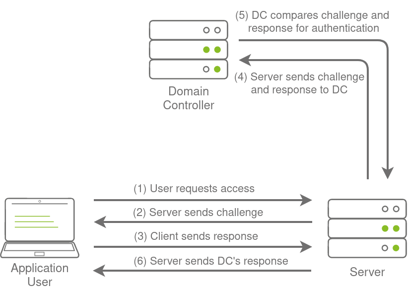
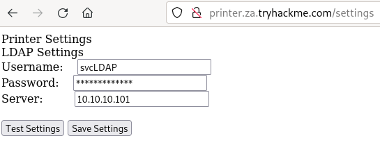
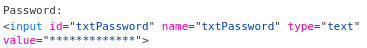
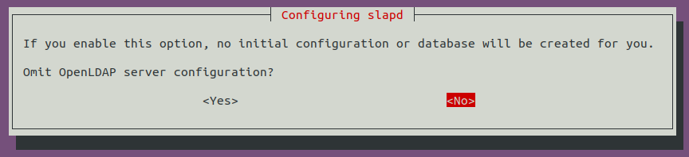
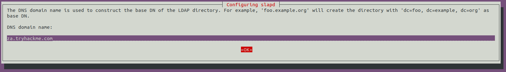
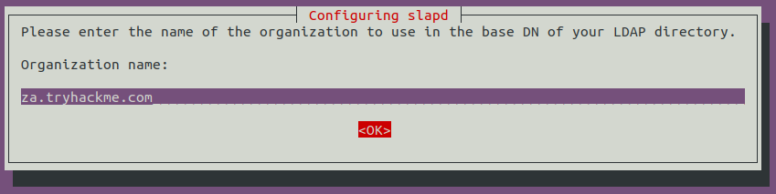
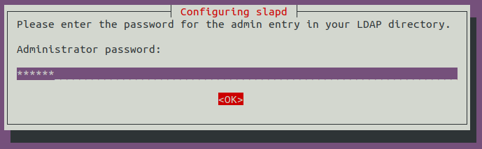
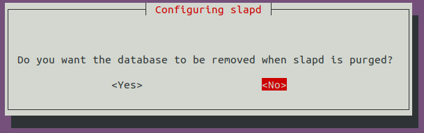
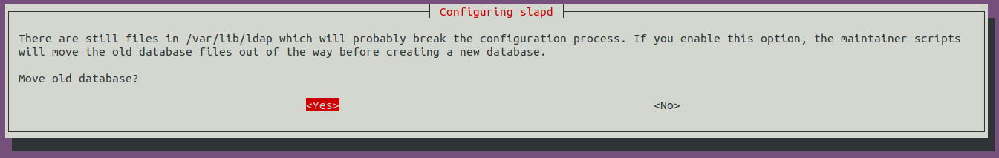

# OSINT and Phishing 

### OSINT

OSINT wird verwendet, um Informationen zu entdecken, die öffentlich zugänglich gemacht wurden. In Bezug auf AD-Anmeldeinformationen kann dies aus mehreren Gründen geschehen, wie zum Beispiel:

    - Benutzer, die Fragen in öffentlichen Foren wie Stack Overflow stellen, aber sensible Informationen wie ihre Anmeldeinformationen in der Frage preisgeben.
    
    - Entwickler, die Skripte auf Diensten wie Github mit hartcodierten Anmeldeinformationen hochladen.
    
    - Anmeldeinformationen, die bei vergangenen Verstößen offengelegt wurden, da Mitarbeiter ihre Arbeitskonten verwendet haben, um sich für andere externe Websites anzumelden. Websites wie HaveIBeenPwned und DeHashed bieten ausgezeichnete Plattformen, um festzustellen, ob die Informationen einer Person, wie die Arbeits-E-Mail, jemals an einem öffentlich bekannten Datenverstoß beteiligt waren.

Durch die Verwendung von OSINT-Techniken kann es möglich sein, öffentlich offengelegte Anmeldeinformationen wiederherzustellen. Wenn wir Glück haben und Anmeldeinformationen finden, müssen wir dennoch einen Weg finden, um zu testen, ob sie gültig sind oder nicht, da OSINT-Informationen veraltet sein können. In Abschnitt 3 werden wir über NTLM-authentifizierte Dienste sprechen, die möglicherweise einen ausgezeichneten Weg bieten, um Anmeldeinformationen zu testen, um zu sehen, ob sie noch gültig sind.

### Phishing

Phishing ist eine weitere ausgezeichnete Methode, um AD zu kompromittieren. Beim Phishing werden Benutzer in der Regel dazu verleitet, ihre Anmeldeinformationen auf einer bösartigen Webseite einzugeben oder sie werden aufgefordert, eine bestimmte Anwendung auszuführen, die im Hintergrund einen Remote Access Trojaner (RAT) installieren würde. Dies ist eine weit verbreitete Methode, da der RAT im Kontext des Benutzers ausgeführt würde und es Ihnen sofort ermöglichen würde, das AD-Konto dieses Benutzers zu übernehmen. Deshalb ist Phishing ein so großes Thema sowohl für Rote als auch Blaue Teams.

# NTLM Authenticated Services

### NTLM und NetNTLM

New Technology LAN Manager (NTLM) ist die Suite von Sicherheitsprotokollen, die zur Authentifizierung der Benutzeridentitäten in AD verwendet werden. NTLM kann für die Authentifizierung verwendet werden, indem ein Challenge-Response-basiertes Schema namens NetNTLM verwendet wird. Dieser Authentifizierungsmechanismus wird von den Diensten in einem Netzwerk stark genutzt. Dienste, die NetNTLM verwenden, können jedoch auch dem Internet ausgesetzt sein. Hier sind einige beliebte Beispiele:

    - Intern gehostete Exchange (Mail)-Server, die ein Outlook Web App (OWA)-Anmeldeportal freigeben.
    
    - Remote Desktop Protocol (RDP)-Dienste eines Servers, die dem Internet zugänglich sind.
    
    - Freigegebene VPN-Endpunkte, die mit AD integriert waren.
    
    - Webanwendungen, die öffentlich zugänglich sind und NetNTLM verwenden.

NetNTLM, auch oft als Windows-Authentifizierung oder einfach NTLM-Authentifizierung bezeichnet, ermöglicht es der Anwendung, die Rolle eines Mittelsmanns zwischen dem Client und AD zu spielen. Alle Authentifizierungsinformationen werden in Form einer Herausforderung an einen Domänencontroller weitergeleitet, und wenn sie erfolgreich abgeschlossen wird, authentifiziert die Anwendung den Benutzer.

Dies bedeutet, dass die Anwendung im Namen des Benutzers authentifiziert und nicht den Benutzer direkt auf der Anwendung selbst authentifiziert. Dadurch wird verhindert, dass die Anwendung AD-Anmeldeinformationen speichert, die nur auf einem Domänencontroller gespeichert werden sollten. Dieser Prozess ist im folgenden Diagramm dargestellt:



### Brute-Force-Angriffe auf Anmeldungen

Wie oben erwähnt, bieten diese freigelegten Dienste einen ausgezeichneten Ort, um Anmeldedaten zu testen, die auf anderem Wege entdeckt wurden. Diese Dienste können jedoch auch direkt genutzt werden, um einen ersten Satz gültiger AD-Anmeldeinformationen wiederherzustellen. Möglicherweise könnten wir versuchen, diese für Brute-Force-Angriffe zu verwenden, wenn wir während unserer anfänglichen Recherchen des Red Teams Informationen wie gültige E-Mail-Adressen wiederhergestellt haben.

Da die meisten AD-Umgebungen eine Kontosperre konfiguriert haben, können wir keinen vollständigen Brute-Force-Angriff durchführen. Stattdessen müssen wir einen Password-Spraying-Angriff durchführen. Anstatt mehrere verschiedene Passwörter auszuprobieren, die den Mechanismus für die Kontosperrung auslösen könnten, wählen wir ein Passwort aus und versuchen, uns mit allen Benutzernamen anzumelden, die wir erlangt haben. Es sollte jedoch beachtet werden, dass diese Art von Angriffen aufgrund der Anzahl fehlgeschlagener Authentifizierungsversuche, die sie generieren werden, erkannt werden können.

---

Du hast eine Liste von Benutzernamen erhalten, die während einer Red-Team-OSINT-Übung entdeckt wurden. Die OSINT-Übung hat auch das anfängliche Onboarding-Passwort der Organisation angegeben, das "Changeme123" zu sein scheint. Obwohl Benutzer ihr anfängliches Passwort immer ändern sollten, wissen wir, dass Benutzer dies oft vergessen. Wir werden ein benutzerdefiniertes Skript verwenden, um einen Password-Spraying-Angriff gegen die Webanwendung durchzuführen, die unter dieser URL gehostet wird: http://ntlmauth.za.tryhackme.com.

Beim Navigieren zur URL sehen wir, dass sie uns nach Windows-Authentifizierungsanmeldeinformationen fragt:

Hinweis: Das Windows-Authentifizierungs-Plugin von Firefox ist äußerst anfällig für Fehler. Wenn du Anmeldedaten manuell testen möchtest, wird Chrome empfohlen.

Wir könnten Tools wie Hydra verwenden, um bei dem Password-Spraying-Angriff zu helfen. Es ist jedoch oft besser, diese Art von Angriffen selbst zu skripten, was dir mehr Kontrolle über den Prozess ermöglicht. Ein Basisskript in Python wurde in den Aufgabendateien bereitgestellt, das für den Password-Spraying-Angriff verwendet werden kann. Die folgende Funktion ist die Hauptkomponente des Skripts:

```python
def password_spray(self, password, url):
    print ("[*] Starting passwords spray attack using the following password: " + password)
    #Reset valid credential counter
    count = 0
    #Iterate through all of the possible usernames
    for user in self.users:
        #Make a request to the website and attempt Windows Authentication
        response = requests.get(url, auth=HttpNtlmAuth(self.fqdn + "\\" + user, password))
        #Read status code of response to determine if authentication was successful
        if (response.status_code == self.HTTP_AUTH_SUCCEED_CODE):
            print ("[+] Valid credential pair found! Username: " + user + " Password: " + password)
            count += 1
            continue
        if (self.verbose):
            if (response.status_code == self.HTTP_AUTH_FAILED_CODE):
                print ("[-] Failed login with Username: " + user)
    print ("[*] Password spray attack completed, " + str(count) + " valid credential pairs found")
```

Diese Funktion nimmt unser vorgeschlagenes Passwort und die URL, die wir anvisieren, als Eingabe und versucht, sich mit jedem Benutzernamen in der Textdatei bei der URL anzumelden. Durch Überwachung der Unterschiede in den HTTP-Antwortcodes von der Anwendung können wir feststellen, ob das Anmeldeinformationenpaar gültig ist oder nicht. Wenn das Anmeldeinformationenpaar gültig ist, antwortet die Anwendung mit einem HTTP-Code 200 (OK). Wenn das Paar ungültig ist, gibt die Anwendung einen HTTP-Code 401 (Unauthorised) zurück.

### Password-Spraying

Wir können das Skript mit dem folgenden Befehl ausführen:

>python ntlm_passwordspray.py -u <Benutzerdatei> -f <FQDN> -p <Passwort> -a <Angriffs-URL>

Wir geben für jeden der Parameter folgende Werte an:

    - <Benutzerdatei> - Textdatei mit unseren Benutzernamen - "usernames.txt"
    
    - <FQDN> - Vollqualifizierter Domänenname, der mit der Organisation verbunden ist, die wir angreifen - "za.tryhackme.com"
    
    - <Passwort> - Das Passwort, das wir für unseren Sprühangriff verwenden möchten - "Changeme123"
    
    - <Angriffs-URL> - Die URL der Anwendung, die Windows-Authentifizierung unterstützt - "http://ntlmauth.za.tryhackme.com"
Unter Verwendung dieser Parameter sollten wir einige gültige Anmeldedatenpaare aus unserem Password-Spraying-Angriff erhalten.

```bash        
┌──(akwa㉿kali)-[~/thm/ActiveDirectory/breachad/tools]
└─$ python ntlm_passwordspray.py -u usernames.txt -f za.tryhackme.com -p Changeme123 -a http://ntlmauth.za.tryhackme.com 
[*] Starting passwords spray attack using the following password: Changeme123
[-] Failed login with Username: anthony.reynolds
[-] Failed login with Username: samantha.thompson
[-] Failed login with Username: dawn.turner
[-] Failed login with Username: frances.chapman
[-] Failed login with Username: henry.taylor
[-] Failed login with Username: jennifer.wood
[+] Valid credential pair found! Username: hollie.powell Password: Changeme123
[-] Failed login with Username: louise.talbot
[+] Valid credential pair found! Username: heather.smith Password: Changeme123
[-] Failed login with Username: dominic.elliott
[+] Valid credential pair found! Username: gordon.stevens Password: Changeme123
[-] Failed login with Username: alan.jones
[-] Failed login with Username: frank.fletcher
[-] Failed login with Username: maria.sheppard
[-] Failed login with Username: sophie.blackburn
[-] Failed login with Username: dawn.hughes
[-] Failed login with Username: henry.black
[-] Failed login with Username: joanne.davies
[-] Failed login with Username: mark.oconnor
[+] Valid credential pair found! Username: georgina.edwards Password: Changeme123
[*] Password spray attack completed, 4 valid credential pairs found

```

Durch die Kombination von OSINT und NetNTLM-Password-Spraying haben wir jetzt unsere ersten gültigen Anmeldeinformationen, die zur weiteren Enumeration von AD verwendet werden könnten!

# LDAP Bind Credentials

### LDAP

Eine weitere Methode der AD-Authentifizierung, die von Anwendungen verwendet werden kann, ist die Lightweight Directory Access Protocol (LDAP)-Authentifizierung. LDAP-Authentifizierung ist ähnlich wie NTLM-Authentifizierung. Bei der LDAP-Authentifizierung überprüft die Anwendung jedoch direkt die Anmeldeinformationen des Benutzers. Die Anwendung verfügt über ein Paar AD-Anmeldeinformationen, die sie zunächst zum Abfragen von LDAP und dann zur Überprüfung der AD-Benutzeranmeldeinformationen verwenden kann.

Die LDAP-Authentifizierung ist ein beliebter Mechanismus bei Drittanbieteranwendungen (nicht von Microsoft), die mit AD integriert sind. Dazu gehören Anwendungen und Systeme wie:

    - Gitlab
    - Jenkins
    - Eigenentwickelte Webanwendungen
    - Drucker
    - VPNs

Wenn eine dieser Anwendungen oder Dienste im Internet freigegeben ist, können dieselben Arten von Angriffen wie bei NTLM-authentifizierten Systemen verwendet werden. Da ein Dienst, der die LDAP-Authentifizierung verwendet, einen Satz AD-Anmeldeinformationen erfordert, eröffnet dies zusätzliche Angriffswege. Im Wesentlichen können wir versuchen, die von dem Dienst verwendeten AD-Anmeldeinformationen wiederherzustellen, um authentifizierten Zugriff auf AD zu erhalten. Der Authentifizierungsprozess über LDAP wird unten dargestellt:


Wenn Sie einen Zugangspunkt auf dem richtigen Host erlangen könnten, wie z.B. einem Gitlab-Server, könnte es so einfach sein, die Konfigurationsdateien zu lesen, um diese AD-Anmeldeinformationen wiederherzustellen. Diese Anmeldeinformationen werden oft im Klartext in Konfigurationsdateien gespeichert, da das Sicherheitsmodell darauf beruht, den Speicherort und die Speicherkonfiguration der Datei sicher zu halten, anstatt ihren Inhalt. Konfigurationsdateien werden im Task 7 ausführlicher behandelt.

### LDAP-Pass-Back-Angriffe

Ein weiterer sehr interessanter Angriff, der gegen LDAP-Authentifizierungsmechanismen durchgeführt werden kann, ist der sogenannte LDAP-Pass-Back-Angriff. Dies ist ein häufiger Angriff gegen Netzwerkgeräte wie Drucker, wenn Sie Zugriff auf das interne Netzwerk erlangt haben, beispielsweise durch Anschließen eines Rogue-Geräts in einem Konferenzraum.

LDAP-Pass-Back-Angriffe können durchgeführt werden, wenn wir Zugriff auf die Konfiguration eines Geräts erhalten, in der die LDAP-Parameter angegeben sind. Dies kann beispielsweise die Webschnittstelle eines Netzwerkdruckers sein. Normalerweise werden die Anmeldeinformationen für diese Schnittstellen auf die Standardwerte wie admin:admin oder admin:password gesetzt. Hier können wir die LDAP-Anmeldeinformationen nicht direkt extrahieren, da das Passwort normalerweise ausgeblendet ist. Wir können jedoch die LDAP-Konfiguration ändern, wie beispielsweise die IP oder den Hostnamen des LDAP-Servers. Bei einem LDAP-Pass-Back-Angriff können wir diese IP zu unserer eigenen IP ändern und dann die LDAP-Konfiguration testen, was das Gerät dazu zwingt, eine LDAP-Authentifizierung an unser Rogue-Gerät durchzuführen. Wir können diesen Authentifizierungsversuch abfangen, um die LDAP-Anmeldeinformationen wiederherzustellen.

### Performen eines LDAP-Passbacks

Es gibt einen Netzwerkdrucker in diesem Netzwerk, dessen Administrationswebsite nicht einmal Anmeldeinformationen erfordert. Navigieren Sie zu http://printer.za.tryhackme.com/settings.aspx, um die Einstellungsseite des Druckers zu finden:



Mithilfe der Browser-Inspektion können wir auch überprüfen, dass die Druckerwebsite zumindest sicher genug war, um das LDAP-Passwort nicht einfach an den Browser zurückzusenden:



Wir haben den Benutzernamen, aber nicht das Passwort. Wenn wir jedoch auf "Testeinstellungen" klicken, können wir sehen, dass eine Authentifizierungsanforderung an den Domänencontroller gesendet wird, um die LDAP-Anmeldeinformationen zu testen. Lassen Sie uns versuchen, dies auszunutzen, um den Drucker dazu zu bringen, sich mit uns zu verbinden, was die Anmeldeinformationen preisgeben würde. Um dies zu tun, verwenden wir einen einfachen Netcat-Listener, um zu testen, ob wir den Drucker dazu bringen können, sich mit uns zu verbinden. Da der Standardport für LDAP 389 ist, können wir den folgenden Befehl verwenden:

>nc -lvnp 389

Sie sollten feststellen, dass wir eine Verbindung zurück erhalten, aber es gibt ein kleines Problem:

```
┌──(akwa㉿kali)-[~/thm/ActiveDirectory/breachad/tools]
└─$ nc -lvnp 389      
listening on [any] 389 ...
connect to [10.50.29.33] from (UNKNOWN) [10.200.32.201] 64370
0�Dc�;

x�
  objectclass0�supportedCapabilities
```

Es kann sein, dass Sie mehr als einen Versuch benötigen, um eine Verbindung zurückzuerhalten, aber es sollte innerhalb von 5 Sekunden eine Antwort erfolgen. Die Antwort "supportedCapabilities" zeigt uns ein Problem auf. Grundsätzlich versucht der Drucker, bevor er die Anmeldeinformationen überträgt, die Details zur LDAP-Authentifizierungsmethode auszuhandeln. Er wird diese Verhandlung nutzen, um die sicherste Authentifizierungsmethode auszuwählen, die sowohl vom Drucker als auch vom LDAP-Server unterstützt wird. Wenn die Authentifizierungsmethode zu sicher ist, werden die Anmeldeinformationen nicht im Klartext übertragen. Bei einigen Authentifizierungsmethoden werden die Anmeldeinformationen überhaupt nicht über das Netzwerk übertragen! Daher können wir nicht einfach normales Netcat verwenden, um die Anmeldeinformationen abzufangen. Wir müssen einen falschen LDAP-Server erstellen und ihn unsicher konfigurieren, um sicherzustellen, dass die Anmeldeinformationen im Klartext übertragen werden.

### Hosting eines falschen LDAP-Servers

Es gibt mehrere Möglichkeiten, einen falschen LDAP-Server zu hosten, aber wir werden für dieses Beispiel OpenLDAP verwenden. Wenn Sie die AttackBox verwenden, wurde OpenLDAP bereits für Sie installiert. Wenn Sie jedoch Ihre eigene Angriffsmaschine verwenden, müssen Sie OpenLDAP mit folgendem Befehl installieren:

>sudo apt-get update && sudo apt-get -y install slapd ldap-utils && sudo systemctl enable slapd

Sie müssen jedoch auch Ihren eigenen falschen LDAP-Server auf der AttackBox konfigurieren. Wir werden damit beginnen, den LDAP-Server mit dem folgenden Befehl neu zu konfigurieren:

>sudo dpkg-reconfigure -p low slapd

Stellen Sie sicher, dass Sie <Nein> drücken, wenn Sie aufgefordert werden, die Serverkonfiguration zu überspringen:



Für den DNS-Domänennamen möchten Sie unsere Ziel-Domäne angeben, die za.tryhackme.com lautet:



Verwenden Sie denselben Namen auch für den Organisationsnamen: "za.tryhackme.com".



Gebe irgendein Password für Admin ein:



Wählen Sie MDB als das LDAP-Datenbankformat aus, das verwendet werden soll.


Für die letzten beiden Optionen stellen Sie sicher, dass die Datenbank nicht entfernt wird, wenn sie gelöscht wird.



Verschieben Sie alte Datenbankdateien, bevor eine neue erstellt wird.



Vor der Verwendung des falschen LDAP-Servers müssen wir ihn anfällig machen, indem wir die unterstützten Authentifizierungsmethoden herabstufen. Wir möchten sicherstellen, dass unser LDAP-Server nur die Authentifizierungsmethoden PLAIN und LOGIN unterstützt. Um dies zu tun, müssen wir eine neue LDIF-Datei erstellen, die den folgenden Inhalt enthält:

***olcSaslSecProps.ldif***
``` 
#olcSaslSecProps.ldif
dn: cn=config
replace: olcSaslSecProps
olcSaslSecProps: noanonymous,minssf=0,passcred
```
Die Datei hat die folgenden Eigenschaften:

    - olcSaslSecProps: Spezifiziert die SASL-Sicherheitseigenschaften.
    
    - noanonymous: Deaktiviert Mechanismen, die anonyme Anmeldungen unterstützen.
    
    - minssf: Spezifiziert die minimale akzeptable Sicherheitsstärke mit 0, was bedeutet, dass keine Schutzmaßnahmen vorhanden sind.

Jetzt können wir die LDIF-Datei verwenden, um unseren LDAP-Server zu patchen, indem wir folgendes verwenden:

>sudo ldapmodify -Y EXTERNAL -H ldapi:// -f ./olcSaslSecProps.ldif && sudo service slapd restart

Wir können überprüfen, ob die Konfiguration unseres falschen LDAP-Servers angewendet wurde, indem wir den folgenden Befehl verwenden (Hinweis: Wenn Sie Kali verwenden, erhalten Sie möglicherweise keine Ausgabe. Die Konfiguration sollte jedoch funktioniert haben, und Sie können mit den nächsten Schritten fortfahren):

```
┌──(akwa㉿kali)-[~/thm/ActiveDirectory/breachad/tools]
└─$ ldapsearch -H ldap:// -x -LLL -s base -b "" supportedSASLMechanisms
dn:
supportedSASLMechanisms: LOGIN
supportedSASLMechanisms: PLAIN
```

### Capturing LDAP Credentials

Unser falscher LDAP-Server wurde nun konfiguriert. Wenn wir auf "Testeinstellungen" unter http://printer.za.tryhackme.com/settings.aspx klicken, erfolgt die Authentifizierung im Klartext. Wenn Sie Ihren falschen LDAP-Server korrekt konfiguriert haben und er die Kommunikation herabstuft, erhalten Sie folgenden Fehler: "Diese unterscheidende Namen enthalten ungültige Syntax". Wenn Sie diesen Fehler erhalten, können Sie mit dem folgenden Befehl einen tcpdump verwenden, um die Anmeldeinformationen zu erfassen:

```
┌──(akwa㉿kali)-[~/thm/ActiveDirectory/breachad/tools]
└─$ sudo tcpdump -SX -i breachad tcp port 389
[sudo] Passwort für akwa: 
tcpdump: verbose output suppressed, use -v[v]... for full protocol decode
listening on breachad, link-type RAW (Raw IP), snapshot length 262144 bytes
12:27:20.664888 IP 10.200.32.201.59907 > kali.ldap: Flags [SEW], seq 671456394, win 64240, options [mss 1289,nop,wscale 8,nop,nop,sackOK], length 0
        0x0000:  4502 0034 7fcf 4000 7f06 290f 0ac8 20c9  E..4..@...).....
        0x0010:  0a32 1d21 ea03 0185 2805 9c8a 0000 0000  .2.!....(.......
        0x0020:  80c2 faf0 710e 0000 0204 0509 0103 0308  ....q...........
        0x0030:  0101 0402                                ....
12:27:20.664922 IP kali.ldap > 10.200.32.201.59907: Flags [S.], seq 2176313445, ack 671456395, win 64240, options [mss 1460,nop,nop,sackOK,nop,wscale 7], length 0
        0x0000:  4500 0034 0000 4000 4006 e7e0 0a32 1d21  E..4..@.@....2.!
        0x0010:  0ac8 20c9 0185 ea03 81b7 e865 2805 9c8b  ...........e(...

        ...................

        0x0000:  4500 0069 7fda 4000 7f06 28d1 0ac8 20c9  E..i..@...(.....
        0x0010:  0a32 1d21 ea04 0185 23a3 7a1b 2762 1c68  .2.!....#.z.'b.h
        0x0020:  5018 0403 94f5 0000 3084 0000 003b 0201  P.......0....;..
        0x0030:  2c60 8400 0000 3202 0102 0418 7a61 2e74  ,`....2.....za.t
        0x0040:  7279 6861 636b 6d65 2e63 6f6d 5c73 7663  ryhackme.com\svc
        0x0050:  4c44 4150 8013 7472 7968 6163 6b6d 656c  LDAP..tryhackmel
        0x0060:  6461 7070 6173 7331 40                   dappass1@
```


***svcLDAP:tryhackmeldappass1@***

Jetzt haben wir ein weiteres Set gültiger AD-Anmeldeinformationen! Durch die Verwendung eines LDAP-Passback-Angriffs und das Herabstufen der unterstützten Authentifizierungsmethode konnten wir die Anmeldeinformationen im Klartext abfangen.


# Authentication Relays

Im Folgenden werden Angriffe betrachtet, die von uns ausgeführt werden können und sich gegen umfassendere Netzwerkauthentifizierungsprotokolle richten. In Windows-Netzwerken kommunizieren zahlreiche Dienste miteinander, was Benutzern die Nutzung der vom Netzwerk bereitgestellten Dienste ermöglicht.

Diese Dienste müssen integrierte Authentifizierungsmethoden verwenden, um die Identität eingehender Verbindungen zu überprüfen. Vorhin haben wir die NTLM-Authentifizierung betrachtet, die in einer Webanwendung verwendet wird. In dieser Aufgabe werden wir etwas genauer darauf eingehen, wie diese Authentifizierung aus der Perspektive des Netzwerks aussieht. Dabei werden wir uns jedoch auf die NetNTLM-Authentifizierung konzentrieren, die von SMB verwendet wird.

### Server Message Block

Der Server Message Block (SMB)-Protokoll ermöglicht es Clients (wie Workstations), mit einem Server (wie einem Dateifreigabe) zu kommunizieren. In Netzwerken, die Microsoft AD verwenden, regelt SMB alles von der Dateifreigabe im Netzwerk bis zur Remote-Verwaltung. Selbst die Benachrichtigung "Papier ist alle", die Ihr Computer erhält, wenn Sie versuchen, ein Dokument zu drucken, ist das Werk des SMB-Protokolls.

Die Sicherheit früherer Versionen des SMB-Protokolls wurde jedoch als unzureichend betrachtet. Es wurden mehrere Schwachstellen und Exploits entdeckt, die dazu genutzt werden konnten, Anmeldeinformationen wiederherzustellen oder sogar Codeausführung auf Geräten zu erlangen. Obwohl einige dieser Schwachstellen in neueren Versionen des Protokolls behoben wurden, setzen Organisationen oft nicht auf die Verwendung aktuellerer Versionen, da ältere Systeme sie nicht unterstützen. Wir werden uns zwei verschiedene Exploits für die NetNTLM-Authentifizierung mit SMB ansehen:

    - Da die NTLM-Herausforderungen abgefangen werden können, können wir Offline-Bruteforcing verwenden, um das Passwort, das mit der NTLM-Herausforderung verbunden ist, wiederherzustellen. Dieser Bruteforce-Angriff ist jedoch deutlich langsamer als das direkte cracken von NTLM-Hashes. Also cracken von NTLM-Hashes ist schneller als das cracken der NTLM-Challenge.

    - Wir können unser Angriffsgerät verwenden, um einen Man-in-the-Middle-Angriff durchzuführen, bei dem die SMB-Authentifizierung zwischen Client und Server weitergeleitet wird. Dadurch erhalten wir eine aktive authentifizierte Sitzung und Zugriff auf den Zielserver.

### LLMNR, NBT-NS, and WPAD

In dieser Aufgabe werfen wir einen Blick auf die Authentifizierung, die während der Verwendung von SMB erfolgt. Wir werden Responder verwenden, um zu versuchen, die NetNTLM-Herausforderung abzufangen, um sie zu knacken. In einem Netzwerk sind normalerweise viele solcher Herausforderungen im Umlauf. Einige Sicherheitslösungen führen sogar einen Scan des gesamten IP-Bereichs durch, um Informationen von Hosts wiederherzustellen. Manchmal können aufgrund veralteter DNS-Einträge diese Authentifizierungsherausforderungen versehentlich auf Ihr Angriffsgerät anstatt auf den beabsichtigten Host treffen.

Responder ermöglicht es uns, Man-in-the-Middle-Angriffe durchzuführen, indem es die Antworten während der NetNTLM-Authentifizierung vergiftet und den Client dazu bringt, mit uns anstelle des tatsächlichen Servers, mit dem er sich verbinden wollte, zu kommunizieren. In einem echten LAN versucht Responder, alle Link-Local Multicast Name Resolution (LLMNR), NetBIOS-Name-Service (NBT-NS) und Web Proxy Auto-Discovery (WPAD)-Anfragen zu vergiften, die er erkennt. In großen Windows-Netzwerken ermöglichen diese Protokolle den Hosts, ihre eigene lokale DNS-Auflösung für alle Hosts im selben lokalen Netzwerk durchzuführen. Sie fragen im Prinzip an, wer diesen oder jenen Namen im Netzwerk hat. Anstatt Netzwerkressourcen wie die DNS-Server zu überlasten, können Hosts zuerst versuchen festzustellen, ob der Host, den sie suchen, im selben lokalen Netzwerk ist, indem sie LLMNR-Anfragen senden und sehen, ob Hosts antworten. Der NBT-NS ist das Vorläuferprotokoll von LLMNR, und WPAD-Anfragen werden gestellt, um einen Proxy für zukünftige HTTP(s)-Verbindungen zu finden.

Da diese Protokolle auf im lokalen Netzwerk ausgestrahlten Anfragen beruhen, würde unser Angriffsgerät auch diese Anfragen empfangen. Normalerweise würden diese Anfragen einfach abgelehnt, da sie nicht für unseren Host bestimmt waren. Responder wird jedoch aktiv auf die Anfragen hören und vergiftete Antworten senden, die dem anfragenden Host mitteilen, dass unsere IP-Adresse mit dem angeforderten Hostnamen verknüpft ist. Durch Vergiften dieser Anfragen versucht Responder, den Client zu zwingen, sich mit unserer Angriffsumgebung zu verbinden. Gleichzeitig startet es mehrere Server wie SMB, HTTP, SQL und andere, um diese Anfragen abzufangen und eine Authentifizierung zu erzwingen.

### Intercepting NetNTLM Challenge

Eine wichtige Sache zu beachten ist, dass Responder im Wesentlichen versucht, das Rennen zu gewinnen, indem es die Verbindungen vergiftet, um sicherzustellen, dass Sie die Verbindung abfangen. Dies bedeutet, dass Responder normalerweise darauf beschränkt ist, Authentifizierungsherausforderungen im lokalen Netzwerk zu vergiften. Da wir über eine VPN-Verbindung mit dem Netzwerk verbunden sind, werden wir nur in der Lage sein, Authentifizierungsherausforderungen zu vergiften, die in diesem VPN-Netzwerk auftreten. Aus diesem Grund haben wir eine authentifizierungsanfrage simuliert, die alle 30 Minuten vergiftet werden kann. Das bedeutet, dass Sie möglicherweise eine Weile warten müssen, bevor Sie die NetNTLM-Herausforderung und -Antwort abfangen können.

Obwohl Responder in der Lage wäre, mehr Authentifizierungsanfragen abzufangen und zu vergiften, wenn es von unserem Angriffsgerät, das mit dem LAN einer Organisation verbunden ist, ausgeführt wird, ist es wichtig zu verstehen, dass dieses Verhalten störend sein kann und daher erkannt werden kann. Durch Vergiften von Authentifizierungsanfragen würden normale Netzwerkauthentifizierungsversuche fehlschlagen, was bedeutet, dass Benutzer und Dienste sich nicht mit den Hosts und Freigaben verbinden würden, die sie beabsichtigen. Beachten Sie dies bitte bei der Verwendung von Responder in einer Sicherheitsbewertung.

Wenn wir unser Angriffsgerät verwenden würden, lassen wir Responder für eine Weile ausführen, um mehrere Antworten abzufangen. Sobald wir ein paar haben, können wir beginnen, einige offline Bruteforce-Attacken der Antworten durchzuführen, in der Hoffnung, die zugehörigen NTLM-Passwörter wiederherzustellen. Wenn die Konten schwache Passwörter konfiguriert haben, haben wir eine gute Chance, sie erfolgreich zu knacken. Wir kopieren den NTLMv2-SSP-Hash in eine Textdatei. Anschließend werden wir den Hash mit einer Passwortliste und Hashcat versuchen zu knacken, indem wir folgenden Befehl verwenden:

    >hashcat -m 5600 <hash file> <password file> --force

### Relaying the Challenge

In einigen Fällen können wir jedoch einen Schritt weiter gehen, indem wir versuchen, die Challenge weiterzuleiten, anstatt sie nur direkt abzufangen. Dies ist etwas schwieriger zu erreichen, ohne vorherige Kenntnisse der Konten, da dieser Angriff von den Berechtigungen des zugehörigen Kontos abhängt. Wir brauchen ein paar Dinge, die uns unterstützen:

    1. SMB-Signierung sollte entweder deaktiviert oder aktiviert, aber nicht erzwungen werden. Wenn wir eine Weiterleitung durchführen, machen wir geringfügige Änderungen an der Anfrage, um sie weiterzuleiten. Wenn SMB-Signierung aktiviert ist, können wir die Nachrichtensignatur nicht fälschen, was bedeutet, dass der Server sie ablehnen würde.

    2. Das zugehörige Konto benötigt die entsprechenden Berechtigungen auf dem Server, um auf die angeforderten Ressourcen zugreifen zu können. Idealerweise versuchen wir, die Herausforderung und Antwort eines Kontos mit administrativen Rechten über den Server weiterzuleiten, da dies es uns ermöglichen würde, einen ersten Zugriff auf den Host zu erreichen.

Da wir technisch gesehen noch keinen AD-Zugang haben, ist etwas Raten erforderlich, um herauszufinden, welche Konten auf welchen Hosts Berechtigungen haben. Wenn wir bereits AD kompromittiert hätten, könnten wir zunächst eine erste Ennumeration durchführen, was normalerweise der Fall ist.

Deshalb sind blinde Weiterleitungen normalerweise nicht optimal. Idealerweise würden Sie zuerst AD mit einer anderen Methode kompromittieren und dann eine Ennumerierung durchführen, um die mit dem kompromittierten Konto verbundenen Berechtigungen zu bestimmen. Von hier aus können Sie normalerweise seitliche Bewegungen für Privilegierungs-Eskalation im gesamten Bereich durchführen. Es ist jedoch immer noch wichtig, grundlegend zu verstehen, wie ein Relay-Angriff funktioniert, wie im folgenden Diagramm dargestellt:


Nachdem wir eine Authentifizierungsanfrage abgefangen haben, können wir die NTLM-Challenge cracken.

```
[SMB] NTLMv2-SSP Client   : 10.200.32.202
[SMB] NTLMv2-SSP Username : ZA\svcFileCopy
[SMB] NTLMv2-SSP Hash     : svcFileCopy::ZA:fb0088b2df5b9b28:28581BD57486AEA6560AE43483D7842A:01010000000000000067DE524366DA01416596A627C6A7670000000002000800360057004300360001001E00570049004E002D00550053004900340052004C00440055004B005600380004003400570049004E002D00550053004900340052004C00440055004B00560038002E0036005700430036002E004C004F00430041004C000300140036005700430036002E004C004F00430041004C000500140036005700430036002E004C004F00430041004C00070008000067DE524366DA0106000400020000000800300030000000000000000000000000200000EA924057ECCDDB5291D0A0620E368D1F44FC915B2E32BC0DD90C212D28C7F7830A001000000000000000000000000000000000000900200063006900660073002F00310030002E00350030002E00320039002E00330033000000000000000000 
```

```
SVCFILECOPY::ZA:fb0088b2df5b9b28:28581bd57486aea6560ae43483d7842a:01010000000000000067de524366da01416596a627c6a7670000000002000800360057004300360001001e00570049004e002d00550053004900340052004c00440055004b005600380004003400570049004e002d00550053004900340052004c00440055004b00560038002e0036005700430036002e004c004f00430041004c000300140036005700430036002e004c004f00430041004c000500140036005700430036002e004c004f00430041004c00070008000067de524366da0106000400020000000800300030000000000000000000000000200000ea924057eccddb5291d0a0620e368d1f44fc915b2e32bc0dd90c212d28c7f7830a001000000000000000000000000000000000000900200063006900660073002f00310030002e00350030002e00320039002e00330033000000000000000000:FPassword1!
                                                          
Session..........: hashcat
Status...........: Cracked
Hash.Mode........: 5600 (NetNTLMv2)
Hash.Target......: SVCFILECOPY::ZA:fb0088b2df5b9b28:28581bd57486aea656...000000
Time.Started.....: Fri Feb 23 10:40:56 2024, (0 secs)
Time.Estimated...: Fri Feb 23 10:40:56 2024, (0 secs)
Kernel.Feature...: Pure Kernel
Guess.Base.......: File (passwordlist.txt)
Guess.Queue......: 1/1 (100.00%)
Speed.#1.........:    11401 H/s (0.27ms) @ Accel:512 Loops:1 Thr:1 Vec:8
Recovered........: 1/1 (100.00%) Digests (total), 1/1 (100.00%) Digests (new)
Progress.........: 513/513 (100.00%)
Rejected.........: 0/513 (0.00%)
Restore.Point....: 0/513 (0.00%)
Restore.Sub.#1...: Salt:0 Amplifier:0-1 Iteration:0-1
Candidate.Engine.: Device Generator
Candidates.#1....: 123456 -> hockey
Hardware.Mon.#1..: Util: 28%

Started: Fri Feb 23 10:40:25 2024
Stopped: Fri Feb 23 10:40:58 2024
```

