#  Why AD Enumeration 

### AD Enumeration

Sobald wir über diese erste Reihe von AD-Anmeldeinformationen und die Mittel verfügen, um uns damit im Netzwerk zu authentifizieren, eröffnet sich eine ganz neue Welt an Möglichkeiten! Mit authentifiziertem Zugriff können wir mit der Enumeration verschiedener Details zur AD-Einrichtung und -Struktur beginnen, selbst mit sehr niedrig privilegiertem Zugriff.

Während eines Red-Team-Engagements führt dies in der Regel dazu, dass wir irgendeine Form von Privileg-Eskalation oder laterale Bewegung durchführen können, um zusätzlichen Zugriff zu erhalten, bis wir ausreichende Berechtigungen haben, um unsere Ziele zu erreichen. In den meisten Fällen sind Enumeration und Ausnutzung eng miteinander verbunden. Sobald ein Angriffspfad, der durch die Enumerationphase aufgezeigt wurde, ausgenutzt wurde, wird erneut eine Enumeration von dieser neuen privilegierten Position aus durchgeführt, wie im Diagramm unten dargestellt.

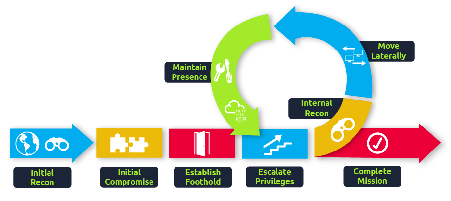

Lernziele
In diesem Netzwerk werden wir verschiedene Methoden behandeln, die zur Enumeration von AD verwendet werden können. Dies ist keineswegs eine vollständige Liste, da verfügbare Methoden in der Regel stark situationsabhängig sind und von dem erlangten Einbruch abhängen. Wir werden jedoch die folgenden Techniken zur Enumeration von AD behandeln:

    - Die AD-Snap-Ins der Microsoft Management Console.
    
    - Die Net-Befehle der Eingabeaufforderung.
    
    - Die AD-RSAT-Cmdlets von PowerShell.
    
    - Bloodhound.


# Credential Injection 

Bevor wir uns mit AD-Objekten und Enumeration beschäftigen, sollten wir zunächst über Methoden zur Anmeldedateninjektion sprechen. Wie du im Breaching AD-Netzwerk gesehen haben wirst, werden Anmeldedaten oft gefunden, ohne dass ein mit der Domäne verbundener Computer kompromittiert wurde. Bestimmte Enumerationstechniken erfordern möglicherweise eine bestimmte Konfiguration, um zu funktionieren.

Du kannst mit einer Kali-Maschine unglaublich weit kommen, indem du AD-Enumeration durchführst. Wenn du jedoch wirklich umfassende Enumeration und sogar Ausnutzung betreiben möchtest, musst du deinen Gegner verstehen und nachahmen können. Daher benötigst du eine Windows-Maschine. Dadurch können wir mehrere integrierte Methoden verwenden, um unsere Enumeration und Exploits zu inszenieren. In diesem Netzwerk werden wir eines dieser integrierten Tools erkunden, das als "runas.exe" bezeichnet wird.

### Runas Explained

Hast du schon einmal AD-Anmeldeinformationen gefunden, aber keinen Ort, um dich damit anzumelden? Runas könnte die Antwort sein, nach der du gesucht hast!

Bei Sicherheitsbewertungen hast du oft Netzwerkzugriff und hast gerade AD-Anmeldeinformationen entdeckt, hast aber keine Möglichkeit oder Berechtigungen, eine neue domänengebundene Maschine zu erstellen. Daher benötigen wir die Möglichkeit, diese Anmeldeinformationen auf einer von uns kontrollierten Windows-Maschine zu verwenden.

Wenn wir die AD-Anmeldeinformationen im Format "Benutzername:Passwort" haben, können wir Runas, ein legitimes Windows-Binary, verwenden, um die Anmeldeinformationen in den Speicher einzuspeisen. Der übliche Runas-Befehl würde ungefähr so aussehen:

>runas.exe /netonly /user:<domain>\<username> cmd.exe

Lassen Sie uns die Parameter genauer betrachten:

    - /netonly: Da wir nicht in der Domäne eingebunden sind, möchten wir die Anmeldeinformationen für die Netzwerkauthentifizierung laden, aber nicht gegen einen Domänencontroller authentifizieren. Daher werden Befehle, die lokal auf dem Computer ausgeführt werden, im Kontext Ihres Standard-Windows-Kontos ausgeführt, aber alle Netzwerkverbindungen erfolgen unter Verwendung des hier angegebenen Kontos.

    - /user: Hier geben wir die Details der Domäne und des Benutzernamens an. Es ist immer ratsam, den vollqualifizierten Domänennamen (FQDN) anstelle des NetBIOS-Namens der Domäne zu verwenden, da dies bei der Auflösung hilft.

    - cmd.exe: Dies ist das Programm, das wir ausführen möchten, sobald die Anmeldeinformationen eingefügt sind. Dies kann geändert werden, aber die sicherste Wahl ist cmd.exe, da Sie dann damit alles starten können, wozu Sie berechtigt sind, mit den eingefügten Anmeldeinformationen.

Wenn Sie diesen Befehl ausführen, werden Sie aufgefordert, ein Passwort einzugeben. Beachten Sie, dass wir den /netonly-Parameter hinzugefügt haben, sodass die Anmeldeinformationen nicht direkt von einem Domänencontroller überprüft werden. Es wird also jedes Passwort akzeptiert. Wir müssen dennoch bestätigen, dass die Netzwerkanmeldeinformationen erfolgreich und korrekt geladen werden.

Hinweis: Wenn Sie Ihre eigene Windows-Maschine verwenden, sollten Sie sicherstellen, dass Sie Ihre erste Eingabeaufforderung als Administrator ausführen. Dadurch wird ein Administrator-Token in CMD eingefügt. Wenn Sie Tools ausführen, die lokale Administratorrechte erfordern, von Ihrer durch Runas gestarteten CMD aus, wird das Token bereits verfügbar sein. Dies gewährt Ihnen keine administrativen Rechte im Netzwerk, stellt jedoch sicher, dass alle lokalen Befehle, die Sie ausführen, mit administrativen Berechtigungen ausgeführt werden.


### It's Always DNS

Hinweis: Diese nächsten Schritte müssen Sie nur durchführen, wenn Sie Ihre eigene Windows-Maschine für die Übung verwenden. Es ist jedoch eine gute Kenntnis, zu lernen, wie man sie durchführt, da es bei Red-Team-Übungen hilfreich sein kann.

Nach Eingabe des Passworts wird ein neues Eingabeaufforderungsfenster geöffnet. Jetzt müssen wir immer noch überprüfen, ob unsere Anmeldeinformationen funktionieren. Der sicherste Weg, dies zu tun, besteht darin, SYSVOL aufzulisten. Jedes AD-Konto, unabhängig von den Berechtigungen, kann den Inhalt des SYSVOL-Verzeichnisses lesen.

SYSVOL ist ein Ordner, der auf allen Domänencontrollern existiert. Es handelt sich um einen freigegebenen Ordner, der die Gruppenrichtlinienobjekte (GPOs) und Informationen sowie andere domänenbezogene Skripte speichert. Es ist eine wesentliche Komponente für Active Directory, da es diese GPOs an alle Computer in der Domäne liefert. Domänenbeigetretene Computer können dann diese GPOs lesen und die entsprechenden anwenden, um domänenweite Konfigurationsänderungen von einem zentralen Ort aus vorzunehmen.

Bevor wir SYSVOL auflisten können, müssen wir unsere DNS konfigurieren. Manchmal haben Sie Glück, und die interne DNS wird automatisch über DHCP oder die VPN-Verbindung für Sie konfiguriert, aber nicht immer (wie in diesem TryHackMe-Netzwerk). Es ist gut zu verstehen, wie man es manuell macht. Ihre sicherste Wahl für einen DNS-Server ist normalerweise ein Domänencontroller. Unter Verwendung der IP des Domänencontrollers können wir die folgenden Befehle in einem PowerShell-Fenster ausführen:

```
$dnsip = "<DC IP>"
$index = Get-NetAdapter -Name 'Ethernet' | Select-Object -ExpandProperty 'ifIndex'
Set-DnsClientServerAddress -InterfaceIndex $index -ServerAddresses $dnsip
```

Natürlich wird 'Ethernet' die Schnittstelle sein, die mit dem Ziel-Netzwerk verbunden ist. Wir können überprüfen, ob DNS funktioniert, indem wir Folgendes ausführen:

>nslookup za.tryhackme.com

Was nun zur DC-IP aufgelöst werden sollte, da dies der Ort ist, an dem der FQDN gehostet wird. Jetzt, da DNS funktioniert, können wir endlich unsere Anmeldeinformationen testen. Wir können den folgenden Befehl verwenden, um eine netzwerkbasierte Auflistung des SYSVOL-Verzeichnisses zu erzwingen:

```
za\gordon.stevens@THMJMP1 C:\Users\gordon.stevens>dir \\za.tryhackme.com\sysvol\   
 Volume in drive \\za.tryhackme.com\sysvol is Windows                              
 Volume Serial Number is 1634-22A9                                                 
                                                                                   
 Directory of \\za.tryhackme.com\sysvol                                            
                                                                                   
02/24/2022  09:57 PM    <DIR>          .                                           
02/24/2022  09:57 PM    <DIR>          ..                                          
02/24/2022  09:57 PM    <JUNCTION>     za.tryhackme.com [C:\Windows\SYSVOL\domain] 
               0 File(s)              0 bytes                                      
               3 Dir(s)  51,590,135,808 bytes free
```


### IP vs Hostnames

Frage: Gibt es einen Unterschied zwischen ***dir \\za.tryhackme.com\SYSVOL*** und ***dir \\DC-IP\SYSVOL*** und warum die große Aufregung um DNS?

Es gibt durchaus einen Unterschied, der sich auf die verwendete Authentifizierungsmethode zurückführen lässt. Wenn wir den Hostnamen angeben, wird zuerst versucht, eine Kerberos-Authentifizierung durchzuführen. Da die Kerberos-Authentifizierung Hostnamen in den Tickets verwendet, können wir, wenn wir stattdessen die IP angeben, den Authentifizierungstyp auf NTLM erzwingen. Obwohl dies auf den ersten Blick für uns gerade keine Rolle spielt, ist es gut, diese geringfügigen Unterschiede zu verstehen, da sie es Ihnen ermöglichen können, während einer Red-Team-Bewertung unauffälliger zu bleiben. In einigen Fällen überwachen Organisationen Overpass- und Pass-the-Hash-Angriffe. Die Erzwingung der NTLM-Authentifizierung ist ein guter Trick, um in solchen Fällen unerkannt zu bleiben.

### Using Injected Credentials

Nun, da wir unsere AD-Anmeldeinformationen in den Speicher injiziert haben, fängt der Spaß an. Mit der Option /netonly werden alle Netzwerkkommunikationen diese eingefügten Anmeldeinformationen für die Authentifizierung verwenden. Dies umfasst alle Netzwerkkommunikationen von Anwendungen, die aus diesem Eingabeaufforderungsfenster ausgeführt werden.

Hier wird es mächtig. Hatten Sie jemals den Fall, dass eine MS SQL-Datenbank die Windows-Authentifizierung verwendet und Sie nicht in der Domäne eingebunden waren? Starten Sie MS SQL Studio aus diesem Eingabeaufforderungsfenster; obwohl es Ihren lokalen Benutzernamen anzeigt, klicken Sie auf Anmelden, und es wird im Hintergrund die AD-Anmeldeinformationen zur Authentifizierung verwenden! Wir können dies sogar verwenden, um uns bei Webanwendungen anzumelden, die die NTLM-Authentifizierung verwenden.

Das werden wir in der nächsten Aufgabe für unsere erste AD-Enumerierungstechnik verwenden.

# Enumeration through Microsoft Management Console

Connect to THMJMP1 using RDP:

>xfreerdp /dynamic-resolution +clipboard /cert:ignore /v:10.200.56.248 /u:andrea.mitchell /p:'Password1'

### Microsoft Management Console

In dieser Aufgabe werden wir unsere erste Enumeration-Methode erkunden, die die einzige Methode ist, die bis zur allerletzten Aufgabe eine grafische Benutzeroberfläche (GUI) verwendet. Wir werden die Microsoft Management Console (MMC) mit den Snap-Ins für die Remote Server Administration Tools (RSAT) verwenden. Falls du die bereitgestellte Windows-VM (THMJMP1) nutzt, ist sie bereits für dich installiert. Wenn du jedoch deine eigene Windows-Maschine verwendest, kannst du die folgenden Schritte ausführen, um die Snap-Ins zu installieren:

    Klicke auf Start.
    Suche nach "Apps & Features" und drücke Enter.
    Klicke auf "Optionale Features verwalten".
    Klicke auf "Feature hinzufügen".
    Suche nach "RSAT".
    Wähle "RSAT: Active Directory-Domänendienste und Lightweight Directory Tools" aus und klicke auf Installieren.

Du kannst MMC starten, indem du die Windows-Starttaste verwendest, nach "Ausführen" suchst und MMC eingibst. Wenn wir MMC einfach nur normal ausführen, würde es nicht funktionieren, da unser Computer nicht zur Domäne gehört und unser lokales Konto nicht zur Authentifizierung in der Domäne verwendet werden kann.

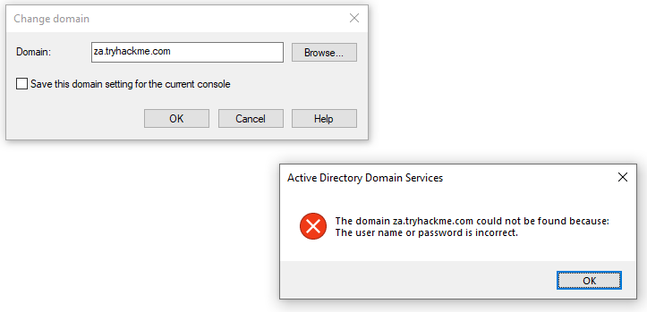


Hier kommt das Runas-Fenster aus der vorherigen Aufgabe ins Spiel. In diesem Fenster können wir MMC starten, was sicherstellt, dass alle MMC-Netzwerkverbindungen unsere injezierten AD-Anmeldeinformationen verwenden.

In MMC können wir jetzt das AD RSAT-Snap-In anhängen:

    Klicken Sie auf Datei -> Snap-In hinzufügen/entfernen.
    
    Wählen Sie und fügen Sie alle drei Active Directory-Snap-Ins hinzu.
    
    Klicken Sie durch etwaige Fehler und Warnungen.
    
    Klicken Sie mit der rechten Maustaste auf "Active Directory-Domänen und -Vertrauensstellungen" und wählen Sie "Forst ändern".
    
    Geben Sie "za.tryhackme.com" als Stammdomäne ein und klicken Sie auf OK.
    
    Klicken Sie mit der rechten Maustaste auf "Active Directory-Standorte und -Dienste" und wählen Sie "Forst ändern".
    
    Geben Sie "za.tryhackme.com" als Stammdomäne ein und klicken Sie auf OK.
    
    Klicken Sie mit der rechten Maustaste auf "Active Directory-Benutzer und -Computer" und wählen Sie "Domäne ändern".
    
    Geben Sie "za.tryhackme.com" als Domäne ein und klicken Sie auf OK.
    
    Klicken Sie mit der rechten Maustaste auf "Active Directory-Benutzer und -Computer" im linken Bereich.
    
    Klicken Sie auf Ansicht -> Erweiterte Funktionen.

Wenn bis zu diesem Punkt alles korrekt funktioniert hat, sollte Ihre MMC jetzt auf die Ziel-Domäne zeigen und authentifiziert sein.

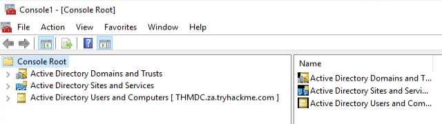

Wir können jetzt damit beginnen, Informationen über die AD-Struktur zu enumerieren.

### Users and Computers

Lassen Sie uns die Active Directory-Struktur betrachten. Für diese Aufgabe konzentrieren wir uns auf AD-Benutzer und -Computer. Erweitern Sie dieses Snap-In und erweitern Sie die "za"-Domäne, um die erste Organisationsstruktur (OU) zu sehen.

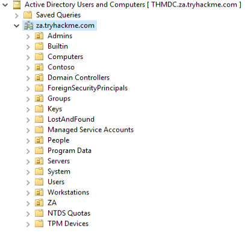

Lassen Sie uns das Verzeichnis "People" betrachten. Hier sehen wir, dass die Benutzer nach Abteilungs-OUs unterteilt sind. Durch Klicken auf jede dieser OUs können wir die Benutzer sehen, die zu dieser Abteilung gehören.

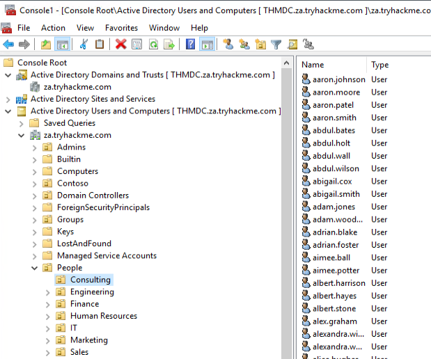

Durch Klicken auf einen dieser Benutzer können wir alle Eigenschaften und Attribute überprüfen. Wir können auch sehen, welchen Gruppen sie angehören.

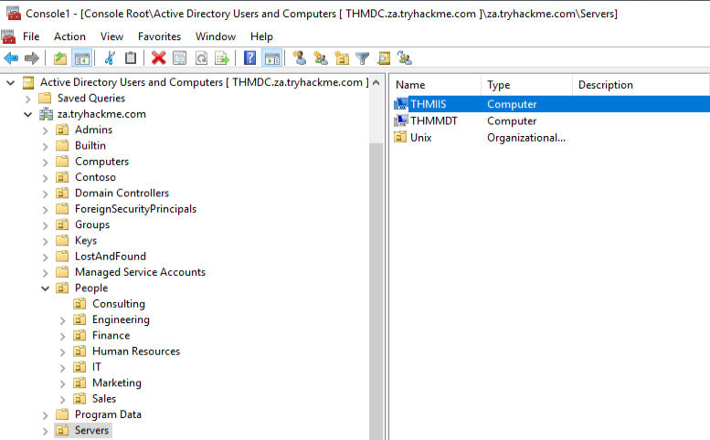

Wenn wir über die entsprechenden Berechtigungen verfügen würden, könnten wir MMC auch direkt verwenden, um Änderungen an AD vorzunehmen, wie z. B. das Ändern des Benutzerpassworts oder das Hinzufügen eines Kontos zu einer bestimmten Gruppe.

Vorteile:

    Die grafische Benutzeroberfläche bietet eine ausgezeichnete Möglichkeit, einen umfassenden Überblick über die AD-Umgebung zu erhalten.
    Es können schnelle Suchvorgänge für verschiedene AD-Objekte durchgeführt werden.
    Es bietet eine direkte Methode, um spezifische Aktualisierungen von AD-Objekten anzuzeigen.
    Wenn wir ausreichende Berechtigungen haben, können wir vorhandene AD-Objekte direkt aktualisieren oder neue hinzufügen.

Nachteile:

    Die GUI erfordert RDP-Zugriff auf die Maschine, auf der sie ausgeführt wird.
    Obwohl das Suchen nach einem Objekt schnell ist, können keine umfassenden Eigenschaften oder Attribute der gesamten AD gesammelt werden.

#  Enumeration through Command Prompt 

### Command Prompt

Manchmal ist es notwendig, schnell und unkompliziert eine AD-Abfrage durchzuführen, und die Eingabeaufforderung ist dafür eine zuverlässige Lösung. Die gute alte CMD ist praktisch, wenn man vielleicht keinen RDP-Zugriff auf ein System hat, Verteidiger die Verwendung von PowerShell überwachen und man seine AD-Enumeration über einen Remote Access Trojaner (RAT) durchführen muss. Es kann sogar hilfreich sein, ein paar einfache AD-Abfragebefehle in sein Phishing-Payload einzubetten, um die wichtigen Informationen zu erhalten, die einem helfen können, den finalen Angriff vorzubereiten.

Die Eingabeaufforderung verfügt über einen integrierten Befehl, den wir verwenden können, um Informationen über AD zu enumerieren, nämlich net. Der net-Befehl ist ein praktisches Werkzeug, um Informationen über das lokale System und AD zu enumerieren. Wir werden uns ein paar interessante Dinge anschauen, die wir von dieser Position aus enumerieren können, aber dies ist keine vollständige Liste.

Hinweis: Für diese Aufgabe müssen Sie THMJMP1 verwenden und können Ihre eigene Windows-VM nicht verwenden. Dies wird in den Nachteilen erklärt.


### Users

Wir können den net-Befehl verwenden, um alle Benutzer im AD-Domäne durch Verwendung der Benutzer-Suboption aufzulisten:

```
C:\>net user /domain
The request will be processed at a domain controller for domain za.tryhackme.com

User accounts for \\THMDC

-------------------------------------------------------------------------------
aaron.conway             aaron.hancock            aaron.harris
aaron.johnson            aaron.lewis              aaron.moore
aaron.patel              aaron.smith              abbie.joyce
abbie.robertson          abbie.taylor             abbie.walker
abdul.akhtar             abdul.bates              abdul.holt
abdul.jones              abdul.wall               abdul.west
abdul.wilson             abigail.cox              abigail.cox1
abigail.smith            abigail.ward             abigail.wheeler
[....]
The command completed successfully.
```

Dies liefert uns alle AD-Benutzer zurück und kann hilfreich sein, um die Größe der Domäne zu bestimmen und weitere Angriffe vorzubereiten. Wir können diese Suboption auch verwenden, um detailliertere Informationen über ein einzelnes Benutzerkonto zu enumerieren:

```
C:\>net user zoe.marshall /domain
The request will be processed at a domain controller for domain za.tryhackme.com

User name                    zoe.marshall
Full Name                    Zoe Marshall
Comment
User's comment
Country/region code          000 (System Default)
Account active               Yes
Account expires              Never

Password last set            2/24/2022 10:06:06 PM
Password expires             Never
Password changeable          2/24/2022 10:06:06 PM
Password required            Yes
User may change password     Yes

Workstations allowed         All
Logon script
User profile
Home directory
Last logon                   Never

Logon hours allowed          All

Local Group Memberships
Global Group memberships     *Domain Users         *Internet Access
The command completed successfully.
```

Hinweis: Wenn der Benutzer nur Mitglied weniger AD-Gruppen ist, kann dieser Befehl uns die Gruppenmitgliedschaften anzeigen. Jedoch wird der Befehl in der Regel, nachdem mehr als zehn Gruppenmitgliedschaften vorhanden sind, nicht in der Lage sein, sie alle aufzulisten.

### Groups

Wir können den net-Befehl verwenden, um die Gruppen der Domäne zu enumerieren, indem wir die Gruppen-Suboption verwenden:

```
C:\>net group /domain
The request will be processed at a domain controller for domain za.tryhackme.com

Group Accounts for \\THMDC

-------------------------------------------------------------------------------
*Cloneable Domain Controllers
*DnsUpdateProxy
*Domain Admins
*Domain Computers
*Domain Controllers
*Domain Guests
*Domain Users
[...]
*Schema Admins
*Server Admins
*Tier 0 Admins
*Tier 1 Admins
*Tier 2 Admins
The command completed successfully.
```

Diese Informationen können uns helfen, spezifische Gruppen zu identifizieren, die für die Zielumsetzung interessant sind. Wir könnten auch weitere Details wie die Mitgliedschaft in einer Gruppe enumerieren, indem wir die Gruppe im selben Befehl angeben:

```
C:\>net group "Tier 1 Admins" /domain
The request will be processed at a domain controller for domain za.tryhackme.com

Group name     Tier 1 Admins
Comment

Members

-------------------------------------------------------------------------------
t1_arthur.tyler          t1_gary.moss             t1_henry.miller
t1_jill.wallis           t1_joel.stephenson       t1_marian.yates
t1_rosie.bryant
The command completed successfully.
```

### Password Policy

Wir können den net-Befehl verwenden, um die Kennwortrichtlinie der Domäne zu enumerieren, indem wir die Accounts-Suboption verwenden:

```
C:\>net accounts /domain
The request will be processed at a domain controller for domain za.tryhackme.com

Force user logoff how long after time expires?:       Never
Minimum password age (days):                          0
Maximum password age (days):                          Unlimited
Minimum password length:                              0
Length of password history maintained:                None
Lockout threshold:                                    Never
Lockout duration (minutes):                           30
Lockout observation window (minutes):                 30
Computer role:                                        PRIMARY
The command completed successfully.
```

Dies liefert uns hilfreiche Informationen wie:

- Die Länge des Kennwortverlaufs. Das bedeutet, wie viele eindeutige Kennwörter der Benutzer angeben muss, bevor er ein altes Kennwort wiederverwenden kann.
- Die Sperrschwellenwert für falsche Kennworteingaben und wie lange das Konto gesperrt wird.
- Die Mindestlänge des Kennworts.
- Das maximale Alter, das Kennwörter erreichen dürfen, was darauf hinweist, ob Kennwörter in regelmäßigen Abständen geändert werden müssen.

Diese Informationen können uns nützlich sein, wenn wir zusätzliche Password-Spraying-Angriffe gegen die anderen Benutzerkonten durchführen möchten, die wir jetzt aufgelistet haben. Sie können uns dabei helfen, besser zu erraten, welche einzelnen Passwörter wir für den Angriff verwenden sollten und wie viele Angriffe wir durchführen können, bevor wir Gefahr laufen, Konten zu sperren. Es sei jedoch darauf hingewiesen, dass wir bei einem blinden Password-Spraying-Angriff möglicherweise trotzdem Konten sperren, da wir nicht überprüft haben, wie viele Versuche dieses spezifische Konto noch hat, bevor es gesperrt wird.

Die vollständige Palette der Optionen im Zusammenhang mit dem net-Befehl finden Sie [hier](https://docs.microsoft.com/en-us/troubleshoot/windows-server/networking/net-commands-on-operating-systems). Probieren Sie diese net-Befehle aus, um Informationen über bestimmte Benutzer und Gruppen zu sammeln.

Vorteile:

- Es sind keine zusätzlichen oder externen Tools erforderlich, und diese einfachen Befehle werden oft nicht vom Blue Team überwacht.
- Wir benötigen keine grafische Benutzeroberfläche (GUI), um diese Enumeration durchzuführen.
- VBScript und andere Makrosprachen, die häufig für Phishing-Payloads verwendet werden, unterstützen diese Befehle nativ, sodass sie verwendet werden können, um anfängliche Informationen über die AD-Domäne zu enumerieren, bevor spezifischere Payloads erstellt werden.

Nachteile:

- Die net-Befehle müssen von einer maschine in der Domäne ausgeführt werden. Wenn die Maschine nicht in der Domäne ist, wird sie standardmäßig der WORKGROUP-Domäne zugeordnet.
- Die net-Befehle zeigen möglicherweise nicht alle Informationen an. Zum Beispiel, wenn ein Benutzer Mitglied von mehr als zehn Gruppen ist, werden nicht alle diese Gruppen in der Ausgabe angezeigt.

# Enumeration through PowerShell

### Powershell

PowerShell ist die Weiterentwicklung der Eingabeaufforderung (Command Prompt). Microsoft hat sie erstmals im Jahr 2006 veröffentlicht. Während PowerShell alle standardmäßigen Funktionen der Eingabeaufforderung bietet, ermöglicht sie auch den Zugriff auf sogenannte Cmdlets (ausgesprochen "Command-lets"), die .NET-Klassen sind, um spezifische Funktionen auszuführen. Obwohl wir unsere eigenen Cmdlets schreiben können, wie es die Ersteller von [PowerView](https://github.com/PowerShellEmpire/PowerTools/tree/master/PowerView) getan haben, können wir bereits sehr weit kommen, indem wir die integrierten verwenden.

Da wir das AD-RSAT-Toolset in Schritt 3 installiert haben, wurden automatisch die zugehörigen Cmdlets für uns installiert. Es sind mehr als 50 Cmdlets installiert. Wir werden uns einige davon ansehen, aber für die [vollständige Liste der Cmdlets können wir auf diese Liste](https://docs.microsoft.com/en-us/powershell/module/activedirectory/?view=windowsserver2022-ps) verweisen.

Mit unserem SSH-Terminal können wir es zu einem PowerShell-Terminal aufrüsten, indem wir folgenden Befehl verwenden: powershell

### Users

Wir können das Cmdlet Get-ADUser verwenden, um AD-Benutzer aufzulisten.

```
PS C:\> Get-ADUser -Identity gordon.stevens -Server za.tryhackme.com -Properties *

AccountExpirationDate                :
accountExpires                       : 9223372036854775807
AccountLockoutTime                   :
[...]
Deleted                              :
Department                           : Consulting
Description                          :
DisplayName                          : Gordon Stevens
DistinguishedName                    : CN=gordon.stevens,OU=Consulting,OU=People,DC=za,DC=tryhackme,DC=com
[...]
```

Die Parameter werden wie folgt verwendet:

- Identity: Der Kontoname, den wir enumerieren.
- Properties: Welche mit dem Konto verbundenen Eigenschaften angezeigt werden sollen, * zeigt alle Eigenschaften an.
- Server: Da wir nicht Teil der Domäne sind, müssen wir diesen Parameter verwenden, um auf unseren Domänencontroller zu verweisen.

Für die meisten dieser Cmdlets können wir auch den -Filter-Parameter verwenden, der eine genauere Steuerung über die Enumerierung ermöglicht, und das Cmdlet Format-Table verwenden, um die Ergebnisse ordentlich anzuzeigen, wie folgt:

```
PS C:\> Get-ADUser -Filter 'Name -like "*stevens"' -Server za.tryhackme.com | Format-Table Name,SamAccountName -A

Name             SamAccountName
----             --------------
chloe.stevens    chloe.stevens
samantha.stevens samantha.stevens
[...]
janice.stevens   janice.stevens
gordon.stevens   gordon.stevens
```

### Groups

Wir können das Cmdlet Get-ADGroup verwenden, um AD-Gruppen aufzulisten.

```
PS C:\> Get-ADGroup -Identity Administrators -Server za.tryhackme.com


DistinguishedName : CN=Administrators,CN=Builtin,DC=za,DC=tryhackme,DC=com
GroupCategory     : Security
GroupScope        : DomainLocal
Name              : Administrators
ObjectClass       : group
ObjectGUID        : f4d1cbcd-4a6f-4531-8550-0394c3273c4f
SamAccountName    : Administrators
SID               : S-1-5-32-544
```

Wir können auch die Gruppenmitgliedschaft mithilfe des Cmdlets Get-ADGroupMember aufzählen.

```
PS C:\> Get-ADGroupMember -Identity Administrators -Server za.tryhackme.com


distinguishedName : CN=Domain Admins,CN=Users,DC=za,DC=tryhackme,DC=com

name              : Domain Admins
objectClass       : group
objectGUID        : 8a6186e5-e20f-4f13-b1b0-067f3326f67c
SamAccountName    : Domain Admins
SID               : S-1-5-21-3330634377-1326264276-632209373-512

[...]

distinguishedName : CN=Administrator,CN=Users,DC=za,DC=tryhackme,DC=com name              : Administrator
objectClass       : user
objectGUID        : b10fe384-bcce-450b-85c8-218e3c79b30fSamAccountName    : Administrator
SID               : S-1-5-21-3330634377-1326264276-632209373-500
```

Eine allgemeinere Suche nach beliebigen AD-Objekten kann mithilfe des Cmdlets Get-ADObject durchgeführt werden. Zum Beispiel, wenn wir nach allen AD-Objekten suchen, die nach einem bestimmten Datum geändert wurden:

```
PS C:\> $ChangeDate = New-Object DateTime(2022, 02, 28, 12, 00, 00)
PS C:\> Get-ADObject -Filter 'whenChanged -gt $ChangeDate' -includeDeletedObjects -Server za.tryhackme.com

Deleted           :
DistinguishedName : DC=za,DC=tryhackme,DC=com
Name              : za
ObjectClass       : domainDNS
ObjectGUID        : 518ee1e7-f427-4e91-a081-bb75e655ce7a

Deleted           :
DistinguishedName : CN=Administrator,CN=Users,DC=za,DC=tryhackme,DC=com
Name              : Administrator
ObjectClass       : user
ObjectGUID        : b10fe384-bcce-450b-85c8-218e3c79b30f
```

Wenn wir beispielsweise einen Passwortsprayangriff durchführen wollten, ohne Konten zu sperren, können wir dies verwenden, um Konten aufzulisten, bei denen badPwdCount größer als 0 ist, um diese Konten in unserem Angriff zu vermeiden:

```
PS C:\> Get-ADObject -Filter 'badPwdCount -gt 0' -Server za.tryhackme.com
PS C:\>
```

Dies wird nur Ergebnisse anzeigen, wenn einer der Benutzer im Netzwerk sein Passwort mehrmals falsch eingegeben hat.

### Domains

Wir können "Get-ADDomain" verwenden, um zusätzliche Informationen über die spezifische Domäne abzurufen.

```
PS C:\> Get-ADDomain -Server za.tryhackme.com

AllowedDNSSuffixes                 : {}
ChildDomains                       : {}
ComputersContainer                 : CN=Computers,DC=za,DC=tryhackme,DC=com
DeletedObjectsContainer            : CN=Deleted Objects,DC=za,DC=tryhackme,DC=com
DistinguishedName                  : DC=za,DC=tryhackme,DC=com
DNSRoot                            : za.tryhackme.com
DomainControllersContainer         : OU=Domain Controllers,DC=za,DC=tryhackme,DC=com
[...]
UsersContainer                     : CN=Users,DC=za,DC=tryhackme,DC=com
```

### Altering AD Objects

Das Tolle an den AD-RSAT-Cmdlets ist, dass einige von ihnen sogar die Erstellung neuer oder die Änderung vorhandener AD-Objekte ermöglichen. Unser Fokus für dieses Netzwerk liegt jedoch auf der Enumeration. Das Erstellen neuer Objekte oder das Ändern vorhandener würde als AD-Exploitation betrachtet werden, was später im AD-Modul behandelt wird.

Wir werden jedoch ein Beispiel dafür zeigen, indem wir das Passwort unseres AD-Benutzers erzwingen und es mit dem Cmdlet "Set-ADAccountPassword" ändern:

```
PS C:\> Set-ADAccountPassword -Identity gordon.stevens -Server za.tryhackme.com -OldPassword (ConvertTo-SecureString -AsPlaintext "old" -force) -NewPassword (ConvertTo-SecureString -AsPlainText "new" -Force)
```

Vergiss nicht als Identität und Password die Daten von der distributor webpage in Task 1 zu verwenden.

Vorteile:

- Die PowerShell-Cmdlets können signifikant mehr Informationen abrufen als die net-Befehle von der Eingabeaufforderung.
- Wir können den Server und die Domäne angeben, um diese Befehle mithilfe von Runas von einer nicht-domänenbeigetretenen Maschine auszuführen.
- Wir können unsere eigenen Cmdlets erstellen, um spezifische Informationen abzurufen.
- Wir können die AD-RSAT-Cmdlets verwenden, um AD-Objekte direkt zu ändern, z. B. Passwörter zurückzusetzen oder einen Benutzer einer bestimmten Gruppe hinzuzufügen.

Nachteile:

- Die PowerShell wird oft stärker von den Blue Teams überwacht als die Eingabeaufforderung.
- Wir müssen die AD-RSAT-Tools installieren oder andere, potenziell erkennbare Skripte für die PowerShell-Enumeration verwenden.


# Enumeration through Bloodhound

Zuletzt werden wir uns die AD-Enumeration mithilfe von [Bloodhound](https://github.com/BloodHoundAD/BloodHound) ansehen. Bloodhound ist das leistungsstärkste AD-Enumerationstool bis heute, und als es 2016 veröffentlicht wurde, hat es die AD-Enumerationsszene für immer verändert.

### Bloodhound History

Über einen erheblichen Zeitraum hatten die Red Teamer (und leider auch Angreifer) die Oberhand. So sehr, dass Microsoft eine eigene Version von Bloodhound in seine Advanced Threat Protection-Lösung integrierte. Es kam alles auf den folgenden Satz an:

"Verteidiger denken in Listen, Angreifer denken in Graphen." - Unbekannt

Bloodhound ermöglichte es Angreifern (und mittlerweile auch Verteidigern), die AD-Umgebung in einem Grafikformat mit verbundenen Knoten zu visualisieren. Jede Verbindung ist ein möglicher Pfad, der ausgenutzt werden könnte, um ein Ziel zu erreichen. Im Gegensatz dazu verwendeten die Verteidiger Listen, wie eine Liste der Domänenadministratoren oder eine Liste aller Hosts in der Umgebung.

Dieses graphenbasierte Denken eröffnete den Angreifern eine Welt. Es ermöglichte einen zweistufigen Angriff. In der ersten Stufe führten die Angreifer Phishing-Angriffe durch, um einen initialen Einstieg zur Enumeration von AD-Informationen zu erhalten. Dieses anfängliche Payload war in der Regel unglaublich laut und würde vom Blue Team erkannt und eingedämmt, bevor die Angreifer außer dem Exfiltrieren der erfassten Daten irgendwelche Aktionen durchführen könnten. Die Angreifer konnten jedoch nun diese Daten offline verwenden, um einen Angriffspfad im Grafikformat zu erstellen, der genau die erforderlichen Schritte und Hops zeigt. Unter Verwendung dieser Informationen während der zweiten Phishing-Kampagne konnten die Angreifer oft ihr Ziel in Minuten erreichen, sobald ein Einbruch erfolgt war. Es geht oft sogar schneller, als es das Blue Team brauchen würde, um ihren ersten Alarm zu erhalten. Das ist die Macht des Denkens in Graphen, weshalb so viele Blue Teams auch begonnen haben, diese Art von Tools zu verwenden, um ihr Sicherheitsniveau besser zu verstehen.

### Sharphound

Häufig hört man, dass Benutzer Sharphound und Bloodhound im selben Zusammenhang verwenden. Allerdings sind sie nicht dasselbe. Sharphound ist das Erfassungstool von Bloodhound. Es wird verwendet, um die AD-Informationen zu erfassen bzw. zu exfiltrieren, die dann visuell in Bloodhound dargestellt werden können. Bloodhound ist die tatsächliche grafische Benutzeroberfläche, die verwendet wird, um die AD-Angriffsgraphen anzuzeigen. Daher müssen wir zunächst lernen, wie man Sharphound verwendet, um AD zu erfassen, bevor wir uns die Ergebnisse visuell mit Bloodhound ansehen können.

Es gibt drei verschiedene Sharphound-Sammler:

- Sharphound.ps1 - Ein PowerShell-Skript zur Ausführung von Sharphound. Die neueste Version von Sharphound hat jedoch aufgehört, die Powershell-Skriptversion zu veröffentlichen. Diese Version ist gut geeignet für den Einsatz mit RATs, da das Skript direkt in den Speicher geladen werden kann und so auf Festplattenscans von AVs umgeht.
- Sharphound.exe - Eine ausführbare Windows-Version zum Ausführen von Sharphound.
- AzureHound.ps1 - Ein PowerShell-Skript zur Ausführung von Sharphound für Azure (Microsoft Cloud Computing Services)-Instanzen. Bloodhound kann Daten aus Azure aufnehmen, um Angriffspfade im Zusammenhang mit der Konfiguration von Azure Identity and Access Management zu finden.

Hinweis: Ihre Bloodhound- und Sharphound-Versionen müssen für die besten Ergebnisse übereinstimmen. Normalerweise werden Updates für Bloodhound durchgeführt, was bedeutet, dass alte Sharphound-Ergebnisse nicht eingespielt werden können. Dieses Netzwerk wurde mit Bloodhound v4.1.0 erstellt. Stellen Sie bitte sicher, dass Sie diese Version mit den Sharphound-Ergebnissen verwenden.

Bei der Verwendung dieser Skripte bei einem Assessment besteht eine hohe Wahrscheinlichkeit, dass diese Dateien als Malware erkannt und ein Alarm an das Blue Team gesendet werden. Hier kann wiederum unsere nicht in eine Domäne eingebundene Windows-Maschine helfen. Wir können das "runas"-Befehl verwenden, um die AD-Anmeldeinformationen einzufügen und Sharphound auf einen Domain Controller zu verweisen. Da wir diese Windows-Maschine kontrollieren, können wir entweder den AV deaktivieren oder Ausnahmen für bestimmte Dateien oder Ordner erstellen, was bereits für Sie auf der THMJMP1-Maschine durchgeführt wurde. Sie können die Sharphound-Binärdateien auf diesem Host im Verzeichnis "C:\Tools\" finden. Wir werden die Version SharpHound.exe für unsere Enumeration verwenden, aber bei Bedarf empefehle ich auch mit den anderen beiden herumzuspielen.

Wir starten Sharphound folgendermaßen:

>Sharphound.exe --CollectionMethods <Methods> --Domain za.tryhackme.com --ExcludeDCs

Die Parameter im Detail:

- CollectionMethods: Bestimmt, welche Art von Daten Sharphound sammeln soll. Die gängigsten Optionen sind Default oder All. Da Sharphound Informationen zwischenspeichert, können Sie nach Abschluss des ersten Durchlaufs nur die Session-Sammelmethode verwenden, um neue Benutzersitzungen abzurufen und den Vorgang zu beschleunigen.
- Domain: Hier geben wir die Domäne an, die wir enumerieren möchten. In einigen Fällen möchten Sie möglicherweise eine übergeordnete oder andere Domäne enumerieren, die Vertrauen mit Ihrer vorhandenen Domäne hat. Sie können Sharphound mitteilen, welche Domäne enumeriert werden soll, indem Sie diesen Parameter ändern.
- ExcludeDCs: Dies weist Sharphound an, keine Domaincontroller anzurühren, was die Wahrscheinlichkeit verringert, dass der Sharphound-Lauf einen Alarm auslöst.

Sie können noch andere verschiedenen Sharphound-Parameter [hier](https://bloodhound.readthedocs.io/en/latest/data-collection/sharphound-all-flags.html) finden. Es ist gut, die anderen Parameter zu checken, da sie je nach den Umständen Ihrer Red-Team-Bewertung erforderlich sein können.

Wir nutzen unsere SSH Session und kopieren Sharphound in unser Userverzeichnis: 

```
PS C:\> copy C:\Tools\Sharphound.exe ~\Documents\
PS C:\> cd ~\Documents\
PS C:\Users\gordon.stevens\Documents>
```

Wir starten Sharphound mit dem oben genannten Befehl.

```
PS C:\Users\gordon.stevens\Documents\>SharpHound.exe --CollectionMethods All --Domain za.tryhackme.com --ExcludeDCs
2022-03-16T19:11:41.2898508+00:00|INFORMATION|Resolved Collection Methods: Group, LocalAdmin, GPOLocalGroup, Session, LoggedOn, Trusts, ACL, Container, RDP, ObjectProps, DCOM, SPNTargets, PSRemote
2022-03-16T19:11:41.3056683+00:00|INFORMATION|Initializing SharpHound at 7:11 PM on 3/16/2022
2022-03-16T19:11:41.6648113+00:00|INFORMATION|Flags: Group, LocalAdmin, GPOLocalGroup, Session, LoggedOn, Trusts, ACL, Container, RDP, ObjectProps, DCOM, SPNTargets, PSRemote
2022-03-16T19:11:41.8211318+00:00|INFORMATION|Beginning LDAP search for za.tryhackme.com
[....]
2022-03-16T19:12:31.6981568+00:00|INFORMATION|Output channel closed, waiting for output task to complete
Closing writers
2022-03-16T19:12:32.2605943+00:00|INFORMATION|Status: 2163 objects finished (+2163 43.26)/s -- Using 85 MB RAM
2022-03-16T19:12:32.2605943+00:00|INFORMATION|Enumeration finished in 00:00:50.4369344
2022-03-16T19:12:32.5418517+00:00|INFORMATION|SharpHound Enumeration Completed at 7:12 PM on 3/16/2022! Happy Graphing!
```
Sharphound wird etwa 1 Minute benötigen, um die Enumeration durchzuführen. In größeren Organisationen kann dies deutlich länger dauern, sogar Stunden, um es das erste Mal auszuführen. Sobald abgeschlossen, erhalten Sie eine ZIP-Datei mit Zeitstempel im gleichen Ordner, von dem aus Sie Sharphound ausgeführt haben.

```
PS C:\Users\gordon.stevens\Documents> dir

    Directory: C:\Users\gordon.stevens\Documents

Mode                LastWriteTime         Length Name
----                -------------         ------ ----
-a----        3/16/2022   7:12 PM         121027 20220316191229_BloodHound.zip
-a----        3/16/2022   5:19 PM         906752 SharpHound.exe
-a----        3/16/2022   7:12 PM         360355 YzE4MDdkYjAtYjc2MC00OTYyLTk1YTEtYjI0NjhiZmRiOWY1.bin 
```

Wir können nun Bloodhound verwenden, um diese ZIP-Datei uns Angriffspfade visuell anzeigen zu lassen.

### Bloodhound

Wie zuvor erwähnt, ist Bloodhound die grafische Benutzeroberfläche, die es uns ermöglicht, Daten, die von Sharphound erfasst wurden, zu importieren und sie in Angriffspfade zu visualisieren. Bloodhound verwendet Neo4j als Backend-Datenbank und Grafiksystem. Neo4j ist ein Graphdatenbankverwaltungssystem. Stellen Sie sicher, dass Bloodhound und Neo4j auf Ihrem Angriffsrechner installiert und konfiguriert sind. Auf jeden Fall ist es gut zu verstehen, was im Hintergrund passiert.

Bevor wir Bloodhound starten können, müssen wir zuerst Neo4j starten:

```
         
thm@thm:~# neo4j console start
Active database: graph.db
Directories in use:
  home:         /var/lib/neo4j
  config:       /etc/neo4j
  logs:         /var/log/neo4j
  plugins:      /var/lib/neo4j/plugins
  import:       /var/lib/neo4j/import
  data:         /var/lib/neo4j/data
  certificates: /var/lib/neo4j/certificates
  run:          /var/run/neo4j
Starting Neo4j.
[....]
2022-03-13 19:59:18.014+0000 INFO  Bolt enabled on 127.0.0.1:7687.
```

In einem anderen Terminal-Tab führen Sie `bloodhound --no-sandbox` aus. Dies zeigt Ihnen die Authentifizierungs-GUI an.

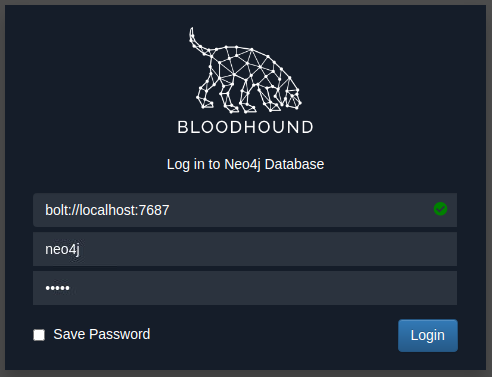

Die Standardanmeldeinformationen für die Neo4j-Datenbank lauten neo4j:neo4j. Verwenden Sie diese, um sich bei Bloodhound anzumelden. Um unsere Ergebnisse zu importieren, müssen Sie die ZIP-Datei von dem Windows-Host herunterladen.

Der einfachste Weg ist die Verwendung des SCP-Befehls auf Ihrer AttackBox:

```
scp <AD-Benutzername>@THMJMP1.za.tryhackme.com:C:/Users/<AD-Benutzername>/Documents/<Sharphound-ZIP> .
```

Nachdem Sie Ihr Passwort eingegeben haben, werden die Ergebnisse in Ihr aktuelles Arbeitsverzeichnis kopiert. Ziehen Sie dann die ZIP-Datei per Drag-and-Drop auf die Bloodhound-GUI, um sie in Bloodhound zu importieren. Es wird angezeigt, dass die Dateien extrahiert und der Import gestartet werden.

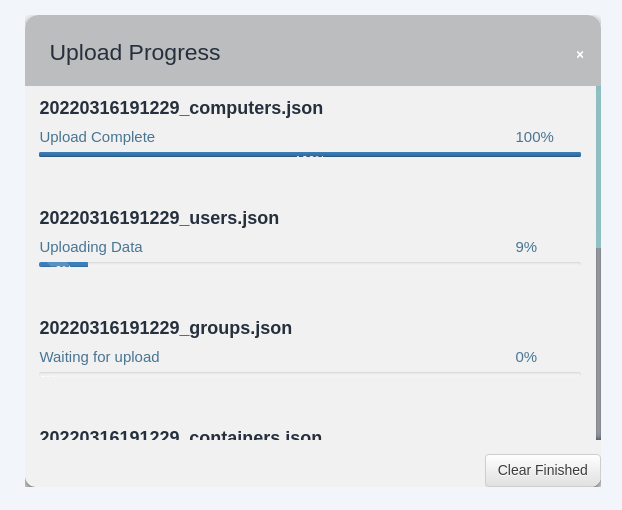


Sobald alle JSON-Dateien importiert wurden, können wir beginnen, Bloodhound zu verwenden, um Angriffspfade für dieses spezifische Domäne zu ermitteln.

### Attack Paths

Bloodhound kann verschiedene Angriffspfade aufzeigen. Durch Drücken der drei Streifen neben "Search for a node" werden die Optionen angezeigt. Der allererste Tab zeigt uns die Informationen zu unseren aktuellen Imports an.

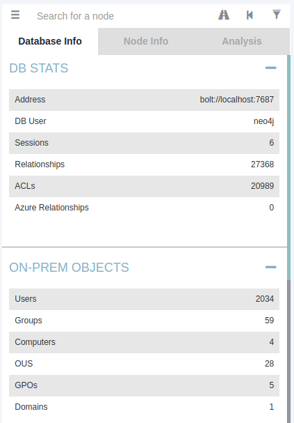

Beachte, dass sich diese Zahlen kumulativ erhöhen, wenn du einen neuen Lauf von Sharphound importierst. Zuerst werden wir uns die Knoteninformationen ansehen. Suchen wir unser AD-Konto in Bloodhound. Du musst auf den Knoten klicken, um die Ansicht zu aktualisieren. Beachte auch, dass du das Beschriftungsschema ändern kannst, indem du die linke Strg-Taste drückst.

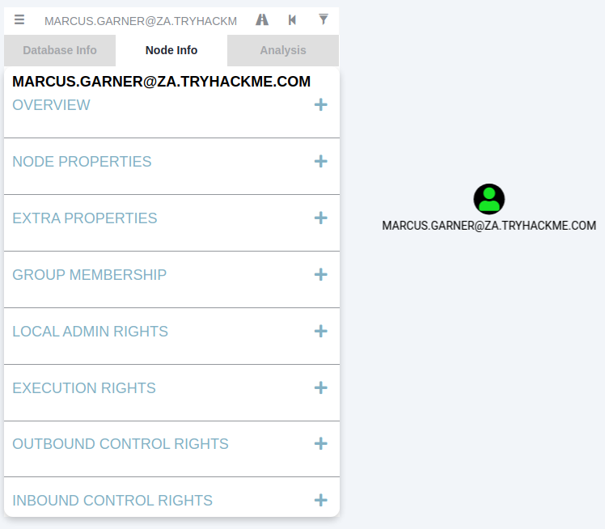

Wir können sehen, dass eine erhebliche Menge an Informationen über unsere Nutzung zurückgegeben wird. Jede der Kategorien bietet folgende Informationen:

- Übersicht: Bietet Zusammenfassungen wie die Anzahl der aktiven Sitzungen des Kontos und ob es hochwertige Ziele erreichen kann.
- Knoteneigenschaften: Zeigt Informationen zum AD-Konto wie den Anzeigenamen und den Titel.
- Zusätzliche Eigenschaften: Bietet detailliertere AD-Informationen wie den Distinguished Name und wann das Konto erstellt wurde.
- Gruppenmitgliedschaft: Zeigt Informationen zu den Gruppen, denen das Konto angehört.
- Lokale Administratorenrechte: Bietet Informationen zu domänenbeigetretenen Hosts, auf denen das Konto administrative Privilegien hat.
- Ausführungsrechte: Bietet Informationen über besondere Berechtigungen wie die Möglichkeit, sich über RDP auf einen Computer zu verbinden.
- Ausgehende Steuerungsrechte: Zeigt Informationen zu AD-Objekten, bei denen dieses Konto Berechtigungen zum Ändern ihrer Attribute hat.
- Eingehende Steuerungsrechte: Bietet Informationen zu AD-Objekten, die die Attribute dieses Kontos ändern können.

Wenn du mehr Informationen in jeder dieser Kategorien wünschst, kannst du die Zahl neben der Informationsabfrage drücken. Zum Beispiel wollen wir die Gruppenmitgliedschaft unseres Kontos betrachten. Durch Drücken der Zahl neben "Gruppenmitgliedschaft erster Grad" können wir sehen, dass unser Konto Mitglied von zwei Gruppen ist.

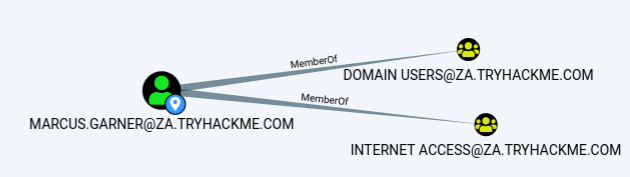

Als nächstes werden wir uns die Analyse-Abfragen ansehen. Dies sind Abfragen, die von den Erstellern von Bloodhound selbst verfasst wurden, um hilfreiche Informationen aufzulisten.

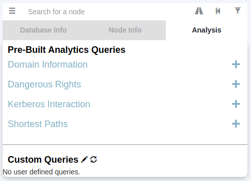

Unter dem Abschnitt "Domäneninformationen" können wir die Abfrage "Finde alle Domänenadministratoren" ausführen. Beachte, dass du die linke Strg-Taste drücken kannst, um die Anzeigeeinstellungen zu ändern.

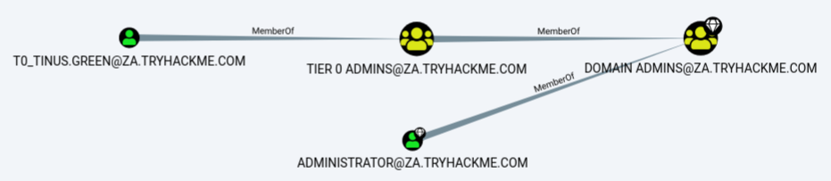

Die Symbole werden als Nodes bezeichnet, und die Linien werden als Edges bezeichnet. Lassen Sie uns genauer betrachten, was Bloodhound uns zeigt. Es gibt ein AD-Benutzerkonto mit dem Benutzernamen T0_TINUS.GREEN, das Mitglied der Gruppe Tier 0 ADMINS ist. Diese Gruppe ist jedoch eine verschachtelte Gruppe in die Gruppe DOMAIN ADMINS, was bedeutet, dass alle Benutzer, die Teil der Gruppe Tier 0 ADMINS sind, effektiv Domain Admins sind.

Darüber hinaus gibt es ein zusätzliches AD-Konto mit dem Benutzernamen ADMINISTRATOR, das Teil der Gruppe DOMAIN ADMINS ist. Somit gibt es zwei Konten in unserer Angriffsfläche, die wir wahrscheinlich versuchen können zu kompromittieren, wenn wir DA-Rechte erlangen möchten. Da das ADMINISTRATOR-Konto ein integriertes Konto ist, würden wir uns wahrscheinlich auf das Benutzerkonto konzentrieren.

Jedes AD-Objekt, das in den vorherigen Aufgaben diskutiert wurde, kann ein Node in Bloodhound sein, und jedes wird ein unterschiedliches Symbol haben, das den Objekttyp darstellt. Wenn wir einen Angriffspfad formulieren möchten, müssen wir die verfügbaren Edges zwischen der aktuellen Position und den Privilegien, die wir haben, sowie dem Ort, den wir erreichen möchten, betrachten.

Bloodhound bietet verschiedene verfügbare Edges, die über das Filter-Symbol zugänglich sind:

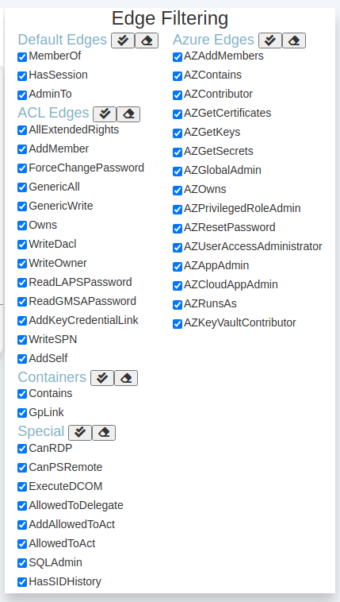

Diese werden ständig aktualisiert, wenn neue Angriffsvektoren entdeckt werden. Wir werden in Zukunft versuchen, diese verschiedenen Edges auszunutzen. Lassen Sie uns jedoch den einfachsten Angriffspfad betrachten, der nur die Standard- und einige spezielle Edges verwendet. Wir werden eine Suche in Bloodhound durchführen, um den Angriffspfad aufzulisten. Drücken Sie das Pfad-Symbol, um die Pfadsuche zu ermöglichen.

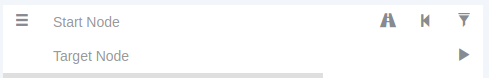

Unser Startknoten wäre unser AD-Benutzername, und unser Endknoten wird die Gruppe Tier 1 ADMINS sein, da diese Gruppe administrative Privilegien über Server hat.

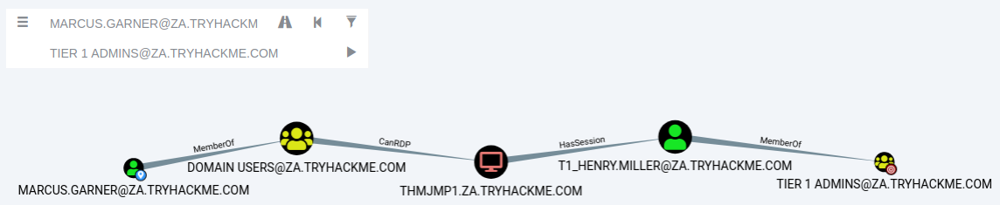

Wenn keine verfügbaren Angriffspfade unter Verwendung der ausgewählten Edge-Filter vorhanden sind, zeigt Bloodhound "Keine Ergebnisse gefunden" an. Beachten Sie, dass dies auch auf eine Inkonsistenz zwischen Bloodhound und Sharphound zurückzuführen sein kann, was bedeutet, dass die Ergebnisse nicht ordnungsgemäß aufgenommen wurden. Bitte verwenden Sie Bloodhound v4.1.0. In unserem Fall zeigt Bloodhound jedoch einen Angriffspfad an. Es zeigt, dass einer der T1-ADMINISTRATOREN ACCOUNT, das Schichtmodell gebrochen hat, indem er seine Anmeldeinformationen verwendet hat, um sich bei THMJMP1, einem Arbeitsplatz, anzumelden. Das wird durch den "HasSession" Pfeil ausgedrückt. Außerdem zeigt es, dass jeder Benutzer, der Teil der GRUPPE DOMAIN-BENUTZER ist, einschließlich unseres AD-Kontos, die Möglichkeit hat, sich über RDP mit diesem Host zu verbinden.

Wir könnten etwas Ähnliches wie folgt tun, um diesen Pfad auszunutzen:

- Verwenden Sie unsere AD-Anmeldeinformationen, um eine RDP-Verbindung zu THMJMP1 herzustellen.
- Suchen Sie nach einem Privilegien-Eskalationsvektor auf dem Host, der uns Administrativen Zugriff ermöglichen würde.
- Mit Administrativem Zugriff können wir Techniken und Werkzeuge zur Anmeldeinformationserfassung verwenden, wie z.B. Mimikatz.
- Da der T1-Administrator eine aktive Sitzung auf THMJMP1 hat, würde unsere Anmeldeinformationserfassung uns den NTLM-Hash des zugehörigen Kontos liefern.

Dies ist ein einfaches Beispiel. Die Angriffspfade können unter normalen Umständen relativ komplex sein und mehrere Aktionen erfordern, um das Endziel zu erreichen. Wenn Sie an den Exploits interessiert sind, die mit jedem Edge verbunden sind, bietet die folgende [Bloodhound-Dokumentation](https://bloodhound.readthedocs.io/en/latest/data-analysis/edges.html) eine ausgezeichnete Anleitung. Bloodhound ist ein unglaublich leistungsfähiges AD-Enumerationswerkzeug, das tiefe Einblicke in die AD-Struktur einer Angriffsfläche bietet. Es lohnt sich, damit herumzuspielen und seine verschiedenen Funktionen kennenzulernen.

### Session Data Only

Die Struktur von AD ändert sich in großen Organisationen nicht sehr oft. Es können ein paar neue Mitarbeiter hinzukommen, aber die generelle Struktur von OUs, Gruppen, Benutzern und Berechtigungen bleibt gleich.

Allerdings ändert sich das Eine ständig: aktive Sitzungen und LogOn-Ereignisse. Da Sharphound eine Momentaufnahme der AD-Struktur erstellt, sind die Daten zu aktiven Sitzungen nicht immer genau, da einige Benutzer ihre Sitzungen bereits beendet haben könnten oder neue Benutzer neue Sitzungen gestartet haben könnten. Dies ist eine wichtige Anmerkung und erklärt, warum wir Sharphound in regelmäßigen Abständen ausführen möchten.

Ein guter Ansatz ist es, Sharphound am Anfang Ihrer Bewertung mit der "All" Sammlungsmethode auszuführen und dann Sharphound mindestens zweimal täglich mit der "Session" Sammlungsmethode auszuführen. Dies liefert Ihnen neue Sitzungsdaten und stellt sicher, dass diese Durchläufe schneller sind, da sie die gesamte AD-Struktur nicht erneut durchsuchen. Die beste Zeit für diese Sitzungsdurchläufe ist ungefähr um 10:00 Uhr, wenn Benutzer ihren ersten Kaffee trinken und mit der Arbeit beginnen, und erneut gegen 14:00 Uhr, wenn sie von ihrer Mittagspause zurückkommen, aber bevor sie nach Hause gehen.

Sie können stagnierende Sitzungsdaten in Bloodhound im Tab "Datenbankinformationen" löschen, indem Sie auf "Sitzungsinformationen löschen" klicken, bevor Sie die Daten aus diesen neuen Sharphound-Durchläufen importieren.

Vorteile:

- Bietet eine grafische Benutzeroberfläche (GUI) zur AD-Enumeration.
- Hat die Fähigkeit, Angriffspfade für die aufgelisteten AD-Informationen anzuzeigen.
- Bietet tiefgreifendere Einblicke in AD-Objekte, die normalerweise mehrere manuelle Abfragen erfordern, um wiederhergestellt zu werden.

Nachteile:

- Erfordert die Ausführung von Sharphound, was laut und oft von AV- oder EDR-Lösungen erkannt werden kann.


# Conclusion

Die Enumeration von AD ist eine umfangreiche Aufgabe. Eine ordnungsgemäße AD-Enumeration ist erforderlich, um die Struktur der Domäne besser zu verstehen und Angriffspfade zu bestimmen, die zur Durchführung von Privilegienerweiterungen oder lateralen Bewegungen genutzt werden können.

### Additional Enumeration Techniques

In diesem Netzwerk haben wir mehrere Techniken behandelt, die zur Enumeration von AD verwendet werden können. Diese Liste ist keineswegs erschöpfend. Hier ist eine Liste von Enumerationstechniken, die ebenfalls erwähnenswert sind:

- [LDAP-Enumeration](https://book.hacktricks.xyz/pentesting/pentesting-ldap): Jedes gültige AD-Anmeldepaar sollte in der Lage sein, sich mit der LDAP-Schnittstelle eines Domänencontrollers zu verbinden. Dadurch können LDAP-Suchabfragen geschrieben werden, um Informationen über die AD-Objekte in der Domäne zu enumerieren.
- [PowerView](https://github.com/PowerShellMafia/PowerSploit/blob/master/Recon/PowerView.ps1): PowerView ist ein Aufklärungsskript, das Teil des [PowerSploit-Projekts](https://github.com/PowerShellMafia/PowerSploit) ist. Obwohl dieses Projekt keine Unterstützung mehr erhält, können Skripte wie PowerView ungemein nützlich sein, um halbautomatische Enumeration von AD-Objekten durchzuführen, wenn es schnell gehen muss.
- [Windows-Verwaltungsinstrumentation](https://0xinfection.github.io/posts/wmi-ad-enum/) (WMI): WMI kann verwendet werden, um Informationen von Windows-Hosts zu enumerieren. Es gibt einen Anbieter namens "root\directory\ldap", der verwendet werden kann, um mit AD zu interagieren. Wir können diesen Anbieter und WMI in PowerShell verwenden, um AD-Enumeration durchzuführen.

Wir sollten auch beachten, dass sich dieser Kurs darauf konzentriert hat, die Struktur der AD-Domäne als Ganzes zu enumerieren, anstatt sich ausschließlich auf die Identifizierung von Fehlkonfigurationen und Schwachstellen zu konzentrieren. Enumerationen, die darauf abzielen, Schwächen zu identifizieren, wie unsichere Freigaben oder Brüche im Schichtmodell, werden in zukünftigen Kursen behandelt.


Gegenmaßnahmen:

Die Verteidigung gegen AD-Enumeration ist äußerst schwierig. Viele dieser Techniken ahmen den regulären Netzwerkverkehr und das Verhalten nach, was es schwierig macht, bösartigen Verkehr von normalem Verkehr zu unterscheiden. Dennoch gibt es ein paar Dinge, die wir tun können, um potenziell bösartiges Verhalten zu erkennen:

- Leistungsfähige AD-Enumerationstechniken wie Sharphound erzeugen eine signifikante Anzahl von LogOn-Ereignissen beim Aufzählen von Sitzungsinformationen. Da es von einem einzelnen AD-Konto ausgeführt wird, werden diese LogOn-Ereignisse mit diesem einzelnen Konto in Verbindung gebracht. Wir können Erkennungsregeln schreiben, um diese Art von Verhalten zu erkennen, wenn es von einem Benutzerkonto ausgeführt wird.
- Wir können Signaturerkennungsregeln für die Tools schreiben, die für spezifische AD-Enumerationstechniken installiert werden müssen, wie die SharpHound-Binärdateien und die AD-RSAT-Tools.
- Sofern nicht von Mitarbeitern unserer Organisation verwendet, können wir die Verwendung von Eingabeaufforderung und Powershell in unserer Organisation überwachen, um potenzielle Enumerationversuche aus nicht autorisierten Quellen zu erkennen.

Als Randnotiz können auch die Mitarbeiter des Blue Teams regelmäßig diese Enumerationstechniken verwenden, um Lücken und Fehlkonfigurationen in der Struktur der AD-Domäne zu identifizieren. Wenn wir diese Fehlkonfigurationen beheben können, selbst wenn ein Angreifer unser AD aufzählt, würden sie keine Fehlkonfigurationen finden, die für Privilegienerweiterungen oder laterale Bewegungen ausgenutzt werden könnten.

Nun, da wir AD aufgezählt haben, ist der nächste Schritt, Privilegienerweiterung und laterale Bewegung in der Domäne durchzuführen, um sich in eine geeignete Position zu bringen, um Angriffe durchzuführen. Dies wird im nächsten Kurs behandelt.


